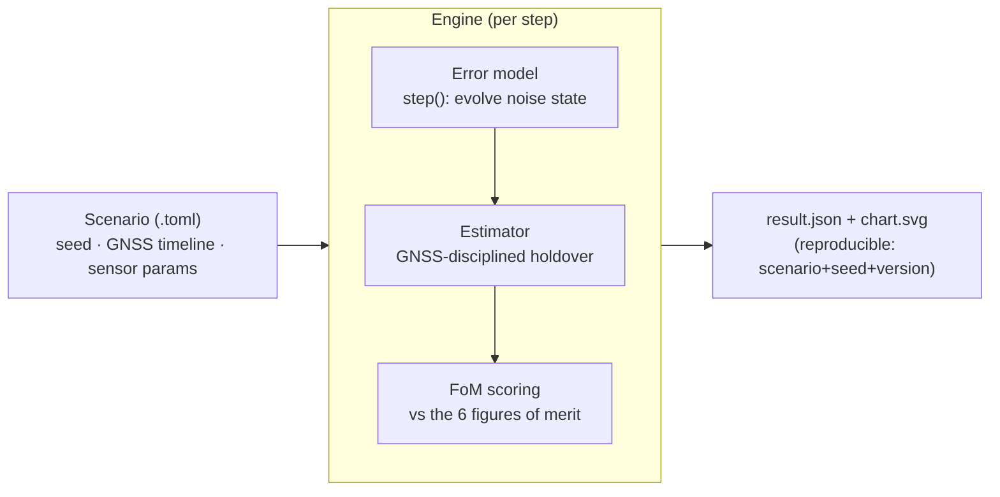

<p align="center">
  
</p>

<h1 align="center">Kshana</h1>

<p align="center">
  <strong>क्षण</strong> — Sanskrit for <em>the precise instant</em>, the smallest measure of time.<br>
  Open, reproducible PNT-resilience simulation with published quantum-sensor performance models.
</p>

<p align="center">
  <a href="https://ashfordeou.github.io/kshana/"></a>
  <a href="tests/sgp4_verification.rs"></a>
  <a href="https://github.com/ashfordeOU/kshana/actions/workflows/ci.yml"></a>
  <a href="https://github.com/ashfordeOU/kshana/releases"></a>
  <a href="LICENSE"></a>
  <a href="Cargo.toml"></a>
  <a href="https://doi.org/10.5281/zenodo.20528627"></a>
</p>

<p align="center">
  <strong>Kshana</strong> (क्षण, Sanskrit: <em>"the precise instant"</em>) is an open, reproducible
  <strong>PNT-resilience simulator with quantum-sensor performance models</strong> —
  positioning, navigation, and timing. It compares quantum and classical sensors mostly
  from published Allan/noise-budget coefficients, with a first-principles cold-atom-
  interferometer accelerometer layer (Mach–Zehnder phase, quantum projection noise,
  contrast decay, and vibration coupling) that <em>derives</em> the noise coefficient
  rather than looking it up; it is not yet a full quantum-physics simulator (Coriolis and
  light-shift systematics remain coefficient-level — see
  <a href="docs/QUANTUM.md">docs/QUANTUM.md</a> and
  <a href="docs/QUANTUM-MODELS.md">docs/QUANTUM-MODELS.md</a>).
</p>

It quantifies, in hard and reproducible numbers, what quantum clocks, quantum
inertial sensors, and optical time-transfer buy a navigation system over classical
PNT — scored against the operational figures of merit that matter for resilient
navigation. Every result is reproducible from `scenario + seed + engine version`,
and every sensor parameter is traceable to a published source — consolidated in one
citable table in [`docs/PROVENANCE.md`](docs/PROVENANCE.md).

*Free and open source under Apache-2.0, professionally developed and maintained by
Ashforde OÜ — commercial support, integration, and proprietary extensions available.*

> **Status: v0.11.0 · a simulation substrate, not yet a product.** A validated,
> fully reproducible engine spanning the PNT stack — orbit geometry and constellation
> design, time systems, inertial navigation (incl. map-aided), GNSS/INS fusion (loose,
> tight, UKF, coupled clock+position), ARAIM integrity, clocks, advanced time-and-frequency
> transfer, the GNSS measurement domain, and resilience (jamming + multi-layer spoofing).
> Honest by design: every figure of merit is labelled *validated* or *not-modeled*, and
> optical-clock figures are space goals on ground hardware (no strontium optical clock has flown).
> See **[Capabilities](#capabilities)** for what it does, **[What it is / is not](#what-it-is--is-not)**
> for scope, and [`docs/CAPABILITY.md`](docs/CAPABILITY.md) / [`docs/VALIDATION.md`](docs/VALIDATION.md)
> for per-capability maturity. The overclaim closure ledger
> [`docs/CLAIMS-VS-REALITY.md`](docs/CLAIMS-VS-REALITY.md) tracks every historical overclaim,
> how it was resolved, and a CI guard (`tests/no_overclaims.rs`) that keeps it resolved.

> **Try it in your browser:** the [playground](web/) runs the engine client-side as
> WebAssembly — pick a scenario, edit the parameters, and see the result, with nothing
> uploaded. Build it locally with `./web/build.sh` (see [`web/README.md`](web/README.md)),
> or publish it to GitHub Pages via the `pages` workflow.

> **New to this?** In plain terms: GPS-style satellite signals tell things *where they
> are* and *what time it is*. When those signals are lost (jammed, blocked, or out of
> view in space), a system has to keep going on its own onboard clock and motion
> sensors — and they slowly drift. "Quantum" clocks and sensors drift far more slowly.
> Kshana measures, in honest numbers, **how much longer a quantum-equipped system can
> coast** before it exceeds its accuracy limits. New readers should start with the
> [plain-language primer](docs/CONCEPTS.md) and the [glossary](docs/GLOSSARY.md).

---

## Contents

- [Why](#why) · [What it is / is not](#what-it-is--is-not) · [Capabilities](#capabilities) · [Results](#results)
- [Install & build](#install--build) · [Usage](#usage) ([Python](#python), [WebAssembly](#webassembly))
- [Scenario format](#scenario-format) · [Output](#output) · [Architecture](#architecture)
- [Repository layout](#repository-layout) · [Validation & honesty](#validation-reproducibility--honesty)
- [Documentation](#documentation) · [FAQ](#faq) · [Troubleshooting](#troubleshooting)
- [Roadmap](#roadmap) · [Contributing](#contributing) · [Citing](#citing) · [Versioning & releases](#versioning--releases) · [License](#license)
- [Support & professional services](#support--professional-services) · [References](#key-references)

## Why

Resilient PNT depends on holding position and time when GNSS is denied or jammed.
Quantum sensors promise far slower drift during those outages. There is no good
**open** tool to quantify that advantage honestly and reproducibly — so primes,
agencies, and labs each rebuild private one-offs. Kshana aims to be the neutral,
citable reference for exactly this question.

The engine knows nothing about "quantum" vs "classical": each sensor is an
**error model** plugged into a common pipeline, so a quantum and a classical
device are compared *apples-to-apples* on the same scenario, with independent
noise realizations.

## What it is / is not

**It is:** a deterministic, dependency-light engine spanning the PNT stack — orbit
geometry, inertial navigation, GNSS/INS fusion, integrity, clocks, and timing. It
runs a scenario (often a GNSS outage), evolves calibrated sensor error models
through the appropriate estimator, and scores the result against the operational
figures of merit — emitting a reproducible JSON result and an SVG chart, from a
Rust library, CLI, Python extension, or in-browser WebAssembly module.

**It is not:** flight hardware, a quantum-payload design, a full GNSS signal
receiver, or a certified avionics product. Quantum-hardware fidelity comes from
published error models, not from this tool. The granular maturity of each
capability is documented in [`docs/CAPABILITY.md`](docs/CAPABILITY.md).

**It is not (yet):** a *full* atom-interferometry physics engine (most quantum sensors
consume published Allan/noise-budget coefficients; the CAI accelerometer has a
first-principles layer — Mach–Zehnder phase, projection noise, contrast decay, and
vibration coupling — but Coriolis and light-shift systematics remain a **P2** roadmap
layer, see [`ROADMAP.md`](ROADMAP.md) and [`docs/QUANTUM-MODELS.md`](docs/QUANTUM-MODELS.md));
a GNSS receiver or PVT solver (it models the measurement domain and resilience, not
signal acquisition or a least-squares fix); or a mission-design / orbit-determination
tool. Owning this scope is deliberate. If you need first-principles cold-atom
interferometer error budgets (e.g. CARIOQA-PMP-grade or X-37B-style validation), see
the P2 roadmap and [get in touch](#support--professional-services) to collaborate.

## Capabilities

| Domain | Capability |
|--------|------------|
| **Orbit & geometry** | SGP4/SDP4 propagation (validated to 4.12 mm against all 666 AIAA 2006-6753 vectors); real two-line elements (a committed, date-stamped Celestrak `gps-ops` snapshot) or synthetic Walker-delta constellations whose mean elements realise the `i:T/P/F` formula to under 1 km over a 24 h propagation; multi-constellation visibility, dilution of precision, and GNSS availability; a gradient-free constellation-design optimiser, streets-of-coverage minimum-satellite sizing, a multi-constellation comparison tool, and a Walker **design sweep** that tabulates coverage / PDOP / revisit-time over a planes × satellites grid and reports the Pareto-optimal designs. |
| **Time systems** | IERS leap-second **UTC / TAI / TT / UT1** scales, a Julian-date API, the IAU-2000 **Earth Rotation Angle**, and GMST-based **TEME ↔ ECEF** with WGS-84 geodetic frames — plus IAU 2006 precession (Fukushima–Williams) toward an ITRF-precise reduction. |
| **Inertial** | Three-axis strapdown INS — quaternion attitude, WGS-84 NED mechanization, coning/sculling compensation, and a deterministic IMU error model (scale-factor, misalignment, g-sensitivity, quantization, drift); a **first-principles cold-atom-interferometer accelerometer** (Mach–Zehnder phase, quantum projection noise, contrast decay, vibration coupling) that *derives* the velocity-random-walk coefficient; and a sequential-importance-resampling **particle filter** for map-aided (terrain-/gravity-referenced) GPS-denied navigation. |
| **Fusion** | Loosely-coupled 15-state GNSS/INS error-state EKF with closed-loop feedback (the `gnss-ins` pack); a **tightly-coupled** pseudorange update that keeps correcting with fewer than four satellites; a coupled **clock + position** filter; a general **unscented (sigma-point) Kalman** estimator for strongly nonlinear measurements; and a tightly-coupled GNSS/INS **UKF navigator** (pseudorange + Doppler) whose force-model orbital coast is validated to **0.77 m RMS** over a 30-minute curving LEO pass that includes a 120-second GNSS outage. |
| **Integrity** | Snapshot and solution-separation (ARAIM-style) RAIM with horizontal/vertical protection levels (HPL/VPL), fault detection & exclusion, and Stanford integrity diagrams; an explicit integrity-risk-budget (**MHSS**) protection level, including the **dual-/multi-constellation constellation-wide fault mode** (EU ARAIM / DO-316). |
| **Clock & timing** | Two-state Kalman holdover (Joseph-form covariance, NIS/NEES consistency health); Allan-family stability (ADEV / MDEV / TDEV / HDEV) with noise-type-specific confidence intervals and a full **IEEE-1139 five-coefficient power-law fit**; geometric corrections (Sagnac, GNSS common-view); and the operational transfer methods — **TWSTFT** with the BIPM Sagnac closed form, **GNSS common-view**, **PPP** ionosphere-free time transfer, a free-space **optical** link with turbulence scintillation, and an inverse-variance **clock-ensemble (paper) timescale** below the best contributing clock. |
| **GNSS measurement domain** | Forward pseudorange / Doppler synthesis with **Klobuchar** (broadcast) and **IONEX / TEC-grid** (measured) ionosphere — including an IONEX file parser, time interpolation between maps, and the thin-shell slant-obliquity mapping — **Saastamoinen + Niell** troposphere, and snapshot RAIM (HPL/VPL). |
| **Resilience** | Link-budget **jamming** (J/S → effective C/N₀ → loss of lock); a stochastic **time-spoof detector** (Neyman–Pearson / χ²₁ energy test with closed-form and Monte-Carlo P_fa/P_md and a Security FoM of 1 − P_md); and a **multi-layer spoof detector** fusing a RAIM-consistency parity test (with the common-mode blind spot modelled honestly), an RF AGC-power monitor, and a signal-quality (SQM early-minus-late) monitor. |
| **Interoperability** | **RINEX-3** multi-GNSS broadcast-ephemeris ingestion (GPS, Galileo, QZSS, BeiDou MEO/IGSO via IS-GPS-200; GLONASS via PZ-90 state-vector RK4) usable as a constellation source (RINEX in, PNT geometry out); a **RINEX-3/4** observation parser (pseudorange, carrier phase, Doppler, signal strength); an **SP3-c/d** precise-ephemeris reader/writer with 9th-order Lagrange interpolation; and **CCSDS OEM 2.0 + OMM** (mean-elements) export for flight-dynamics tools (GMAT, Orekit, STK). |

Each capability is reachable as a Rust API, a runnable scenario `kind`, or both.
Maturity per capability — *validated*, *runnable*, or *library* — is tracked in
[`docs/CAPABILITY.md`](docs/CAPABILITY.md).

## Results

Each scenario compares a quantum sensor against its classical counterpart through a
~1.8 h GNSS outage. Numbers are reproducible (`scenario + seed + version`).

<p align="center">
  
  <br><em>Dead-reckoning position error during a GNSS outage: the quantum sensor (blue)
  stays flat near the spec; the classical sensor (red) diverges to tens of kilometres.
  Generated by Kshana from <code>scenarios/imu-deadreckoning.toml</code>.</em>
</p>

| Pack | Scenario | Quantum | Classical |
|------|----------|---------|-----------|
| **1 — Clock holdover** | `clock-holdover.toml` (20 ns spec) | optical clock holds the full outage | CSAC breaches the spec mid-outage |
| **2 — Inertial dead-reckoning** | `imu-deadreckoning.toml` (100 m spec) | cold-atom: **~41 m**, holds full outage | nav-grade: breaches in **~350 s** → tens of km |
| **3 — Time transfer** (optical inter-satellite link) | `timetransfer.toml` | optical: **~0.3 mm** ranging | RF (TWSTFT): **~150 mm** ranging |
| **4 — Hybrid fusion** (capstone) | `hybrid-pnt.toml` | full position+timing for the whole outage | **position-limited at ~350 s** |

The capstone shows the fusion thesis: optical inter-satellite time-transfer keeps even
a classical *clock* locked, isolating the *inertial* sensor as the classical suite's
weak link — i.e. quantum inertial + optical timing together.

A further scenario, `orbit-gnss-challenged.toml`, derives GNSS availability from
**orbital geometry** rather than hand-authored windows: a spacecraft inside the GNSS
shell is propagated against a GPS-like Walker constellation, and the visible-satellite
count (line-of-sight, Earth-occultation, elevation mask) sets the fix state at each
step. Over a day the user is in fix only ~59% of the time; the quantum clock holds a
5 ns timing solution through every gap (availability **1.0**), the chip-scale clock
only **~0.83**.

The constellation can also be given as real two-line element sets. A *full* TLE
(line 1 + line 2) is propagated with the full **SGP4/SDP4** model — including
atmospheric drag and the deep-space lunar-solar and 12 h / 24 h resonance terms that
matter for ~12 h GNSS orbits — validated against the official AIAA 2006-6753 vectors
to a worst-case ≈ 4 mm. `scenarios/orbit-sgp4-gps.toml` ships a **real Celestrak
`gps-ops` snapshot** of the operational GPS constellation (2021-07-28, 30 satellites)
and requires valid TLE checksums — two-line element sets are open data from the US
Space Force / 18th Space Defense Squadron catalogue, redistributed by Celestrak
(Dr T. S. Kelso, [celestrak.org](https://celestrak.org)); refresh with
`scripts/fetch_tles.sh`. A line-2-only block keeps
the analytic two-body propagation (`scenarios/orbit-real-tle.toml`); the two forms can
be mixed in one constellation. A constellation can equally be built from a block of
**RINEX-3 GPS broadcast-ephemeris** records — the format a receiver decodes —
propagated by the IS-GPS-200 user algorithm and fed through the same geometry
(`scenarios/orbit-rinex.toml`).

## Install & build

Requires a Rust toolchain (≥ 1.75; developed on 1.93).

```bash
git clone https://github.com/AshfordeOU/kshana
cd kshana
cargo build --release
cargo test          # all tests pass
```

## Usage

Run any scenario; the CLI dispatches on the scenario's `kind` field and writes a
`<scenario>.result.json` and a `<scenario>.chart.svg` next to it:

```bash
cargo run -- scenarios/clock-holdover.toml
cargo run -- scenarios/imu-deadreckoning.toml
cargo run -- scenarios/timetransfer.toml
cargo run -- scenarios/hybrid-pnt.toml
cargo run -- scenarios/orbit-gnss-challenged.toml
cargo run -- scenarios/orbit-sgp4-gps.toml
cargo run -- scenarios/orbit-rinex.toml
cargo run -- scenarios/integrity-raim.toml

# Export a propagated constellation to an SP3-c precise-ephemeris file:
cargo run -- scenarios/orbit-sgp4-gps.toml --export-sp3 gps.sp3
```

**Interoperability role.** Kshana is the *performance-simulation* layer that sits
alongside the post-processing toolchain, not a replacement for it: feed its **RINEX**
output into RTKLIB or gLAB for a position solution, and use its **SP3** output as a
precise-orbit product for tools like Ginan — Kshana answers *what resilience a given
PNT architecture buys* before you have real signals, in formats those tools already
ingest (`--export-sp3`, or `export_sp3 = true` in an `orbit` scenario, writes
`<scenario>.sp3`).

Example output (clock holdover — note the Integrity and Security figures of merit):

```
scenario c827e5d40d25 | quantum holdover 6600s p95 0.0ns integrity 1.000 security 0.997 | classical holdover 2610s p95 19.7ns integrity 1.000 security 0.000
wrote scenarios/clock-holdover.result.json and scenarios/clock-holdover.chart.svg
```

The optical clock's tight detection floor keeps `security 0.997`; the chip-scale
clock's own noise over the monitoring window exceeds the 20 ns spec, so it has no
spoof-detection margin (`security 0.000`). The orbit scenario additionally reports a
geometry block — fraction of samples with a fix, and best/median PDOP and position
accuracy — alongside the clock result.

> **Read these two numbers carefully.** `security` is an *analytic spoof-detectability
> bound* derived from each clock's stability — it is meaningful only against a
> configured spoofing scenario and is **not** a multi-satellite RAIM detector. `integrity`
> here is the filter's *self-consistency* (fraction of outage samples inside its own k-sigma
> bound), **not** an aviation HPL/VPL integrity figure. See
> [`docs/INTEGRITY.md`](docs/INTEGRITY.md).
>
> For genuine receiver-autonomous integrity, the **`integrity` scenario kind**
> (`scenarios/integrity-raim.toml`) runs real snapshot and solution-separation
> (ARAIM-style) RAIM over the propagated constellation geometry: it computes
> horizontal/vertical **protection levels (HPL/VPL)** per epoch and reports the
> fraction of epochs that meet the configured alert limits, with a Stanford
> integrity diagram for error-vs-PL classification.

### Python

An optional Python extension (PyO3, abi3) wraps the same engine. Build and install
it with [maturin](https://www.maturin.rs/):

```bash
pip install maturin
maturin develop --features python   # or: maturin build --features python
```

```python
import json, kshana

result = json.loads(kshana.run(open("scenarios/clock-holdover.toml").read()))
print(result["quantum"]["fom"]["integrity"])

# json, svg, and a one-line summary at once:
result_json, chart_svg, summary = kshana.run_full(open("scenarios/orbit-gnss-challenged.toml").read())
print(kshana.version(), summary)
```

Wheels are built for Linux, macOS, and Windows by the `wheels` workflow on each
release tag.

### WebAssembly

The engine also runs in the browser via [wasm-pack](https://rustwasm.github.io/wasm-pack/):

```bash
wasm-pack build --target web -- --features wasm
```

```js
import init, { run, chart_svg, version } from "./pkg/kshana.js";
await init();
const result = JSON.parse(run(tomlText));
console.log(version(), result.classical.fom.timing_p95_ns);
```

## Scenario format

Scenarios are declarative TOML. A top-level `kind` selects the pack (`clock` is
the default if omitted; `inertial`, `timetransfer`, `hybrid`, `fusion`,
`gnss-ins`, `orbit`, `gnss-sim`, `integrity`, `spoof`, `jamming`, `sweep`, `sweep-nd`).
Common fields: `seed`, a `[time]` grid, a `[gnss]` availability timeline (the outage
driver), and per-sensor blocks with `provenance` strings citing the source of every
figure. Example (clock):

```toml
seed = 42
threshold_ns = 20.0
[time]
step_s = 10.0
duration_s = 7200.0
[gnss]
windows = [
  { t0 = 0.0,   t1 = 600.0,  state = "nominal" },  # 10 min GNSS sync
  { t0 = 600.0, t1 = 7200.0, state = "denied"  },  # ~1.8 h outage
]
[clock_quantum]
id = "optical-sr-lattice"
provenance = "Strontium optical lattice clock, space-oriented goal sigma_y(1s)=1e-15 (arXiv:1503.08457)"
y0 = 5.0e-17
q_wf = 1.0e-30   # white FM:  q_wf = sigma_y(1s)^2
q_rw = 0.0       # random-walk FM
drift = 0.0      # linear aging (per second)
[clock_classical]
id = "csac-sa45s"
provenance = "Microchip SA65 / SA.45s CSAC datasheet sigma_y(1s)=3e-10"
y0 = 5.0e-10
q_wf = 9.0e-20
q_rw = 0.0
drift = 0.0
```

Optional fields (off when absent): a clock may add `flicker_floor` (1/f FM Allan
floor); an inertial sensor may add `gyro_bias` and `q_arw` (gyro bias and angular
random walk), and `bias_instability` and `q_aa` (the Allan bias-instability floor and
acceleration random walk) — together a **single-axis (1-DOF) accelerometer error
budget** (VRW/ARW and bias-instability). This is the error budget the shipped
`inertial` scenario *pack* runs. Separately, the library now carries a verified
**3-axis strapdown navigator** (`src/inertial/{attitude,mechanization,imu_errors}.rs`):
quaternion attitude with coning/sculling compensation, a full NED mechanization
(Earth-rate and transport-rate terms, WGS-84 Somigliana gravity), and a
deterministic IMU error model in which **scale-factor, misalignment,
g-sensitivity, quantization, and rate-ramp are modelled** (IEEE Std 952-1997
§A.2; Groves 2013 §4.3). That 3-axis path is now **wired into a runnable
loosely-coupled GNSS/INS pack** (`kind = "gnss-ins"`): a 15-state error-state EKF
disciplines the strapdown solution against noisy fixes while GNSS is up, then
coasts through the outage, reporting the fused horizontal error against the
open-loop free-INS coast. A **tightly-coupled pseudorange** update is also
available (it forms the innovation in the range domain, so it keeps correcting
with fewer than four satellites). A
clock-holdover scenario may add `runs` (> 1) to run a **Monte Carlo ensemble** — each
figure of merit is then reported as a mean with a 5th–95th-percentile spread and the
chart shades the error confidence band (see `scenarios/clock-ensemble.toml`).

A `fusion` scenario (same blocks as `hybrid`) runs **two independent Kalman estimators**
— one for the clock state, one for the position state — disciplined by GNSS and aided by
optical time transfer, and reports a combined holdover FoM. The two blocks share no
cross-covariance: this is a stacked pair of error budgets, **not** a true coupled
clock+position joint filter (cross-block covariance is a roadmap item). See
`scenarios/fusion-pnt.toml`.

A `spoof` scenario injects a time-spoof — one of four `[attack.shape]` kinds
(`linear_ramp`, `step_jump`, `meaconing`, `replay`; a bare `rate_ns_per_s` is still
accepted as a linear ramp) — and runs each clock's spoof detector. The detector is a
two-sided **χ²₁ energy / Neyman–Pearson test** on the clock-aided monitor statistic:
the threshold is set from a target false-alarm budget `target_pfa`, and the
**missed-detection probability `P_md`** is reported both closed-form and by
Monte-Carlo (`mc_runs` trials per hypothesis — the two agree to a few ×1/√N). The
**Security figure of merit is `1 − P_md`** at the operationally-harmful (spec)
magnitude, so a quiet clock that catches a spec-sized spoof scores ≈ 1 and a noisy
one that often misses it scores lower (see `scenarios/spoof-attack.toml`,
`scenarios/spoof-meaconing.toml`).

A `gnss-sim` scenario is a **measurement-domain** simulation: for each visible
satellite it synthesises the pseudorange `ρ = geometric range + c·δt_rx − c·δt_sv +
I + T + noise + multipath` and the L1 Doppler, with the **Klobuchar** single-frequency
ionosphere (`[iono]`, IS-GPS-200 §20.3.3.5.2.5) and the **Saastamoinen** zenith
troposphere projected by the **Niell (1996)** mapping function (`[tropo]`). The
residuals feed **snapshot RAIM** for per-epoch HPL/VPL, and every satellite's
pseudorange, Doppler, C/N₀, and iono/tropo corrections are emitted in the JSON
`gnss_measurements` array. It is a forward simulator (it generates measurements from
a known truth), not a receiver/solver — a zero-noise run reproduces geometry plus the
corrections to sub-millimetre (see `scenarios/gnss-sim-raim.toml`).

A `jamming` scenario models RF interference as a **link budget**: a `[jammer]`
(ECEF position, transmit `power_dbw`, type) raises the jammer-to-signal ratio at a
`[receiver]` watching a Walker `[constellation]`. From the geometry (free-space
path loss and the per-direction receive-antenna gain) it computes each satellite's
`J/S`, the **effective C/N₀** via the standard anti-jam equation (despreading
processing gain × the spectral-separation factor `Q`; Kaplan & Hegarty §9.4), and
flags loss of lock below a configurable tracking threshold — reporting an
`availability_under_jamming` figure of merit. A 10 W broadband jammer at 1 km
denies the receiver entirely (J/S ≈ 72 dB); the same jammer at 100 km only
degrades the links (see `scenarios/jamming-demo.toml`).

A `sweep` scenario runs a **trade study**: it varies one `parameter` (`threshold_ns`,
`duration_s`, `quantum_q_wf`, or `classical_q_wf`) from `start` to `stop` over `steps`
points on a `lin` or `log` `scale`, records a `metric` (e.g. `holdover_s`) for both
clocks, and charts the two curves. The base scenario goes under `[base]` (see
`scenarios/sweep-clock-stability.toml`).

A `sweep-nd` scenario generalises this to **any pack and any number of axes**: it
varies dotted TOML keys of a `[base]` scenario (of any `kind`) over the Cartesian
product of `[[axes]]`, re-runs each grid node, and records `metrics` given as
dotted JSON paths into the result (e.g. `classical.fom.holdover_s`). It works for
every pack because it operates at the TOML/result boundary; native runs evaluate
the grid in parallel (no extra dependency, wasm falls back to sequential) and the
output is deterministic and row-major (see `scenarios/sweep-nd-inertial.toml`).

An `orbit` scenario derives the `[gnss]` timeline from geometry instead of authoring
it — give a `[user]` orbit, a `[constellation]`, an elevation `mask_deg`, and the two
clock blocks. It also reports position accuracy from the satellite geometry; the
optional `sigma_uere_m` (1-sigma user-equivalent range error, default 1 m) scales the
position dilution of precision into a position sigma. The user orbit may be made
**eccentric** with `eccentricity` and `argp_deg`, and `j2 = true` adds Earth-oblateness
secular drift (see `scenarios/orbit-molniya.toml`). The constellation can instead be a
**real one**: give `[constellation]` a `tle` block of two-line element sets and the
satellites are parsed from it (see `scenarios/orbit-real-tle.toml`). Add one or more
`[[constellations]]` blocks for **multi-GNSS** (e.g. GPS + Galileo; see
`scenarios/orbit-multignss.toml`):

```toml
kind = "orbit"
seed = 7
threshold_ns = 5.0
mask_deg = 10.0
sigma_uere_m = 1.0           # optional; position sigma = position-DOP * this
[time]
step_s = 60.0
duration_s = 86400.0
[user]                       # spacecraft (altitude in km, angles in deg)
altitude_km = 8000.0
inclination_deg = 0.0
[constellation]              # Walker-delta GNSS (GPS-like)
altitude_km = 20180.0
inclination_deg = 55.0
planes = 6
sats_per_plane = 4
phasing_f = 1.0
[clock_quantum]  # ... as above
[clock_classical]  # ... as above
```

See `scenarios/` for one example of every kind.

## Output

The result artifact is versioned, self-describing JSON: per-step time series, the
scored figures of merit, the active model specs (with provenance), the seed, a
**scenario hash** — so any chart can be reproduced from the file — and, for each clock,
an `adev_curve` (`[{tau_s, adev, n_samples, noise, edf, ci_lo, ci_hi}]`): the overlapping
Allan deviation across octave-spaced averaging times — the standard way to read a clock's
stability — now with a **noise-type-specific 95% confidence band** per point (the record's
power-law type is identified from its modified-Allan slope, and the χ² interval uses the
matching NIST SP 1065 effective degrees of freedom). The browser playground renders it as a
log-log "Clock stability (ADEV)" chart. (MDEV, TDEV, and HDEV are available as library
estimators; the exported result curve is the overlapping ADEV.) Every field, with units and a
source pointer, is documented in [`docs/SCHEMA.md`](docs/SCHEMA.md). The figures of
merit follow the standard operational PNT figures of merit:

| Figure of merit | How Kshana computes it |
|-----------------|------------------------|
| Timing Performance (clock/orbit packs) | clock-phase error RMS + 95th-percentile over the outage, in **nanoseconds** (`timing_rms_ns`) — a timing metric, not position |
| Positioning Performance (inertial/hybrid packs) | 1-DOF position-error RMS + 95th-percentile over the outage, in **metres** (`pos_rms_m`); single-axis. A single run is flagged `monte_carlo: false`; set `runs = N` for a Monte Carlo ensemble that reports each metric's mean, spread, and bootstrap 95% CI. Still **not** a 2-D CEP/2DRMS or DOP-weighted accuracy (those need the 3-axis model — roadmap) |
| Autonomy | holdover duration — time in-spec after GNSS loss (grid-quantised: a lower bound) |
| Resilience | error-growth slope during the outage |
| Availability | fraction of the run with an in-spec solution |
| Integrity | filter **self-consistency** — fraction of outage samples whose error stays inside the Kalman filter's own k-sigma bound. **Not** an aviation HPL/VPL/RAIM integrity figure (see [`docs/INTEGRITY.md`](docs/INTEGRITY.md)) |
| Security | **analytic spoof-*detectability* bound** from clock stability — how small/slow a time-spoof a single-clock consistency monitor could flag. Meaningful only with a configured attack; **not** a multi-satellite RAIM detector |

New to these terms? Each is defined in plain language in the [glossary](docs/GLOSSARY.md).

## Architecture

One engine; each sensor pack plugs in via a common error-model interface. See
[`docs/ARCHITECTURE.md`](docs/ARCHITECTURE.md) for the full set of diagrams.




## Repository layout

```
kshana/
├── src/
│   ├── types.rs        # Seconds, TimeGrid, ModelSpec
│   ├── scenario.rs     # GNSS timeline, clock scenario config
│   ├── models.rs       # ErrorModel trait, ClockModel (white FM, RWFM, aging)
│   ├── estimator.rs    # HoldoverEstimator (quadratic offset+aging removal)
│   ├── fom.rs          # figure-of-merit scoring
│   ├── allan.rs        # overlapping Allan deviation
│   ├── kalman.rs       # two-state Kalman clock estimator + integrity bound
│   ├── report.rs       # result schema, scenario hash, SVG chart (clock)
│   ├── run.rs          # clock + orbit-clock run pipelines
│   ├── inertial.rs     # Pack 2: inertial dead-reckoning (accel + gyro) + FoMs
│   ├── timetransfer.rs # Pack 3: optical/RF time-transfer link
│   ├── hybrid.rs       # Pack 4: combined PNT suite + ISL clock-aiding
│   ├── orbit.rs        # orbit propagation + GNSS line-of-sight visibility
│   ├── api.rs          # scenario dispatch shared by the CLI and bindings
│   ├── python.rs       # optional PyO3 extension (feature = "python")
│   ├── wasm.rs         # optional wasm-bindgen module (feature = "wasm")
│   └── main.rs         # CLI
├── scenarios/          # cited scenarios (one per pack + a geometry-driven one)
├── scripts/            # reproducibility + repo-hygiene guards
├── docs/               # CONCEPTS, ARCHITECTURE, VALIDATION, GLOSSARY, assets/
├── .github/workflows/  # CI gate, release, and wheel-build pipelines
├── pyproject.toml      # Python packaging (maturin)
├── CHANGELOG.md        # Keep a Changelog + SemVer
└── CONTRIBUTING.md
```

## Documentation

| Document | For whom | What's in it |
|----------|----------|--------------|
| [Concepts primer](docs/CONCEPTS.md) | everyone, start here | what Kshana does and why, from zero to the physics |
| [Playground](web/README.md) | everyone | run the engine in your browser (WebAssembly); build &amp; deploy notes |
| [Glossary](docs/GLOSSARY.md) | everyone | plain-language definitions of every term |
| [Architecture](docs/ARCHITECTURE.md) | developers / reviewers | module map, engine pipeline, dispatch, and diagrams |
| [Validation status](docs/VALIDATION.md) | reviewers / citers | what is `validated` vs `not modeled`, with evidence |
| [Provenance](docs/PROVENANCE.md) | reviewers / citers | every sensor parameter, model, and dataset traced to its published source, in one citable table |
| [Reproducibility &amp; provenance](docs/REPRODUCIBILITY.md) | reviewers / packagers | determinism guarantees, golden-pinning, SBOM, build provenance |
| [Positioning](docs/POSITIONING.md) | evaluators | where Kshana sits vs RTKLIB/gLAB (complementary), and the zero-install browser tier |
| [SGP4 validation](docs/SGP4-VALIDATION.md) | reviewers / citers | agreement with the AIAA 2006-6753 reference (666 states, ~4 mm) |
| [Changelog](CHANGELOG.md) | everyone | released history (Keep a Changelog + SemVer) |
| [Contributing](CONTRIBUTING.md) | contributors | build, guards, test/citation discipline, DCO |
| [Code of Conduct](CODE_OF_CONDUCT.md) | community | expected conduct (Contributor Covenant) |
| [Security policy](SECURITY.md) | reporters | how to report a vulnerability; dual-use note |

## Validation, reproducibility & honesty

- Every noise term is calibrated to a **published, cited** figure and validated
  against the standard relation (Allan deviation for clocks; Groves' dead-reckoning
  error growth for inertial; the timing→ranging conversion for time transfer). Status
  per term is tracked in [`docs/VALIDATION.md`](docs/VALIDATION.md) as `validated` or
  `not modeled` — nothing is presented as validated that is not.
- **Reproducible by construction:** `scenario + seed + engine version → identical
  bits`. `scripts/check-reproducible.sh` enforces it; quantum and classical runs use
  independent seeds so their noise is uncorrelated.
- Maturity is stated honestly: optical-clock and optical-link figures are *targets /
  ground-demonstrator* results, not flown.

## FAQ

**Do I need to understand quantum physics to use this?**
No. If you can run a command line you can run Kshana. Start with the
[plain-language primer](docs/CONCEPTS.md); look terms up in the [glossary](docs/GLOSSARY.md).

**Is this a quantum-hardware design or flight software?**
No. It is a performance *simulator*. Quantum-hardware fidelity comes from published
error models, not from this tool. See [What it is / is not](#what-it-is--is-not).

**Are the quantum results realistic, or marketing?**
Every parameter is cited to a datasheet or paper, every model is validated against a
textbook relation, and maturity is labelled honestly in
[VALIDATION.md](docs/VALIDATION.md) — including that no strontium optical clock has
flown. The engine is neutral: quantum and classical are the same code with different
published numbers.

**Can I trust two runs to agree?**
Yes — runs are deterministic: `scenario + seed + engine version → bit-identical output`,
enforced by `scripts/check-reproducible.sh`.

**Can I use it from Python or in a browser?**
Yes — see [Python](#python) and [WebAssembly](#webassembly). Both call the same engine.

**How do I model my own sensor?**
Write a scenario `.toml` with your sensor's published figures in the `provenance`
fields. See [Scenario format](#scenario-format) and the examples in `scenarios/`.

**Is it free for commercial use?**
Yes, under Apache-2.0. Optional commercial support and proprietary extensions are
available — see [Support](#support--professional-services).

## Troubleshooting

**`cargo build` fails on an old toolchain.** Kshana needs Rust ≥ 1.75. Update with
`rustup update`.

**Building the Python extension fails to link on macOS** (`Undefined symbols … _Py…`).
A Python extension resolves its symbols at load time. `maturin` sets the right linker
flag automatically — use `maturin develop --features python` rather than a bare
`cargo build`.

**The Python build complains the interpreter is newer than PyO3 knows.** Set
`PYO3_USE_ABI3_FORWARD_COMPATIBILITY=1` (abi3 wheels are forward-compatible across
CPython versions).

**WebAssembly build can't find the target.** Install it once with
`rustup target add wasm32-unknown-unknown`, then `wasm-pack build --target web -- --features wasm`.

**Where did my output go?** Each run writes `<scenario>.result.json` and
`<scenario>.chart.svg` next to the input `.toml`. These are git-ignored by design.

## Roadmap

See [`ROADMAP.md`](ROADMAP.md) for the phased roadmap, [`CHANGELOG.md`](CHANGELOG.md)
for released history, and [`docs/CAPABILITY.md`](docs/CAPABILITY.md) for the
per-capability roadmap. Near-term items include **ITRF-precise frame reduction**
(polar motion and sub-arcsecond nutation on top of the shipped GMST-based
TEME&harr;ECEF), two-part Julian dates, tightly-coupled carrier-phase fusion, and
surfacing the loosely-/tightly-coupled GNSS/INS navigator across more packs. The
**quantum physics layer** is a **P2** item: the CAI accelerometer is now simulated from
first principles (Mach–Zehnder phase, projection noise, contrast decay, vibration
coupling), while the clock/time-transfer sensors are still driven by published
Allan/noise-budget coefficients. GMST-based TEME&harr;ECEF, the IERS
leap-second time systems (UTC/TAI/TT/UT1), SGP4/SDP4 orbit propagation (v0.7.0,
validated against the AIAA 2006-6753 vectors), and the runnable `gnss-ins` fusion
pack have all **shipped**, and the inertial velocity is exposed downstream. An active
stochastic time-spoof detector (Neyman–Pearson / χ²₁ energy test with Monte-Carlo
P_fa/P_md and a Security FoM of 1−P_md), a link-budget jamming model (J/S → effective
C/N₀ → loss of lock), multi-constellation availability, a single-axis (1-DOF)
IMU error budget, two independent (clock + position) Kalman estimators reported as a
combined FoM, real constellation geometry from TLEs, an HTML scorecard report,
geometry-derived GNSS availability
*and* dilution of precision from Keplerian orbits with eccentricity and J2 drift,
Monte Carlo confidence bands, trade-study parameter sweeps, an in-browser WebAssembly
playground, and optional Python (PyO3) and WebAssembly (wasm-bindgen) bindings have
landed on `main`.

## Contributing

See [`CONTRIBUTING.md`](CONTRIBUTING.md). In short: tests pass (`cargo test`), the
two guard scripts pass, Conventional Commits, and a `CHANGELOG.md` `[Unreleased]`
entry for every user-visible change. Participation is governed by our
[Code of Conduct](CODE_OF_CONDUCT.md). To report a security issue, see the
[Security policy](SECURITY.md) — please do not open a public issue for vulnerabilities.

## Citing

If you use Kshana in academic or technical work, please cite it. Machine-readable
metadata is in [`CITATION.cff`](CITATION.cff) (GitHub renders a "Cite this repository"
button from it); cite the version you used (e.g. `v0.11.0`) together with the
scenario and seed for full reproducibility. Every release is archived on Zenodo with
a citable DOI — the concept DOI [10.5281/zenodo.20528627](https://doi.org/10.5281/zenodo.20528627)
always resolves to the latest version.

> Baweja, C. (2026). *Kshana — a PNT-resilience simulator with quantum-sensor performance models*. Ashforde OÜ. https://doi.org/10.5281/zenodo.20528627

## Versioning & releases

Kshana follows [Semantic Versioning](https://semver.org). While pre-1.0 the public
scenario/result schema may still change; breaking changes are called out explicitly
in the [`CHANGELOG.md`](CHANGELOG.md). Tagged releases are published to
[crates.io](https://crates.io/crates/kshana), [PyPI](https://pypi.org/project/kshana/),
and [npm](https://www.npmjs.com/package/kshana), and listed under
[GitHub Releases](https://github.com/AshfordeOU/kshana/releases). Every result is
reproducible from `scenario + seed + engine version`.

## License

Apache-2.0 — see [`LICENSE`](LICENSE). Contributions are accepted under the same
license (inbound = outbound); sign commits off per the Developer Certificate of
Origin with `git commit -s`.

**Trademark.** "Kshana" and its marks are trademarks of Ashforde OÜ. The license
covers the code, not the name — please rename forks and derivative distributions.

## Support & professional services

Kshana is free and open source under Apache-2.0 and **professionally developed and
maintained by Ashforde OÜ** (Estonia). The open engine is complete and usable on its
own. For organisations that need more, Ashforde OÜ offers:

- **Commercial support & integration** — embedding Kshana in your toolchain, custom
  scenarios, and priority fixes.
- **Custom sensor models** — calibrated to your hardware, including export-sensitive
  resilience models maintained in a private overlay.
- **Kshana Pro** — proprietary model-based systems-engineering and programme tooling
  that plugs into the open engine to complete the workflow.
- **Training & consulting** on quantum/classical PNT performance analysis.

This is the open-core model: the engine is, and stays, openly licensed; the sustaining
business is expertise, support, and the proprietary extensions — not license fees.
Contact **contact@ashforde.org**.

## Key references

- Riley, *Handbook of Frequency Stability Analysis* — [NIST SP 1065](https://tf.nist.gov/general/pdf/2220.pdf) (Allan-deviation relations).
- Origlia, Schiller, Bongs et al. — [arXiv:1503.08457](https://arxiv.org/abs/1503.08457) (strontium optical lattice clock, space-oriented goal).
- Oelker et al., *Nature Photonics* (2019) — [JILA PDF](https://jila-pfc.colorado.edu/sites/default/files/2019-09/Oelker-Sr%20record%20stability_2019-Nature_Photonics.pdf) (laboratory Sr clock, 4.8×10⁻¹⁷).
- Templier et al., *Science Advances* (2022) — [arXiv:2209.13209](https://arxiv.org/abs/2209.13209) (hybrid quantum accelerometer triad).
- Groves, *Principles of GNSS, Inertial, and Multisensor Integrated Navigation* — [IEEE AESS tutorial (UCL Discovery)](https://discovery.ucl.ac.uk/id/eprint/1470141/) (dead-reckoning error growth).
- Giorgetta et al., *Nature Photonics* 7, 434 (2013) — [arXiv:1211.4902](https://arxiv.org/abs/1211.4902); Deschênes et al., *Phys. Rev. X* 6, 021016 (2016) — [APS](https://journals.aps.org/prx/abstract/10.1103/PhysRevX.6.021016) (optical two-way time-frequency transfer).
- Optical inter-satellite time-transfer concept — see Giorgetta and Deschênes above.
