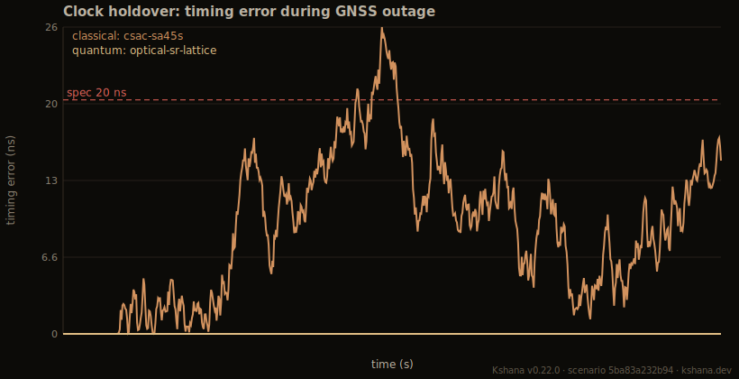
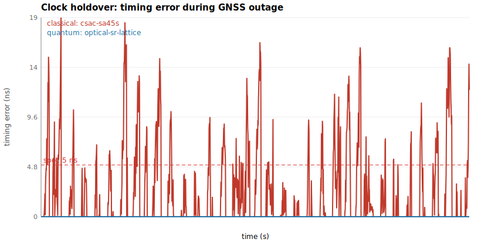
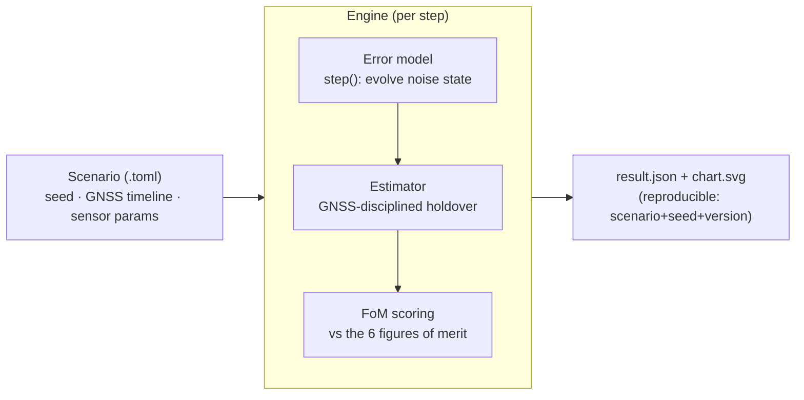
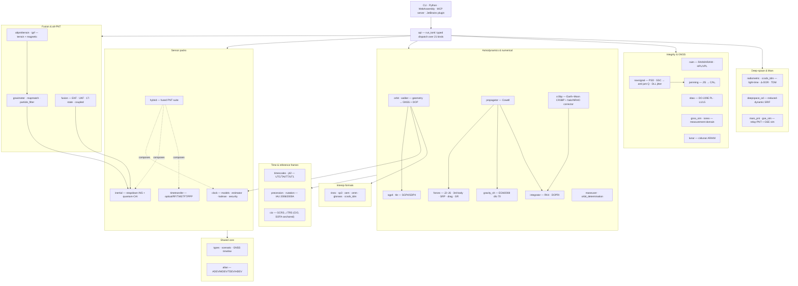
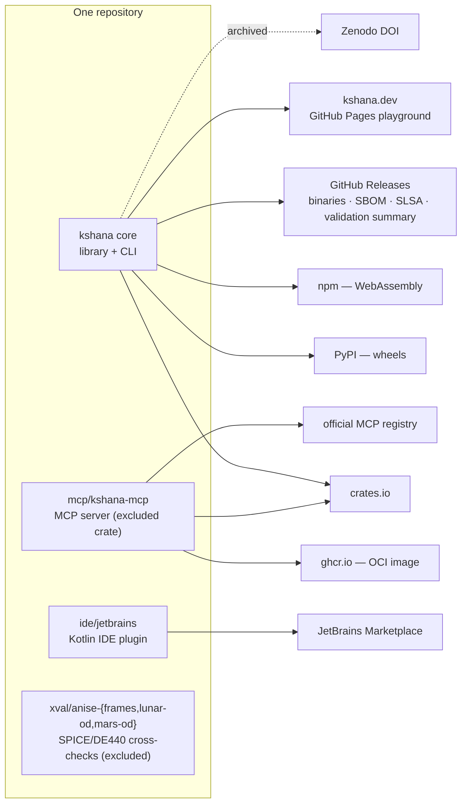

<p align="center">
  
</p>

<h1 align="center">Kshana</h1>

<p align="center">
  <strong>क्षण</strong> — Sanskrit for <em>the precise instant</em>, the smallest measure of time.<br>
  Open, reproducible PNT-resilience simulation with published quantum-sensor performance models.
</p>

<p align="center">
  <a href="https://ashfordeou.github.io/kshana/"></a>
  <a href="tests/sgp4_verification.rs"></a>
  <a href="https://github.com/ashfordeOU/kshana/actions/workflows/ci.yml"></a>
  <a href="https://github.com/ashfordeOU/kshana/actions/workflows/ci.yml"></a>
  <a href="https://github.com/ashfordeOU/kshana/releases"></a>
  <a href="https://plugins.jetbrains.com/plugin/32181-kshana--pnt-simulator"></a>
  <a href="LICENSE"></a>
  <a href="Cargo.toml"></a>
  <a href="https://doi.org/10.5281/zenodo.20528627"></a>
</p>

<p align="center">
  <strong>Kshana</strong> (क्षण, Sanskrit: <em>"the precise instant"</em>) is an open, reproducible
  <strong>PNT-resilience simulator with quantum-sensor performance models</strong> —
  positioning, navigation, and timing. It compares quantum and classical sensors mostly
  from published Allan/noise-budget coefficients, with a first-principles cold-atom-
  interferometer accelerometer layer (Mach–Zehnder phase, quantum projection noise,
  contrast decay, and vibration coupling) that <em>derives</em> the noise coefficient
  rather than looking it up; it is not yet a full quantum-physics simulator (Coriolis and
  light-shift systematics remain coefficient-level — see
  <a href="docs/QUANTUM.md">docs/QUANTUM.md</a> and
  <a href="docs/QUANTUM-MODELS.md">docs/QUANTUM-MODELS.md</a>).
</p>

It quantifies, in hard and reproducible numbers, what quantum clocks, quantum
inertial sensors, and optical time-transfer buy a navigation system over classical
PNT — scored against the operational figures of merit that matter for resilient
navigation. Every result is reproducible from `scenario + seed + engine version`,
and every sensor parameter is traceable to a published source — consolidated in one
citable table in [`docs/PROVENANCE.md`](docs/PROVENANCE.md).

*Free and open source under Apache-2.0, professionally developed and maintained by
Ashforde OÜ — commercial support, integration, and proprietary extensions available.*

> **Status: v0.17.0 · a simulation substrate, not yet a product.** A validated,
> fully reproducible engine spanning the PNT stack — orbit geometry and constellation
> design, a numerical (Cowell) propagator with a six-perturbation force model, maneuver
> and trajectory design, time systems, inertial navigation (incl. map-aided and
> gravity-map-matching alt-PNT), GNSS/INS fusion (loose, tight, UKF, coupled
> clock+position, 17-state), orbit determination, ARAIM integrity, clocks, advanced
> time-and-frequency transfer, the GNSS measurement domain, resilience (jamming +
> multi-layer spoofing), and an open **deep-space / Mars radiometric navigation**
> engine (light-time + Shapiro, CCSDS-TDM, reduced-dynamic SRIF, one-/two-way fusion).
> Honest by design: every figure of merit is labelled *validated* or *not-modeled*, and
> optical-clock figures are space goals on ground hardware (no strontium optical clock has flown).
>
> **Validation ladder** (maturity is *not* uniform across domains — and saying so is the point):
> | Domain | Tier |
> |---|---|
> | Earth PNT (orbit, frames, time, clocks, IMU, integrity) | **Real-data validated** — ESA SP3 (Galileo 0.13 m, Swarm-A 0.10 m), NIST SP1065, SOFA/ERFA, heritage vectors |
> | Deep-space / Mars navigation | **Simulation-validated** — synthetic closed-loop OD + analytic self-consistency; Sun-central dynamics cross-checked vs JPL **DE440** (137 m @ 1-day arc) |
> | Real-mission deep-space OD | **Roadmap** — pending real DSN/ESTRACK tracking-data validation |
>
> Deep-space figures (Mars-LMO OD ≈ 0.2 m; relay-PNT orbiter 0.4 m / rover 5.1 m) are **simulation / covariance figures of merit**, not real-mission results.
> See **[Capabilities](#capabilities)** for what it does, **[What it is / is not](#what-it-is--is-not)**
> for scope, and [`docs/CAPABILITY.md`](docs/CAPABILITY.md) / [`docs/VALIDATION.md`](docs/VALIDATION.md)
> for per-capability maturity. The overclaim closure ledger
> [`docs/CLAIMS-VS-REALITY.md`](docs/CLAIMS-VS-REALITY.md) tracks every historical overclaim,
> how it was resolved, and a CI guard (`tests/no_overclaims.rs`) that keeps it resolved.

> **Try it in your browser:** the [playground](web/) runs the engine client-side as
> WebAssembly — pick a scenario, edit the parameters, and see the result, with nothing
> uploaded. Build it locally with `./web/build.sh` (see [`web/README.md`](web/README.md)),
> or publish it to GitHub Pages via the `pages` workflow.

> **New to this?** In plain terms: GPS-style satellite signals tell things *where they
> are* and *what time it is*. When those signals are lost (jammed, blocked, or out of
> view in space), a system has to keep going on its own onboard clock and motion
> sensors — and they slowly drift. "Quantum" clocks and sensors drift far more slowly.
> Kshana measures, in honest numbers, **how much longer a quantum-equipped system can
> coast** before it exceeds its accuracy limits. New readers should start with the
> [plain-language primer](docs/CONCEPTS.md) and the [glossary](docs/GLOSSARY.md).

---

## Contents

- [Why](#why) · [What it is / is not](#what-it-is--is-not) · [Capabilities](#capabilities) · [Results](#results)
- [Install & build](#install--build) · [Usage](#usage) ([Python](#python), [WebAssembly](#webassembly))
- [Scenario format](#scenario-format) · [Output](#output) · [Architecture](#architecture)
- [Repository layout](#repository-layout) · [Validation & honesty](#validation-reproducibility--honesty)
- [Documentation](#documentation) · [FAQ](#faq) · [Troubleshooting](#troubleshooting)
- [Roadmap](#roadmap) · [Contributing](#contributing) · [Citing](#citing) · [Versioning & releases](#versioning--releases) · [License](#license)
- [Support & professional services](#support--professional-services) · [References](#key-references)

## Why

Resilient PNT depends on holding position and time when GNSS is denied or jammed.
Quantum sensors promise far slower drift during those outages. There is no good
**open** tool to quantify that advantage honestly and reproducibly — so primes,
agencies, and labs each rebuild private one-offs. Kshana aims to be the neutral,
citable reference for exactly this question.

The engine knows nothing about "quantum" vs "classical": each sensor is an
**error model** plugged into a common pipeline, so a quantum and a classical
device are compared *apples-to-apples* on the same scenario, with independent
noise realizations.

## What it is / is not

**It is:** a deterministic, dependency-light engine spanning the PNT stack — orbit
geometry, inertial navigation, GNSS/INS fusion, integrity, clocks, and timing. It
runs a scenario (often a GNSS outage), evolves calibrated sensor error models
through the appropriate estimator, and scores the result against the operational
figures of merit — emitting a reproducible JSON result and an SVG chart, from a
Rust library, a CLI, a Python extension, an in-browser WebAssembly module, a
**Model Context Protocol (MCP) server** for AI agents, or a **JetBrains IDE plugin**.

**It is not:** flight hardware, a quantum-payload design, a full GNSS signal
receiver, or a certified avionics product. Quantum-hardware fidelity comes from
published error models, not from this tool. The granular maturity of each
capability is documented in [`docs/CAPABILITY.md`](docs/CAPABILITY.md).

**It is not (yet):** a *full* atom-interferometry physics engine (most quantum sensors
consume published Allan/noise-budget coefficients; the CAI accelerometer has a
first-principles layer — Mach–Zehnder phase, projection noise, contrast decay, and
vibration coupling — but Coriolis and light-shift systematics remain a **P2** roadmap
layer, see [`ROADMAP.md`](ROADMAP.md) and [`docs/QUANTUM-MODELS.md`](docs/QUANTUM-MODELS.md));
a full GNSS *signal-acquisition* receiver (it now solves a single-point **PVT** position
fix from real RINEX code observations — validated on real IGS data — but does **not**
acquire or track raw signal); or a full mission-design suite (it has Lambert / porkchop /
maneuver / orbit-determination building blocks, but is the performance-simulation layer
*above* GMAT/Orekit, not a replacement). Owning this scope is deliberate. If you need first-principles cold-atom
interferometer error budgets (e.g. CARIOQA-PMP-grade or X-37B-style validation), see
the P2 roadmap and [get in touch](#support--professional-services) to collaborate.

## Capabilities

| Domain | Capability |
|--------|------------|
| **Orbit & geometry** | SGP4/SDP4 propagation (validated to 4.12 mm against all 666 AIAA 2006-6753 vectors); real two-line elements (a committed, date-stamped Celestrak `gps-ops` snapshot) or synthetic Walker-delta constellations whose mean elements realise the `i:T/P/F` formula to under 1 km over a 24 h propagation; multi-constellation visibility, dilution of precision, and GNSS availability; a gradient-free constellation-design optimiser, streets-of-coverage minimum-satellite sizing, a multi-constellation comparison tool, and a Walker **design sweep** that tabulates coverage / PDOP / revisit-time over a planes × satellites grid and reports the Pareto-optimal designs. |
| **Numerical propagator** | A **Cowell** numerical propagator (`src/propagator.rs`) complementing the analytic SGP4/SDP4 path, with a hierarchical **six-perturbation** force model (`src/forces.rs`): two-body + the full **J2–J6 zonal** field (the exact analytic gradient of its disturbing potential), an optional **EGM2008 tesseral spherical-harmonic geopotential to degree/order 70** (`src/gravity_sh.rs`; real NGA coefficients, Holmes–Featherstone normalized-Legendre recurrence, cross-checked against the closed-form Legendre functions and the analytic ∇V identity), **epoch-driven Sun and Moon third-body** gravity (a built-in low-precision ephemeris, no DE/SPK kernel), **solar-radiation pressure** (cannonball model with a conical umbra+penumbra shadow), **atmospheric drag** (Vallado piecewise-exponential density, co-rotating atmosphere), the **post-Newtonian Schwarzschild relativistic correction**, and the **Lense–Thirring frame-dragging** term (IERS 2010 §10, linear in Earth's angular momentum, ~1–2 orders below Schwarzschild) — driven by a choice of two adaptive integrators (RK4 step-doubling or the **Dormand–Prince RK5(4)** embedded pair). Validated against analytic truth stronger than a cross-tool would give: the unperturbed orbit matches the exact universal-variable Kepler solution to **sub-metre over 24 h**, energy/angular-momentum conserve to ~1e-9, and each perturbation matches a hand-derived closed-form signature. |
| **Maneuvers & trajectory design** | Impulsive ΔV nodes with 6×6 covariance propagation (ECI / LVLH execution-error frames), finite-burn integration checked against the closed-form **Tsiolkovsky** rocket equation to < 0.01 %, an **Izzo-2015** single-revolution **Lambert** solver, an exact universal-variable **Kepler** propagator, and a **porkchop** (launch × arrival) C3 / arrival-V∞ sweep emitted as a JSON contour grid — the performance-simulation layer above GMAT/Orekit, with every Lambert output round-tripped against two-body truth and the porkchop minimum checked against the analytic Hohmann floor. |
| **Time systems & reference frames** | IERS leap-second **UTC / TAI / TT / UT1** scales, a Julian-date API, the IAU-2000 **Earth Rotation Angle**, GMST-based **TEME ↔ ECEF** with WGS-84 geodetic frames, IAU 2006 precession (Fukushima–Williams), full **IAU 2000A/2000B nutation**, IERS **polar motion**, and the equinox-free **CIO-based IAU 2006/2000A GCRS↔ITRS** reduction — all validated **bit-for-bit** against the SOFA/ERFA vectors, and **independently cross-checked against ANISE** (the pure-Rust NAIF/SPICE reimplementation): kshana's GCRS→ITRS vs ANISE's ITRF93 from JPL's `earth_latest_high_prec.bpc`, the same IERS Earth-orientation parameters fed to both, agree to **≤ 0.86 m on the ground / ≤ 3.6 m at GNSS orbit** (max 0.028″) across eight epochs 2020–2023. |
| **Inertial** | Three-axis strapdown INS — quaternion attitude, WGS-84 NED mechanization, coning/sculling compensation, and a deterministic IMU error model (scale-factor, misalignment, g-sensitivity, quantization, drift); a **first-principles cold-atom-interferometer accelerometer** (Mach–Zehnder phase, quantum projection noise, contrast decay, vibration coupling) that *derives* the velocity-random-walk coefficient; and a sequential-importance-resampling **particle filter** for map-aided (terrain-/gravity-referenced) GPS-denied navigation. |
| **Alt-PNT (GPS-denied)** | A cold-atom **gravimeter measurement model** whose white-noise floor (`σ = ASD/√τ`) is derived from the CAI accelerometer physics; a low-degree, fully-normalised **spherical-harmonic gravity-anomaly field** (validated against the closed-form Legendre functions and a hand-derived single-term anomaly) plus synthetic mascons; and a **gravity-map-matching particle filter** that recovers a GPS-denied track from the anomaly sequence it flies through. It extends to **terrain-referenced navigation** (TERCOM/SITAN against an SRTM `.hgt` DEM, `src/altpnt/terrain.rs`), an **IGRF-14 geomagnetic main field** to degree/order 13 (`src/igrf.rs`, validated against the tilted-dipole closed form and ∇V finite differences), and a **combined gravity + magnetic + terrain** navigator that fuses all three scalar channels through one particle filter (information is additive — no channel makes the fix worse). A **60-minute GPS-denied benchmark** (a ~700 km / one-hour outage where the inertial solution drifts to ~70 km) is recovered to **~145 m (< 500 m)** by a hierarchical coarse-to-fine matcher — the ESA NAVISP *Quantum Wayfarer* target. |
| **Fusion** | Loosely-coupled 15-state GNSS/INS error-state EKF with closed-loop feedback (the `gnss-ins` pack); a **tightly-coupled** pseudorange update that keeps correcting with fewer than four satellites; a coupled **clock + position** filter; a general **unscented (sigma-point) Kalman** estimator for strongly nonlinear measurements; a tightly-coupled GNSS/INS **UKF navigator** (pseudorange + Doppler) whose force-model orbital coast is validated to **0.77 m RMS** over a 30-minute curving LEO pass that includes a 120-second GNSS outage; and a full **17-state tightly-coupled GNSS/INS UKF** (position, velocity, attitude error, accelerometer and gyro biases, clock bias and drift) whose **quantum-CAI dead-reckoning** coasts a 120-second outage on the cold-atom accelerometer's derived velocity-random-walk. |
| **Orbit determination** | Recovery of an orbital state `[r, v]` from ground-station range tracking, composing the two-body + J2 force model and RK4 integrator with a **Gauss–Newton batch** corrector (`determine_orbit_batch`, sub-metre / mm·s⁻¹ from noiseless ranges, ~2 m at a 5 m noise floor) and a **sequential** unscented-filter variant (`determine_orbit_sequential`). |
| **Lunar & cislunar** | An Earth–Moon **circular restricted three-body (CR3BP)** propagator in the rotating frame — conserved Jacobi constant and all five Lagrange points (`src/cr3bp.rs`) — now with a **6×6 state-transition matrix and a single-shooting differential corrector** (`cr3bp_jacobian`, `propagate_state_stm`, `differential_correct_halo`) that produces genuinely periodic **halo / NRHO** orbits: the STM is validated against finite differences, corrected orbits close to machine precision, and seeding the published apolune state reproduces the **L2 southern 9:2 NRHO** (the Gateway orbit) at period ≈ 6.57 d / perilune ≈ 3,250 km, consistent with the published ≈ 6.56 d / ≈ 3,370 km (a CR3BP — circular, Sun-free — solution, **not** validated against a real LANS/Gateway ephemeris; the selenocentric MCI/MCMF transform of the corrected orbit is a follow-on); plus **LunaNet / LNIS** cislunar PNT geometry (MCI↔MCMF reduction, selenographic coordinates) with a **lunar south-pole ARAIM** pass that honestly surfaces the integrity gap: a ~30 m σ_URE drives the protection level well above a 50 m alert limit (`src/lunar.rs`, `scenarios/lunanet-araim.toml`). |
| **Deep-space & Mars PNT** | An open **radiometric navigation engine**: iterative light-time + **Shapiro** relativistic delay, two-/one-/three-way **Doppler & range** (Moyer two-leg), coherent transponder turnaround ratios, regenerative/PN ranging (CCSDS 414), and **Δ-DOR** plane-of-sky (CCSDS 506), with solar-plasma/tropo/iono media; **CCSDS-TDM (503)** tracking-data-message parse + emit; a **reduced-dynamic Square-Root Information Filter** (RTN empirical accelerations + a 3-state onboard clock + Mars atmospheric drag) that does **Mars-LMO orbit determination to ≈ 0.2 m** in a synthetic closed loop; a joint **one-way + two-way fusion** estimator; a multi-body dynamics core (`Body{μ, re, zonals, gravity, IAU-pole}`, Mars GMM-3 gravity, an IAU body-fixed Mars frame, a pluggable `EphemerisProvider` seam, two-part Julian dates + TT↔TDB); and the **`mars-pnt`** relay-PNT scenario (a MARCONI areostationary relay constellation) with an end-to-end **GSE performance simulator** (geometry → link budget → observables → SRIF → covariance). **Simulation-validated** (covariance / closed-loop figures of merit); the Sun-central Mars dynamics are cross-checked against JPL **DE440** (137 m @ 1-day arc, `xval/anise-mars-od`). Real DSN/ESTRACK tracking-data validation is on the roadmap. |
| **Integrity** | Snapshot and solution-separation (ARAIM-style) RAIM with horizontal/vertical protection levels (HPL/VPL), fault detection & exclusion, and Stanford integrity diagrams; an explicit integrity-risk-budget (**MHSS**) protection level, including the **dual-/multi-constellation constellation-wide fault mode** (EU ARAIM / DO-316), exercised on a real GPS + Galileo snapshot (`scenarios/araim-gps-galileo.toml`). |
| **Augmentation (SBAS)** | **SBAS / WAAS protection levels** in the DO-229E weighted-least-squares form (precision-approach and en-route K-factors) and the **L1/L5 dual-frequency ionosphere-free** combination (IS-GPS-705, γ₁₅ ≈ 1.793) that underpins DO-316 — `src/sbas.rs`, with the protection-level geometry cross-checked against a NumPy `inv(GᵀG)` reference. |
| **Clock & timing** | Two-state Kalman holdover (Joseph-form covariance, NIS/NEES consistency health); Allan-family stability (ADEV / MDEV / TDEV / HDEV) with noise-type-specific confidence intervals and a full **IEEE-1139 five-coefficient power-law fit**; geometric corrections (Sagnac, GNSS common-view); and the operational transfer methods — **TWSTFT** with the BIPM Sagnac closed form, **GNSS common-view**, **PPP** ionosphere-free time transfer, a free-space **optical** link with turbulence scintillation, and an inverse-variance **clock-ensemble (paper) timescale** below the best contributing clock. A **GNSS-denied clock-holdover calculator** (`src/holdover.rs`) exposes the closed-form van-Loan coast-error growth as a *holdover-to-threshold* inversion — how long a clock free-runs before its timing error exceeds budget — across representative classical and quantum-clock classes; **modelled** (cross-checked against the multi-step `clock_state` covariance recursion), and honest that for a very stable clock the holdover to a tight threshold is set by the *assumed* long-tau noise floor, not the cited ADEV. |
| **GNSS measurement domain** | Forward pseudorange / Doppler synthesis with **Klobuchar** (broadcast) and **IONEX / TEC-grid** (measured) ionosphere — including an IONEX file parser, time interpolation between maps, and the thin-shell slant-obliquity mapping — **Saastamoinen + Niell** troposphere, and snapshot RAIM (HPL/VPL). |
| **Resilience** | Link-budget **jamming** (J/S → effective C/N₀ → loss of lock, with the anti-jam spectral-separation factor `Q` now **derived from the actual signal and jammer power spectra** via `src/navsignal.rs` — `Q = 1/(R_c·κ)`, cross-checked in CI against the previous representative constant); a stochastic **time-spoof detector** (Neyman–Pearson / χ²₁ energy test with closed-form and Monte-Carlo P_fa/P_md and a Security FoM of 1 − P_md); and a **multi-layer spoof detector** fusing a RAIM-consistency parity test (with the common-mode blind spot modelled honestly), an RF AGC-power monitor, and a signal-quality (SQM early-minus-late) monitor; and a **quantum-inertial dead-reckoning error budget** (`QuantumNavBudget`, `src/inertial/quantum_imu.rs`) composing the cold-atom-interferometer white-noise velocity-random-walk with residual bias (cross-checked against the independent `AccelModel` integrator) and scale-factor error into a position-drift-over-holdover figure — the inertial twin of the clock holdover. |
| **Nav-signal & code tracking** | The **signal level** between the link budget and the measurement domain (`src/navsignal.rs`): unit-area **power spectral densities** for **BPSK-R(n)** and **sine-BOC(m,n)**; the **spectral-separation coefficient** κ = ∫ G_s·G_i df, which **derives the anti-jam `Q`** the jamming model uses (`Q = 1/(R_c·κ)`) from the actual signal/jammer spectra instead of a representative constant; the **RMS (Gabor) bandwidth** (BOC > BPSK — the ranging-information / Cramér–Rao measure); the **coherent early–late DLL code-tracking thermal-noise jitter** (Kaplan & Hegarty; ~sub-metre for C/A at 45 dB-Hz); and the **multipath error envelope** (coherent EML — narrow-correlator suppression). Validated against closed-form anchors (BPSK self-SSC = 2/(3·R_c), unit-area PSDs, sub-metre C/A jitter). This is signal-**performance** analysis, **not** antenna / RF-payload hardware design (a payload partner's role). |
| **Interoperability** | **RINEX-3** multi-GNSS broadcast-ephemeris ingestion (GPS, Galileo, QZSS, BeiDou MEO/IGSO via IS-GPS-200; GLONASS via PZ-90 state-vector RK4) usable as a constellation source (RINEX in, PNT geometry out); a **RINEX-3/4** observation parser (pseudorange, carrier phase, Doppler, signal strength) that now **feeds a single-point-positioning solver** (`pvt`) — real code observations in, a real **receiver position** out, validated on IGS data; an **SP3-c/d** precise-ephemeris reader/writer with 9th-order Lagrange interpolation; and **CCSDS OEM 2.0 + OMM** (mean-elements) export for flight-dynamics tools (GMAT, Orekit, STK); and **CCSDS-TDM (503)** tracking-data-message parse + emit for deep-space radiometric tracking. |

Each capability is reachable as a Rust API, a runnable scenario `kind`, or both.
Maturity per capability — *validated*, *runnable*, or *library* — is tracked in
[`docs/CAPABILITY.md`](docs/CAPABILITY.md). A **machine-checked verification matrix**
(`src/verification.rs`) renders the requirement → module → test → oracle → status
cross-reference, with unit-tested honesty invariants that permit a *validated* label
only where an independent **external** oracle backs it — and that record the
hardware/PA capabilities Kshana deliberately does **not** provide.

## Results

Each scenario compares a quantum sensor against its classical counterpart through a
~1.8 h GNSS outage. Numbers are reproducible (`scenario + seed + version`).

<p align="center">
  
  <br><em>Dead-reckoning position error during a GNSS outage: the quantum sensor (blue)
  stays flat near the spec; the classical sensor (red) diverges to tens of kilometres.
  Generated by Kshana from <code>scenarios/imu-deadreckoning.toml</code>.</em>
</p>

| Pack | Scenario | Quantum | Classical |
|------|----------|---------|-----------|
| **1 — Clock holdover** | `clock-holdover.toml` (20 ns spec) | optical clock holds the full outage | CSAC breaches the spec mid-outage |
| **2 — Inertial dead-reckoning** | `imu-deadreckoning.toml` (100 m spec) | cold-atom: **~41 m**, holds full outage | nav-grade: breaches in **~350 s** → tens of km |
| **3 — Time transfer** (optical inter-satellite link) | `timetransfer.toml` | optical: **~0.3 mm** ranging | RF (TWSTFT): **~150 mm** ranging |
| **4 — Hybrid fusion** (capstone) | `hybrid-pnt.toml` | full position+timing for the whole outage | **position-limited at ~350 s** |

The capstone shows the fusion thesis: optical inter-satellite time-transfer keeps even
a classical *clock* locked, isolating the *inertial* sensor as the classical suite's
weak link — i.e. quantum inertial + optical timing together.

<p align="center">
  
  <br><em>Clock holdover through a GNSS outage: the optical clock (blue) stays inside the
  20 ns spec for the full coast; the chip-scale clock (red) breaches it part-way.
  Generated by Kshana from <code>scenarios/clock-holdover.toml</code>.</em>
</p>

A further scenario, `orbit-gnss-challenged.toml`, derives GNSS availability from
**orbital geometry** rather than hand-authored windows: a spacecraft inside the GNSS
shell is propagated against a GPS-like Walker constellation, and the visible-satellite
count (line-of-sight, Earth-occultation, elevation mask) sets the fix state at each
step. Over a day the user is in fix only ~59% of the time; the quantum clock holds a
5 ns timing solution through every gap (availability **1.0**), the chip-scale clock
only **~0.83**.

<p align="center">
  
  <br><em>GNSS availability derived from orbital geometry: the visible-satellite count
  (line-of-sight, Earth-occultation, elevation mask) sets the fix state at each step,
  so the clock must coast every gap. Generated by Kshana from
  <code>scenarios/orbit-gnss-challenged.toml</code>.</em>
</p>

The constellation can also be given as real two-line element sets. A *full* TLE
(line 1 + line 2) is propagated with the full **SGP4/SDP4** model — including
atmospheric drag and the deep-space lunar-solar and 12 h / 24 h resonance terms that
matter for ~12 h GNSS orbits — validated against the official AIAA 2006-6753 vectors
to a worst-case ≈ 4 mm. `scenarios/orbit-sgp4-gps.toml` ships a **real Celestrak
`gps-ops` snapshot** of the operational GPS constellation (2021-07-28, 30 satellites)
and requires valid TLE checksums — two-line element sets are open data from the US
Space Force / 18th Space Defense Squadron catalogue, redistributed by Celestrak
(Dr T. S. Kelso, [celestrak.org](https://celestrak.org)); refresh with
`scripts/fetch_tles.sh`. A line-2-only block keeps
the analytic two-body propagation (`scenarios/orbit-real-tle.toml`); the two forms can
be mixed in one constellation. A constellation can equally be built from a block of
**RINEX-3 GPS broadcast-ephemeris** records — the format a receiver decodes —
propagated by the IS-GPS-200 user algorithm and fed through the same geometry
(`scenarios/orbit-rinex.toml`).

## Install & build

Requires a Rust toolchain (≥ 1.75; developed on 1.93).

```bash
git clone https://github.com/AshfordeOU/kshana
cd kshana
cargo build --release
cargo test          # all tests pass
```

## Usage

Run any scenario; the CLI dispatches on the scenario's `kind` field and writes a
`<scenario>.result.json` and a `<scenario>.chart.svg` next to it:

```bash
cargo run -- scenarios/clock-holdover.toml
cargo run -- scenarios/imu-deadreckoning.toml
cargo run -- scenarios/timetransfer.toml
cargo run -- scenarios/hybrid-pnt.toml
cargo run -- scenarios/orbit-gnss-challenged.toml
cargo run -- scenarios/orbit-sgp4-gps.toml
cargo run -- scenarios/orbit-rinex.toml
cargo run -- scenarios/integrity-raim.toml

# Export a propagated constellation to an SP3-c precise-ephemeris file:
cargo run -- scenarios/orbit-sgp4-gps.toml --export-sp3 gps.sp3

# Export the constellation's mean elements to a CCSDS OMM catalogue (one OMM
# message per TLE-defined satellite, with its real NORAD id / COSPAR designator):
cargo run -- scenarios/orbit-sgp4-gps.toml --export-omm gps.omm

# Export the velocity-carrying state to a CCSDS OEM 2.0 ephemeris (GMAT/Orekit/STK):
cargo run -- scenarios/orbit-sgp4-gps.toml --export-oem gps.oem
```

**Interoperability role.** Kshana is the *performance-simulation* layer that sits
alongside the post-processing toolchain, not a replacement for it: feed its **RINEX**
output into RTKLIB or gLAB for a position solution, and use its **SP3** output as a
precise-orbit product for tools like Ginan — Kshana answers *what resilience a given
PNT architecture buys* before you have real signals, in formats those tools already
ingest (`--export-sp3`, or `export_sp3 = true` in an `orbit` scenario, writes
`<scenario>.sp3`). The same orbit can be published as standards-track **CCSDS OMM**
mean elements (`--export-omm`, or `export_omm = true`, writes `<scenario>.omm`) —
one OMM 502.0 KVN message per TLE-defined satellite, carrying each object's real
NORAD catalogue number, COSPAR international designator, and epoch, for any
OMM-aware consumer instead of a bespoke two-line element set.

Example output (clock holdover — note the Integrity and Security figures of merit):

```
scenario c827e5d40d25 | quantum holdover 6600s p95 0.0ns integrity 1.000 security 0.997 | classical holdover 2610s p95 19.7ns integrity 1.000 security 0.000
wrote scenarios/clock-holdover.result.json and scenarios/clock-holdover.chart.svg
```

The optical clock's tight detection floor keeps `security 0.997`; the chip-scale
clock's own noise over the monitoring window exceeds the 20 ns spec, so it has no
spoof-detection margin (`security 0.000`). The orbit scenario additionally reports a
geometry block — fraction of samples with a fix, and best/median PDOP and position
accuracy — alongside the clock result.

> **Read these two numbers carefully.** `security` is an *analytic spoof-detectability
> bound* derived from each clock's stability — it is meaningful only against a
> configured spoofing scenario and is **not** a multi-satellite RAIM detector. `integrity`
> here is the filter's *self-consistency* (fraction of outage samples inside its own k-sigma
> bound), **not** an aviation HPL/VPL integrity figure. See
> [`docs/INTEGRITY.md`](docs/INTEGRITY.md).
>
> For genuine receiver-autonomous integrity, the **`integrity` scenario kind**
> (`scenarios/integrity-raim.toml`) runs real snapshot and solution-separation
> (ARAIM-style) RAIM over the propagated constellation geometry: it computes
> horizontal/vertical **protection levels (HPL/VPL)** per epoch and reports the
> fraction of epochs that meet the configured alert limits, with a Stanford
> integrity diagram for error-vs-PL classification.

### Python

An optional Python extension (PyO3, abi3) wraps the same engine. Build and install
it with [maturin](https://www.maturin.rs/):

```bash
pip install maturin
maturin develop --features python   # or: maturin build --features python
```

```python
import json, kshana

result = json.loads(kshana.run(open("scenarios/clock-holdover.toml").read()))
print(result["quantum"]["fom"]["integrity"])

# json, svg, and a one-line summary at once:
result_json, chart_svg, summary = kshana.run_full(open("scenarios/orbit-gnss-challenged.toml").read())
print(kshana.version(), summary)
```

Wheels are built for Linux, macOS, and Windows by the `wheels` workflow on each
release tag.

### WebAssembly

The engine also runs in the browser via [wasm-pack](https://rustwasm.github.io/wasm-pack/):

```bash
wasm-pack build --target web -- --features wasm
```

```js
import init, { run, chart_svg, version } from "./pkg/kshana.js";
await init();
const result = JSON.parse(run(tomlText));
console.log(version(), result.classical.fom.timing_p95_ns);
```

### AI agents (MCP)

Kshana ships an [MCP](https://modelcontextprotocol.io) server, [`kshana-mcp`](mcp/kshana-mcp/),
so AI assistants and agents can run the **validated** engine instead of guessing the
math — usable from **Cursor, JetBrains AI Assistant / Junie, and any MCP-compatible
assistant or agent**. It exposes `run_scenario`, `list_scenario_kinds`,
`validate_scenario`, `export_sp3`, and `export_omm` (each a thin wrapper over
`kshana::api`).

```bash
cargo install kshana-mcp                          # crates.io
docker run --rm -i ghcr.io/ashfordeou/kshana-mcp  # or OCI, no Rust toolchain
```

Then register `kshana-mcp` in your client's `mcpServers` config — see
[`mcp/kshana-mcp/README.md`](mcp/kshana-mcp/README.md) for per-client snippets. The
server is a standalone, workspace-excluded crate (the `rmcp` SDK is edition 2024), so it
never affects the lean published `kshana` crate or its build.

**In a JetBrains IDE** you can also install the
[**Kshana — PNT simulator**](https://plugins.jetbrains.com/plugin/32181-kshana--pnt-simulator)
plugin from the JetBrains Marketplace (or *Settings → Plugins → Marketplace → search
"Kshana"*) to run scenarios from a right-click — see [`ide/jetbrains/`](ide/jetbrains/).

## Scenario format

Scenarios are declarative TOML. A top-level `kind` selects the pack — **twenty-eight** in
all (`clock` is the default if omitted): `inertial`, `timetransfer`, `hybrid`, `fusion`,
`gnss-ins`, `orbit`, `ephemeris`, `gnss-sim`, `integrity`, `lunar-integrity`, `spoof`,
`spoof-detect`, `jamming`, `sweep`, `sweep-nd`, `gravity-map`, `terrain-nav`,
`combined-altpnt`, `pvt`, `mars-pnt`, `impairment-eval` (AI/ML RF-impairment detection
evaluation testbed — labelled synthetic corpus + detector-agnostic ROC/AUC harness +
in/out-of-distribution optimism gap), `quantum-trade` (quantum-vs-classical PNT
trade with measured-ADEV ingestion + GNSS-denied resilience envelope; MODELLED),
`space-weather` (solar/geomagnetic indices + Jacchia-71 exospheric temperature +
activity-driven thermospheric density over the static atmosphere; MODELLED),
`oem-interop` (CCSDS OEM import/round-trip bridge for GMAT/Orekit/STK ephemerides;
MODELLED), and the mission-analysis trio `launch-window` (two-body launch azimuth /
plane-change / opportunities), `reentry` (Allen-Eggers ballistic re-entry corridor),
and `eo-coverage` (EO swath / GSD / access / revisit geometry) — all MODELLED.
Common fields: `seed`, a `[time]` grid, a `[gnss]` availability timeline (the outage
driver), and per-sensor blocks with `provenance` strings citing the source of every
figure. Example (clock):

```toml
seed = 42
threshold_ns = 20.0
[time]
step_s = 10.0
duration_s = 7200.0
[gnss]
windows = [
  { t0 = 0.0,   t1 = 600.0,  state = "nominal" },  # 10 min GNSS sync
  { t0 = 600.0, t1 = 7200.0, state = "denied"  },  # ~1.8 h outage
]
[clock_quantum]
id = "optical-sr-lattice"
provenance = "Strontium optical lattice clock, space-oriented goal sigma_y(1s)=1e-15 (arXiv:1503.08457)"
y0 = 5.0e-17
q_wf = 1.0e-30   # white FM:  q_wf = sigma_y(1s)^2
q_rw = 0.0       # random-walk FM
drift = 0.0      # linear aging (per second)
[clock_classical]
id = "csac-sa45s"
provenance = "Microchip SA65 / SA.45s CSAC datasheet sigma_y(1s)=3e-10"
y0 = 5.0e-10
q_wf = 9.0e-20
q_rw = 0.0
drift = 0.0
```

Optional fields (off when absent): a clock may add `flicker_floor` (1/f FM Allan
floor); an inertial sensor may add `gyro_bias` and `q_arw` (gyro bias and angular
random walk), and `bias_instability` and `q_aa` (the Allan bias-instability floor and
acceleration random walk) — together a **single-axis (1-DOF) accelerometer error
budget** (VRW/ARW and bias-instability). This is the error budget the shipped
`inertial` scenario *pack* runs. Separately, the library now carries a verified
**3-axis strapdown navigator** (`src/inertial/{attitude,mechanization,imu_errors}.rs`):
quaternion attitude with coning/sculling compensation, a full NED mechanization
(Earth-rate and transport-rate terms, WGS-84 Somigliana gravity), and a
deterministic IMU error model in which **scale-factor, misalignment,
g-sensitivity, quantization, and rate-ramp are modelled** (IEEE Std 952-1997
§A.2; Groves 2013 §4.3). That 3-axis path is now **wired into a runnable
loosely-coupled GNSS/INS pack** (`kind = "gnss-ins"`): a 15-state error-state EKF
disciplines the strapdown solution against noisy fixes while GNSS is up, then
coasts through the outage, reporting the fused horizontal error against the
open-loop free-INS coast. A **tightly-coupled pseudorange** update is also
available (it forms the innovation in the range domain, so it keeps correcting
with fewer than four satellites). A
clock-holdover scenario may add `runs` (> 1) to run a **Monte Carlo ensemble** — each
figure of merit is then reported as a mean with a 5th–95th-percentile spread and the
chart shades the error confidence band (see `scenarios/clock-ensemble.toml`).

A `fusion` scenario (same blocks as `hybrid`) runs **two independent Kalman estimators**
— one for the clock state, one for the position state — disciplined by GNSS and aided by
optical time transfer, and reports a combined holdover FoM. The two blocks share no
cross-covariance: this is a stacked pair of error budgets, **not** a true coupled
clock+position joint filter (cross-block covariance is a roadmap item). See
`scenarios/fusion-pnt.toml`.

A `spoof` scenario injects a time-spoof — one of four `[attack.shape]` kinds
(`linear_ramp`, `step_jump`, `meaconing`, `replay`; a bare `rate_ns_per_s` is still
accepted as a linear ramp) — and runs each clock's spoof detector. The detector is a
two-sided **χ²₁ energy / Neyman–Pearson test** on the clock-aided monitor statistic:
the threshold is set from a target false-alarm budget `target_pfa`, and the
**missed-detection probability `P_md`** is reported both closed-form and by
Monte-Carlo (`mc_runs` trials per hypothesis — the two agree to a few ×1/√N). The
**Security figure of merit is `1 − P_md`** at the operationally-harmful (spec)
magnitude, so a quiet clock that catches a spec-sized spoof scores ≈ 1 and a noisy
one that often misses it scores lower (see `scenarios/spoof-attack.toml`,
`scenarios/spoof-meaconing.toml`).

A `gnss-sim` scenario is a **measurement-domain** simulation: for each visible
satellite it synthesises the pseudorange `ρ = geometric range + c·δt_rx − c·δt_sv +
I + T + noise + multipath` and the L1 Doppler, with the **Klobuchar** single-frequency
ionosphere (`[iono]`, IS-GPS-200 §20.3.3.5.2.5) and the **Saastamoinen** zenith
troposphere projected by the **Niell (1996)** mapping function (`[tropo]`). The
residuals feed **snapshot RAIM** for per-epoch HPL/VPL, and every satellite's
pseudorange, Doppler, C/N₀, and iono/tropo corrections are emitted in the JSON
`gnss_measurements` array. It is a forward simulator (it generates measurements from
a known truth), not a receiver/solver — a zero-noise run reproduces geometry plus the
corrections to sub-millimetre (see `scenarios/gnss-sim-raim.toml`).

A `jamming` scenario models RF interference as a **link budget**: a `[jammer]`
(ECEF position, transmit `power_dbw`, type) raises the jammer-to-signal ratio at a
`[receiver]` watching a Walker `[constellation]`. From the geometry (free-space
path loss and the per-direction receive-antenna gain) it computes each satellite's
`J/S`, the **effective C/N₀** via the standard anti-jam equation (despreading
processing gain × the spectral-separation factor `Q`; Kaplan & Hegarty §9.4), and
flags loss of lock below a configurable tracking threshold — reporting an
`availability_under_jamming` figure of merit. A 10 W broadband jammer at 1 km
denies the receiver entirely (J/S ≈ 72 dB); the same jammer at 100 km only
degrades the links (see `scenarios/jamming-demo.toml`).

A `sweep` scenario runs a **trade study**: it varies one `parameter` (`threshold_ns`,
`duration_s`, `quantum_q_wf`, or `classical_q_wf`) from `start` to `stop` over `steps`
points on a `lin` or `log` `scale`, records a `metric` (e.g. `holdover_s`) for both
clocks, and charts the two curves. The base scenario goes under `[base]` (see
`scenarios/sweep-clock-stability.toml`).

A `sweep-nd` scenario generalises this to **any pack and any number of axes**: it
varies dotted TOML keys of a `[base]` scenario (of any `kind`) over the Cartesian
product of `[[axes]]`, re-runs each grid node, and records `metrics` given as
dotted JSON paths into the result (e.g. `classical.fom.holdover_s`). It works for
every pack because it operates at the TOML/result boundary; native runs evaluate
the grid in parallel (no extra dependency, wasm falls back to sequential) and the
output is deterministic and row-major (see `scenarios/sweep-nd-inertial.toml`).

An `orbit` scenario derives the `[gnss]` timeline from geometry instead of authoring
it — give a `[user]` orbit, a `[constellation]`, an elevation `mask_deg`, and the two
clock blocks. It also reports position accuracy from the satellite geometry; the
optional `sigma_uere_m` (1-sigma user-equivalent range error, default 1 m) scales the
position dilution of precision into a position sigma. The user orbit may be made
**eccentric** with `eccentricity` and `argp_deg`, and `j2 = true` adds Earth-oblateness
secular drift (see `scenarios/orbit-molniya.toml`). The constellation can instead be a
**real one**: give `[constellation]` a `tle` block of two-line element sets and the
satellites are parsed from it (see `scenarios/orbit-real-tle.toml`). Add one or more
`[[constellations]]` blocks for **multi-GNSS** (e.g. GPS + Galileo; see
`scenarios/orbit-multignss.toml`):

```toml
kind = "orbit"
seed = 7
threshold_ns = 5.0
mask_deg = 10.0
sigma_uere_m = 1.0           # optional; position sigma = position-DOP * this
[time]
step_s = 60.0
duration_s = 86400.0
[user]                       # spacecraft (altitude in km, angles in deg)
altitude_km = 8000.0
inclination_deg = 0.0
[constellation]              # Walker-delta GNSS (GPS-like)
altitude_km = 20180.0
inclination_deg = 55.0
planes = 6
sats_per_plane = 4
phasing_f = 1.0
[clock_quantum]  # ... as above
[clock_classical]  # ... as above
```

The **GPS-denied alt-PNT** kinds navigate with no GNSS at all, matching a measured field
sequence against a map through a particle filter. A `gravity-map` scenario flies a track
through a spherical-harmonic gravity-anomaly field and recovers it from a cold-atom
gravimeter's reading (`scenarios/gps-denied-gravity-nav.toml`); a `terrain-nav` scenario
does the same against an SRTM elevation DEM (TERCOM/SITAN, `scenarios/terrain-nav.toml`);
and a `combined-altpnt` scenario fuses **gravity + IGRF magnetic + terrain** in one filter
(`scenarios/combined-altpnt.toml`).

A `lunar-integrity` scenario evaluates **cislunar** PNT: it runs a lunar south-pole
ARAIM protection-level pass against a LunaNet/LNIS relay set and honestly reports the
integrity gap — a ~30 m lunar σ_URE drives the protection level well above a 50 m alert
limit, so the service is *unavailable* under aviation-style integrity rules
(`scenarios/lunanet-araim.toml`).

See `scenarios/` for one example of every kind.

## Output

The result artifact is versioned, self-describing JSON: per-step time series, the
scored figures of merit, the active model specs (with provenance), the seed, a
**scenario hash** — so any chart can be reproduced from the file — and, for each clock,
an `adev_curve` (`[{tau_s, adev, n_samples, noise, edf, ci_lo, ci_hi}]`): the overlapping
Allan deviation across octave-spaced averaging times — the standard way to read a clock's
stability — now with a **noise-type-specific 95% confidence band** per point (the record's
power-law type is identified from its modified-Allan slope, and the χ² interval uses the
matching NIST SP 1065 effective degrees of freedom). The browser playground renders it as a
log-log "Clock stability (ADEV)" chart. (MDEV, TDEV, and HDEV are available as library
estimators; the exported result curve is the overlapping ADEV.) Every field, with units and a
source pointer, is documented in [`docs/SCHEMA.md`](docs/SCHEMA.md).

**Every chart is self-describing.** The browser playground, the CLI's `*.chart.svg`
export, and the HTML scorecard all stamp each chart image with a footer reading
`Kshana v<version> · scenario <hash> · kshana.dev`. The `scenario <hash>` is the first
12 hex characters of the run's **scenario hash** — a SHA-256 over the canonical scenario
definition (seed, thresholds, model parameters, GNSS windows, …); the integrity and lunar
reports, which carry no hash of their own, fall back to a SHA-256 of the scenario source.
It is the **same fingerprint** shown in the one-line summary and the result JSON, so a
saved or pasted chart always carries its version, the exact scenario that produced it (for
bit-for-bit reproduction), and the source — change any input and the hash changes.

The figures of merit follow the standard operational PNT figures of merit:

| Figure of merit | How Kshana computes it |
|-----------------|------------------------|
| Timing Performance (clock/orbit packs) | clock-phase error RMS + 95th-percentile over the outage, in **nanoseconds** (`timing_rms_ns`) — a timing metric, not position |
| Positioning Performance (inertial/hybrid packs) | 1-DOF position-error RMS + 95th-percentile over the outage, in **metres** (`pos_rms_m`); single-axis. A single run is flagged `monte_carlo: false`; set `runs = N` for a Monte Carlo ensemble that reports each metric's mean, spread, and bootstrap 95% CI. Still **not** a 2-D CEP/2DRMS or DOP-weighted accuracy (those need the 3-axis model — roadmap) |
| Autonomy | holdover duration — time in-spec after GNSS loss (grid-quantised: a lower bound) |
| Resilience | error-growth slope during the outage |
| Availability | fraction of the run with an in-spec solution |
| Integrity | filter **self-consistency** — fraction of outage samples whose error stays inside the Kalman filter's own k-sigma bound. **Not** an aviation HPL/VPL/RAIM integrity figure (see [`docs/INTEGRITY.md`](docs/INTEGRITY.md)) |
| Security | **analytic spoof-*detectability* bound** from clock stability — how small/slow a time-spoof a single-clock consistency monitor could flag. Meaningful only with a configured attack; **not** a multi-satellite RAIM detector |

New to these terms? Each is defined in plain language in the [glossary](docs/GLOSSARY.md).

## Architecture

**One engine, many front doors.** A single Rust core (`kshana`) runs every scenario,
reached through a CLI, a Python extension, an in-browser WebAssembly module, an **MCP
server** for AI agents, and a **JetBrains IDE plugin** — all converging on one
`api::run_toml` dispatch. Inside, the sensor packs plug into a common error-model
interface; alongside them sit a **reference-frame layer** (IAU 2006/2000A
precession–nutation and the CIO-based GCRS↔ITRS reduction), an **astrodynamics/numerical
layer** (analytic SGP4/SDP4 **and** a numerical Cowell propagator with its
EGM2008/perturbation force model, maneuver design, and orbit determination), an
**integrity/GNSS layer** (RAIM/ARAIM, SBAS, the measurement domain, jamming, cislunar),
and a **fusion / alt-PNT layer** (the GNSS/INS estimators and the gravity/terrain/magnetic
map-matchers).

Two standalone, **workspace-excluded** crates sit beside the core — `mcp/kshana-mcp`
(the MCP server, built on the edition-2024 `rmcp` SDK) and `xval/anise-frames` (the
ANISE/SPICE frame cross-check, which pulls MPL-2.0 deps) — kept out of the published
crate's dependency graph, `Cargo.lock`, license gate, and MSRV build by the root
`Cargo.toml` `exclude` list. The JetBrains plugin (`ide/jetbrains`) is a separate Kotlin
project. See [`docs/ARCHITECTURE.md`](docs/ARCHITECTURE.md) for the full set of diagrams.





**Components & distribution.** The core crate ships through the Rust, Python, and
JavaScript ecosystems; the MCP server and IDE plugin reach AI agents and JetBrains IDEs.
Each `vX.Y.Z` tag republishes every channel automatically (see
[Versioning & releases](#versioning--releases)).



## Repository layout

```
kshana/
├── src/                                       # the kshana core crate (library + CLI)
│   ├── api.rs · main.rs · lib.rs              # typed dispatch (21 kinds) + CLI + crate root
│   ├── python.rs · wasm.rs                    # optional PyO3 / wasm-bindgen bindings
│   ├── types.rs · scenario.rs · allan.rs      # shared core (time grid, GNSS timeline, Allan)
│   │
│   ├── models.rs · estimator.rs · kalman.rs   # Pack 1 — clock holdover + integrity
│   ├── security.rs · detection.rs · spoof.rs · spoof_monitors.rs  # spoof detection
│   ├── filter_health.rs · fom.rs · report.rs · chart.rs · run.rs  # health · scoring · output
│   ├── inertial/                              # Pack 2 — strapdown INS (attitude · mechanization · imu_errors · quantum_imu)
│   ├── timetransfer.rs · timetransfer_adv.rs · timegeo.rs  # Pack 3 — TWSTFT/CV/PPP/optical, Sagnac
│   ├── hybrid.rs · ensemble.rs · sweep.rs     # Pack 4 — fused PNT, Monte-Carlo, trade sweeps
│   │
│   ├── timescales.rs · jd2.rs · ephem.rs      # time systems, two-part JD, Sun/Moon ephemeris
│   ├── precession.rs · nutation.rs · cio.rs   # IAU 2006/2000A precession-nutation + CIO GCRS↔ITRS
│   ├── frames.rs · *_data.rs                  # TEME↔ECEF + generated nutation/CIO/EGM2008/IGRF tables
│   │
│   ├── orbit.rs · sgp4.rs · tle.rs · walker.rs   # geometry, SGP4/SDP4, TLE, Walker design
│   ├── propagator.rs · forces.rs · gravity_sh.rs · integrator.rs  # Cowell + perturbations (EGM2008 d/o70, GR) + RK4/DOPRI
│   ├── maneuver.rs · batch_ls.rs · orbit_determination.rs  # burns/Lambert/porkchop, Gauss-Newton, OD
│   ├── cr3bp.rs · lunar.rs                    # Earth–Moon CR3BP + halo/NRHO STM corrector, cislunar/LunaNet ARAIM
│   ├── body.rs · mars_frame.rs · ephem_provider.rs · radiometric.rs · ccsds_tdm.rs  # deep-space: multi-body · Mars frame · ephemeris seam · radiometric obs + CCSDS-TDM
│   ├── deepspace_od.rs · clock_state.rs · mars_atmos.rs · mars_pnt.rs · linkbudget.rs · gse_sim.rs  # SRIF OD · onboard clock · Mars drag · relay-PNT · link budget · GSE sim
│   │
│   ├── fusion/                                # GNSS/INS — EKF · UKF · tightly_coupled(17) · coupled · closed_loop
│   ├── raim.rs · sbas.rs                      # RAIM/ARAIM HPL/VPL, SBAS DO-229E PLs + L1/L5 iono-free
│   ├── gnss_sim.rs · ionex.rs · pvt.rs · jamming.rs  # measurement domain · ionosphere maps · single-point positioning · jamming
│   ├── navsignal.rs                            # nav-signal PSD (BPSK-R/BOC) · spectral-separation → anti-jam Q · DLL code-tracking jitter · multipath envelope
│   ├── gravimeter.rs · igrf.rs · mapmatch.rs · particle_filter.rs · altpnt/  # gravity/magnetic/terrain alt-PNT
│   ├── rinex.rs · rinex_obs.rs · glonass.rs · sp3.rs · oem.rs · omm.rs · permalink.rs  # interop formats
│   └── bin/validation_report.rs              # builds the release validation-summary HTML
│
├── mcp/kshana-mcp/        # standalone, workspace-EXCLUDED crate — the MCP server (+ Dockerfile, server.json)
├── ide/jetbrains/         # standalone Kotlin/Gradle IntelliJ-Platform plugin
├── xval/anise-{frames,lunar-od,mars-od}/  # standalone, workspace-EXCLUDED ANISE/SPICE cross-checks (frames · lunar DE440 · Mars DE440)
│
├── scenarios/            # one cited .toml per kind + geometry-driven + GPS-denied
├── scripts/              # reproducibility + repo-hygiene + SBOM guards
├── docs/                 # CONCEPTS, ARCHITECTURE, CAPABILITY, VALIDATION, PROVENANCE, GLOSSARY, …
├── web/                  # the WebAssembly playground + kshana.dev site
├── tools/                # table generators (EGM2008 · IGRF · nutation · CIO) + fetch_tles.sh
├── .github/workflows/    # ci · release · publish · wheels · pages · mcp-publish · jetbrains-plugin · frame-xval
├── pyproject.toml        # Python packaging (maturin)
├── CHANGELOG.md          # Keep a Changelog + SemVer
└── CITATION.cff · ROADMAP.md · CONTRIBUTING.md · SECURITY.md
```

## Documentation

| Document | For whom | What's in it |
|----------|----------|--------------|
| [Concepts primer](docs/CONCEPTS.md) | everyone, start here | what Kshana does and why, from zero to the physics |
| [Playground](web/README.md) | everyone | run the engine in your browser (WebAssembly); build &amp; deploy notes |
| [Glossary](docs/GLOSSARY.md) | everyone | plain-language definitions of every term |
| [Architecture](docs/ARCHITECTURE.md) | developers / reviewers | module map, engine pipeline, dispatch, and diagrams |
| [Validation status](docs/VALIDATION.md) | reviewers / citers | what is `validated` vs `not modeled`, with evidence |
| [Provenance](docs/PROVENANCE.md) | reviewers / citers | every sensor parameter, model, and dataset traced to its published source, in one citable table |
| [Reproducibility &amp; provenance](docs/REPRODUCIBILITY.md) | reviewers / packagers | determinism guarantees, golden-pinning, SBOM, build provenance |
| [Positioning](docs/POSITIONING.md) | evaluators | where Kshana sits vs RTKLIB/gLAB (complementary), and the zero-install browser tier |
| [Technical report](paper/kshana-technical-report.md) · [JOSS paper](paper/paper.md) | reviewers / citers / evaluators | the full extended research paper — architecture, per-domain models, validation, case studies, and limitations — plus the concise JOSS submission |
| [SGP4 validation](docs/SGP4-VALIDATION.md) | reviewers / citers | agreement with the AIAA 2006-6753 reference (666 states, ~4 mm) **and** a head-to-head against the independent `sgp4` crate (agree to sub-micron / 4.12 mm) |
| [Integrity FoM](docs/INTEGRITY.md) | evaluators | what the `integrity` / `security` figures mean — and what they are **not** vs aviation HPL/VPL |
| [Quantum models](docs/QUANTUM.md) · [details](docs/QUANTUM-MODELS.md) | reviewers | the cold-atom-interferometer physics layer, and where coefficients are still looked up |
| [Compliance](docs/COMPLIANCE.md) | evaluators | DO-229E / DO-316 algorithm scope, and what is **not** a conformance claim |
| [Result schema](docs/SCHEMA.md) | integrators | every field of the result JSON, with units and a source pointer |
| [Claims vs reality](docs/CLAIMS-VS-REALITY.md) | reviewers | the overclaim-closure ledger + the CI guard (`tests/no_overclaims.rs`) that keeps it resolved |
| [Roadmap](ROADMAP.md) | everyone | the phased roadmap — what has shipped and what is next |
| [MCP server](mcp/kshana-mcp/README.md) · [JetBrains plugin](ide/jetbrains/README.md) | agents / IDE users | run Kshana from an AI assistant or a JetBrains IDE |
| [Changelog](CHANGELOG.md) | everyone | released history (Keep a Changelog + SemVer) |
| [Contributing](CONTRIBUTING.md) | contributors | build, guards, test/citation discipline, DCO |
| [Code of Conduct](CODE_OF_CONDUCT.md) | community | expected conduct (Contributor Covenant) |
| [Security policy](SECURITY.md) | reporters | how to report a vulnerability; dual-use note |

## Validation, reproducibility & honesty

- Every noise term is calibrated to a **published, cited** figure and validated
  against the standard relation (Allan deviation for clocks; Groves' dead-reckoning
  error growth for inertial; the timing→ranging conversion for time transfer). Status
  per term is tracked in [`docs/VALIDATION.md`](docs/VALIDATION.md) as `validated` or
  `not modeled` — nothing is presented as validated that is not.
- **Reproducible by construction:** `scenario + seed + engine version → identical
  bits`. `scripts/check-reproducible.sh` enforces it; quantum and classical runs use
  independent seeds so their noise is uncorrelated.
- Maturity is stated honestly: optical-clock and optical-link figures are *targets /
  ground-demonstrator* results, not flown.

### Validation at a glance

Every row is enforced by a named test in CI; the full evidence (and what is *not*
modelled) is in [`docs/VALIDATION.md`](docs/VALIDATION.md) and the per-release
[`kshana-validation-summary.html`](https://github.com/AshfordeOU/kshana/releases)
artifact (generated by `cargo run --bin validation_report`, SLSA-attested).

| Capability | Agreement | Reference / oracle |
|------------|-----------|--------------------|
| SGP4/SDP4 propagation | 666/666 vectors, worst **4.12 mm** | AIAA 2006-6753 (Vallado `tcppver.out`) + head-to-head vs the independent `sgp4` crate |
| Reference frames — IAU 2000A/B nutation, IAU 2006/2000A CIO chain, ERA | **bit-for-bit** (X,Y to 1e-14, s to 1e-18, ERA to 1e-12) | ERFA/SOFA `eraXys06a` · `eraC2ixys` · `eraEra00` · `eraNut00a/b` |
| GCRS→ITRS vs an independent SPICE engine | max **0.028″** → ≤ 0.86 m ground, ≤ 3.6 m GNSS orbit | ANISE (pure-Rust NAIF/SPICE), same IERS `finals2000A` EOP, 8 epochs 2020–2023 |
| EGM2008 geopotential (degree/order 70) | acceleration = ∇V to **< 1e-6**; zonal collapse to validated J2 | NGA EGM2008 coefficients + analytic ∇V identity |
| Allan estimators (ADEV/MDEV/TDEV/HDEV) + confidence bands | reproduce reference deviations; χ² bands match | NIST SP 1065 (Riley), 1000-point Table 31/32 |
| IMU error model — ARW / VRW / bias-instability | recovered to **< 5 %** (bias-instability < 15 %) | Analog Devices ADIS16465 datasheet; NaveGo reference profile |
| Numerical (Cowell) propagator, unperturbed | **sub-metre over 24 h**; energy/momentum conserve ~1e-9 | exact universal-variable Kepler |
| Lambert · Tsiolkovsky · porkchop | round-trip to two-body truth; ΔV **< 0.01 %** | Izzo 2015 · rocket equation · analytic Hohmann floor |
| Orbit determination (Gauss–Newton batch) | sub-m / mm·s⁻¹ noiseless; ~2 m at a 5 m noise floor | two-body + J2 over an RK4 arc |
| Force-model fit vs Galileo precise ephemeris (full-arc) | **0.61 m** 3-D RMS, 24 h, d/o-70, force-only | ESA/ESOC `ESA0MGNFIN` final orbit (E11), real `finals2000A` EOP |
| Force-model fit vs Swarm-A precise ephemeris (reduced-dynamic) | **0.10 m** 3-D RMS (empirical-tier bound, not a measure) | ESA `SW_OPER_SP3ACOM_2_` precise orbit |
| Force-model fit vs LRO lunar (honest miss) | **6.6 m** reduced-dynamic, *above* the 5 m target | JPL Horizons LRO (NAIF −85) + GRAIL `GRGM660PRIM` |
| Deep-space Mars OD (reduced-dynamic SRIF) | **≈ 0.2 m** Mars-LMO (simulation FoM, *not* real-mission) | synthetic closed-loop OD — estimator-machinery validation |
| Sun-central Mars dynamics vs JPL DE440 | **137 m @ 1-day arc** (grows with arc = unmodelled n-body) | JPL DE440 via ANISE (`xval/anise-mars-od`, kernel-gated) |
| Single-point positioning vs a surveyed IGS coordinate (real observations) | **5.7 m** 3-D RMS / **1.1 m** horizontal, dual-frequency iono-free code SPP | IGS station ABMF survey + GPS broadcast ephemeris, 2018-05-13 (`tests/pvt_abmf.rs`) |
| Tightly-coupled GNSS/INS UKF | **0.77 m RMS** over a 30-min LEO pass incl. a 120 s outage | force-model coast, hand-derived |
| GPS-denied gravity-map navigation | ~70 km INS drift → **~145 m** recovered | ESA NAVISP *Quantum Wayfarer* target |
| Terrain-referenced navigation (TERCOM/SITAN) | 70 km drift → **< 500 m** (grid-resolution floor ~140 m) | SRTM `.hgt` DEM; hand-injected drift (non-circular check) |
| IGRF-14 main field (degree/order 13) | pole ~80.7°N, dipole ~29.7 µT, physical 22–67 µT band | IAGA `igrf14coeffs.txt` (Schmidt semi-normalised) |
| Nav-signal modulation & code tracking | BPSK self-SSC = **2/(3·R_c)**; unit-area PSDs; **sub-metre** C/A DLL jitter @ 45 dB-Hz | Closed-form SSC/PSD anchors + Kaplan & Hegarty DLL thermal-noise formula |
| CR3BP halo/NRHO differential corrector | STM = finite differences; orbit closes to **machine precision**; L2 9:2 NRHO **≈ 6.57 d / perilune ≈ 3,250 km** | finite-difference STM check + published L2 southern 9:2 NRHO (≈ 6.56 d / ≈ 3,370 km) — CR3BP, not a real Gateway ephemeris |
| ARAIM dual-constellation integrity | constellation-wide fault mode on real GPS + Galileo | EU ARAIM TR / DO-316; Celestrak `gps-ops` 2021-07-28 |
| Cross-platform reproducibility | bit-identical input + shape goldens on 3 OSes | Linux / macOS / Windows CI matrix, SHA-256 goldens |
| Test coverage | **~96 % line** on `src/`, gated ≥ 85 % | cargo-tarpaulin (LLVM engine) |

## FAQ

**Do I need to understand quantum physics to use this?**
No. If you can run a command line you can run Kshana. Start with the
[plain-language primer](docs/CONCEPTS.md); look terms up in the [glossary](docs/GLOSSARY.md).

**Is this a quantum-hardware design or flight software?**
No. It is a performance *simulator*. Quantum-hardware fidelity comes from published
error models, not from this tool. See [What it is / is not](#what-it-is--is-not).

**Are the quantum results realistic, or marketing?**
Every parameter is cited to a datasheet or paper, every model is validated against a
textbook relation, and maturity is labelled honestly in
[VALIDATION.md](docs/VALIDATION.md) — including that no strontium optical clock has
flown. The engine is neutral: quantum and classical are the same code with different
published numbers.

**Can I trust two runs to agree?**
Yes — runs are deterministic: `scenario + seed + engine version → bit-identical output`,
enforced by `scripts/check-reproducible.sh`.

**Can I use it from Python or in a browser?**
Yes — see [Python](#python) and [WebAssembly](#webassembly). Both call the same engine.

**How do I model my own sensor?**
Write a scenario `.toml` with your sensor's published figures in the `provenance`
fields. See [Scenario format](#scenario-format) and the examples in `scenarios/`.

**Is it free for commercial use?**
Yes, under Apache-2.0. Optional commercial support and proprietary extensions are
available — see [Support](#support--professional-services).

## Troubleshooting

**`cargo build` fails on an old toolchain.** Kshana needs Rust ≥ 1.75. Update with
`rustup update`.

**Building the Python extension fails to link on macOS** (`Undefined symbols … _Py…`).
A Python extension resolves its symbols at load time. `maturin` sets the right linker
flag automatically — use `maturin develop --features python` rather than a bare
`cargo build`.

**The Python build complains the interpreter is newer than PyO3 knows.** Set
`PYO3_USE_ABI3_FORWARD_COMPATIBILITY=1` (abi3 wheels are forward-compatible across
CPython versions).

**WebAssembly build can't find the target.** Install it once with
`rustup target add wasm32-unknown-unknown`, then `wasm-pack build --target web -- --features wasm`.

**Where did my output go?** Each run writes `<scenario>.result.json` and
`<scenario>.chart.svg` next to the input `.toml`. These are git-ignored by design.

## Roadmap

See [`ROADMAP.md`](ROADMAP.md) for the phased roadmap, [`CHANGELOG.md`](CHANGELOG.md)
for released history, and [`docs/CAPABILITY.md`](docs/CAPABILITY.md) for the
per-capability roadmap. The **ITRF-precise frame reduction** is now delivered — the
full CIO-based IAU 2006/2000A GCRS↔ITRS chain (polar motion + sub-arcsecond nutation),
validated bit-for-bit against SOFA/ERFA and independently cross-checked against ANISE
(pure-Rust SPICE) to ≤ 3.6 m at GNSS orbit. Near-term items include tightly-coupled carrier-phase fusion and surfacing the
loosely-/tightly-coupled GNSS/INS navigator across more packs; the **deep-space / Mars
radiometric-navigation** engine landed in v0.17.0 (simulation-validated). The
**quantum physics layer** is a **P2** item: the CAI accelerometer is now simulated from
first principles (Mach–Zehnder phase, projection noise, contrast decay, vibration
coupling), while the clock/time-transfer sensors are still driven by published
Allan/noise-budget coefficients. GMST-based TEME&harr;ECEF, the IERS
leap-second time systems (UTC/TAI/TT/UT1), SGP4/SDP4 orbit propagation (v0.7.0,
validated against the AIAA 2006-6753 vectors), and the runnable `gnss-ins` fusion
pack have all **shipped**, and the inertial velocity is exposed downstream. An active
stochastic time-spoof detector (Neyman–Pearson / χ²₁ energy test with Monte-Carlo
P_fa/P_md and a Security FoM of 1−P_md), a link-budget jamming model (J/S → effective
C/N₀ → loss of lock), multi-constellation availability, a single-axis (1-DOF)
IMU error budget, two independent (clock + position) Kalman estimators reported as a
combined FoM, real constellation geometry from TLEs, an HTML scorecard report,
geometry-derived GNSS availability
*and* dilution of precision from Keplerian orbits with eccentricity and J2 drift,
Monte Carlo confidence bands, trade-study parameter sweeps, an in-browser WebAssembly
playground, and optional Python (PyO3) and WebAssembly (wasm-bindgen) bindings have
landed on `main`.

## Contributing

See [`CONTRIBUTING.md`](CONTRIBUTING.md). In short: tests pass (`cargo test`), the
two guard scripts pass, Conventional Commits, and a `CHANGELOG.md` `[Unreleased]`
entry for every user-visible change. Participation is governed by our
[Code of Conduct](CODE_OF_CONDUCT.md). To report a security issue, see the
[Security policy](SECURITY.md) — please do not open a public issue for vulnerabilities.

## Citing

If you use Kshana in academic or technical work, please cite it. Machine-readable
metadata is in [`CITATION.cff`](CITATION.cff) (GitHub renders a "Cite this repository"
button from it); cite the version you used (e.g. `v0.17.0`) together with the
scenario and seed for full reproducibility. Every release is archived on Zenodo with
a citable DOI — the concept DOI [10.5281/zenodo.20528627](https://doi.org/10.5281/zenodo.20528627)
always resolves to the latest version.

> Baweja, C. (2026). *Kshana — a PNT-resilience simulator with quantum-sensor performance models*. Ashforde OÜ. https://doi.org/10.5281/zenodo.20528627

## Versioning & releases

Kshana follows [Semantic Versioning](https://semver.org). While pre-1.0 the public
scenario/result schema may still change; breaking changes are called out explicitly in
the [`CHANGELOG.md`](CHANGELOG.md). Every result is reproducible from
`scenario + seed + engine version`.

**Every `vX.Y.Z` tag publishes all channels automatically** — one CI pipeline fans out to:

| Channel | Install / get | Contents |
|---------|---------------|----------|
| [crates.io](https://crates.io/crates/kshana) | `cargo install kshana` · `kshana = "0.17"` | Rust library + CLI |
| [crates.io](https://crates.io/crates/kshana-mcp) | `cargo install kshana-mcp` | the MCP server |
| [PyPI](https://pypi.org/project/kshana/) | `pip install kshana` | abi3 wheels (Linux/macOS/Windows) + sdist |
| [npm](https://www.npmjs.com/package/kshana) | `npm install kshana` | WebAssembly module + JS wrapper |
| [ghcr.io](https://github.com/AshfordeOU/kshana/pkgs/container/kshana-mcp) | `docker run -i ghcr.io/ashfordeou/kshana-mcp` | multi-arch OCI image — no toolchain needed |
| official MCP registry | auto-discovered by MCP clients | `io.github.ashfordeOU/kshana-mcp` |
| [JetBrains Marketplace](https://plugins.jetbrains.com/plugin/32181-kshana--pnt-simulator) | IDE → Plugins → search "Kshana" | the **Kshana — PNT simulator** IDE plugin |
| [GitHub Releases](https://github.com/AshfordeOU/kshana/releases) | download | `kshana` + `kshana-mcp` binaries, a CycloneDX **SBOM**, **SLSA** build provenance, and an HTML validation summary |
| [Zenodo](https://doi.org/10.5281/zenodo.20528627) | DOI | a citable archive of every release |
| [kshana.dev](https://kshana.dev) | open in a browser | the WebAssembly playground (redeployed from `main`) |

The MCP server's crate / image / registry version tracks the engine (it bundles the
library); the JetBrains plugin versions independently (it shells out to your installed
`kshana` binary).

## License

Apache-2.0 — see [`LICENSE`](LICENSE). Contributions are accepted under the same
license (inbound = outbound); sign commits off per the Developer Certificate of
Origin with `git commit -s`.

**Trademark.** "Kshana" and its marks are trademarks of Ashforde OÜ. The license
covers the code, not the name — please rename forks and derivative distributions.

## Support & professional services

Kshana is free and open source under Apache-2.0 and **professionally developed and
maintained by Ashforde OÜ** (Estonia). The open engine is complete and usable on its
own. For organisations that need more, Ashforde OÜ offers:

- **Commercial support & integration** — embedding Kshana in your toolchain, custom
  scenarios, and priority fixes.
- **Custom sensor models** — calibrated to your hardware, including export-sensitive
  resilience models maintained in a private overlay.
- **Kshana Pro** — proprietary model-based systems-engineering and programme tooling
  that plugs into the open engine to complete the workflow.
- **Training & consulting** on quantum/classical PNT performance analysis.

This is the open-core model: the engine is, and stays, openly licensed; the sustaining
business is expertise, support, and the proprietary extensions — not license fees.
Contact **contact@ashforde.org**.

## Key references

**Validation oracles & standards** — the external authorities Kshana's checks are anchored to:

- Vallado, Crawford, Hujsak & Kelso — *Revisiting Spacetrack Report #3* ([AIAA 2006-6753](https://doi.org/10.2514/6.2006-6753); [test data](https://celestrak.org/publications/AIAA/2006-6753/)): the SGP4/SDP4 verification set Kshana matches to 4.12 mm, and the worked frame examples the TEME→ITRF chain is checked against.
- IAU [SOFA](https://www.iausofa.org/) / [ERFA](https://github.com/liberfa/erfa) — the reference time and frame routines the IAU 2000A nutation and the CIO GCRS↔ITRS reduction are validated bit-for-bit against.
- Petit & Luzum (eds.) — *IERS Conventions (2010)*, [IERS TN 36](https://www.iers.org/IERS/EN/Publications/TechnicalNotes/tn36.html) (Earth-orientation, polar motion, and frame standards).
- Riley — *Handbook of Frequency Stability Analysis*, [NIST SP 1065](https://nvlpubs.nist.gov/nistpubs/Legacy/SP/nistspecialpublication1065.pdf) (Allan-deviation relations and the NBS14 reference series).
- Montenbruck & Gill — *Satellite Orbits: Models, Methods and Applications* ([Springer](https://doi.org/10.1007/978-3-642-58351-3)): the force models behind the force-model fit to agency precise ephemerides.
- Howell — *Three-dimensional, periodic, halo orbits*, Celestial Mechanics 32(1) (1984), [doi:10.1007/BF01358403](https://doi.org/10.1007/BF01358403); Zimovan-Spreen, Howell & Davis — *Near rectilinear halo orbits and nearby higher-period dynamical structures*, Astrodynamics 6 (2022), [doi:10.1007/s42064-021-0125-x](https://doi.org/10.1007/s42064-021-0125-x) (the halo/NRHO families the CR3BP differential corrector reproduces).

**Device & method physics** — the cited sources behind the sensor models:

- Origlia, Schiller, Bongs et al. — [arXiv:1503.08457](https://arxiv.org/abs/1503.08457) (strontium optical lattice clock, space-oriented goal).
- Oelker et al., *Nature Photonics* (2019) — [doi:10.1038/s41566-019-0493-4](https://doi.org/10.1038/s41566-019-0493-4) (laboratory Sr clock, 4.8×10⁻¹⁷).
- Templier et al., *Science Advances* (2022) — [arXiv:2209.13209](https://arxiv.org/abs/2209.13209) (hybrid quantum accelerometer triad).
- Groves, *Principles of GNSS, Inertial, and Multisensor Integrated Navigation* — [IEEE AESS tutorial (UCL Discovery)](https://discovery.ucl.ac.uk/id/eprint/1470141/) (dead-reckoning error growth).
- Giorgetta et al., *Nature Photonics* 7, 434 (2013) — [arXiv:1211.4902](https://arxiv.org/abs/1211.4902); Deschênes et al., *Phys. Rev. X* 6, 021016 (2016) — [APS](https://journals.aps.org/prx/abstract/10.1103/PhysRevX.6.021016) (optical two-way time-frequency transfer; the optical inter-satellite link models its non-reciprocity budget after these).
- Betz — *Binary Offset Carrier Modulations for Radionavigation*, NAVIGATION 48(4) (2001), [doi:10.1002/j.2161-4296.2001.tb00247.x](https://doi.org/10.1002/j.2161-4296.2001.tb00247.x) (the BOC modulation and spectral-separation theory behind `src/navsignal.rs`).
- Kaplan & Hegarty (eds.) — *Understanding GPS/GNSS: Principles and Applications* (3rd ed., Artech House, 2017): the anti-jam effective-C/N₀ equation and the early–late DLL code-tracking thermal-noise jitter the nav-signal and jamming models use.

**Comparison & open prior art** — the tools and surveys Kshana is positioned against:

- Humphreys et al. — [*TEXBAT*](https://radionavlab.ae.utexas.edu/texbat/) (ION GNSS 2012): the spoofing test-battery parameters the multi-layer detector is characterised against.
- González et al. — [NaveGo](https://github.com/rodralez/NaveGo) (2017): the open, validated inertial-navigation error profiles used as the classical baseline.
- Iiyama, Casadesús Vila & Gao — [*LuPNT*](https://github.com/Stanford-NavLab/LuPNT) (ION GNSS+ 2023, Stanford NavLab): open lunar-PNT simulator.
- Knowles, Kanhere, Neamati & Gao — *gnss\_lib\_py*, SoftwareX 27 (2024), [doi:10.1016/j.softx.2024.101811](https://doi.org/10.1016/j.softx.2024.101811): open GNSS data analysis.
- Li, Zaminpardaz, Kealy & Greentree — *Quantum sensors for enhanced positioning and navigation: a comprehensive review*, GPS Solutions 30(1):62 (2026), [doi:10.1007/s10291-026-02030-y](https://doi.org/10.1007/s10291-026-02030-y).
- Bertone et al. — *Earth and Space Science* 8(6) (2021), [doi:10.1029/2020EA001454](https://doi.org/10.1029/2020EA001454): GRAIL reduced-dynamic OD, the empirical-acceleration floor the LRO fit reproduces.
