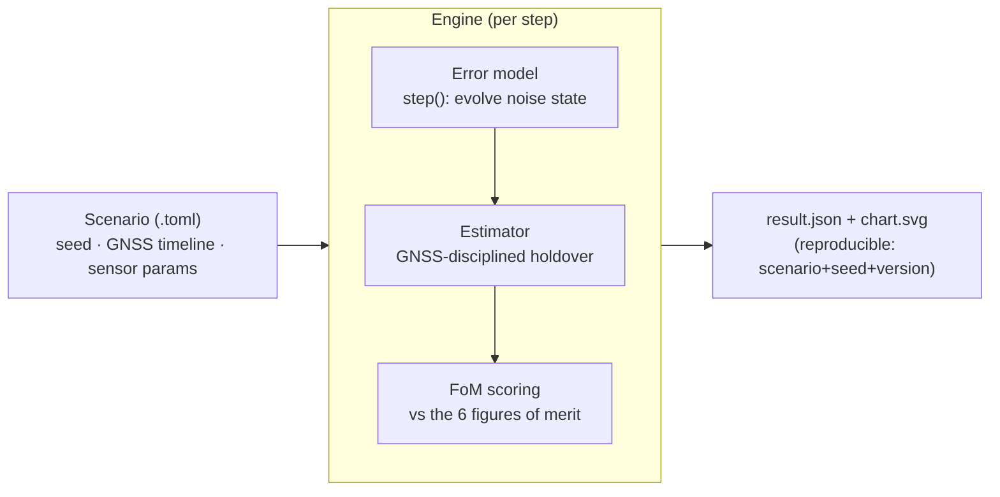
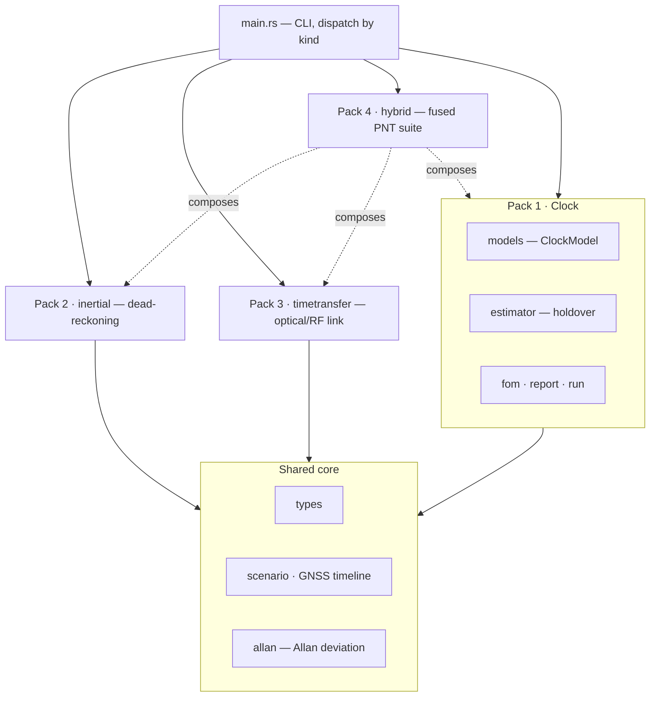

# Kshana

**Kshana** (क्षण, Sanskrit: *"the precise instant"*) is an open, reproducible simulator
for **hybrid quantum/classical PNT** — positioning, navigation, and timing.

It quantifies, in hard and reproducible numbers, what quantum clocks, quantum
inertial sensors, and optical time-transfer buy a navigation system over classical
PNT — scored against the operational figures of merit that matter for resilient
navigation. Every result is reproducible from `scenario + seed + engine version`,
and every sensor parameter is traceable to a published source.

*Free and open source under Apache-2.0, professionally developed and maintained by
Ashforde OÜ — commercial support, integration, and proprietary extensions available.*

> **Status: research-grade, v0.1.0.** Four sensor packs implemented, calibrated to
> published data, and validated against the standard relations. Read
> [`docs/VALIDATION.md`](docs/VALIDATION.md) before citing any number — each noise
> term is labelled `validated` or `not modeled`, and optical-clock figures are
> *space goals on ground hardware* (no strontium optical clock has flown).

---

## Why

Resilient PNT depends on holding position and time when GNSS is denied or jammed.
Quantum sensors promise far slower drift during those outages. There is no good
**open** tool to quantify that advantage honestly and reproducibly — so primes,
agencies, and labs each rebuild private one-offs. Kshana aims to be the neutral,
citable reference for exactly this question.

The engine knows nothing about "quantum" vs "classical": each sensor is an
**error model** plugged into a common pipeline, so a quantum and a classical
device are compared *apples-to-apples* on the same scenario, with independent
noise realizations.

## What it is / is not

**It is:** a deterministic engine that runs a GNSS-outage scenario, evolves
calibrated sensor error models, runs a holdover/dead-reckoning estimator, and
scores the result against six figures of merit, emitting a JSON result and an SVG
chart.

**It is not:** flight hardware, a quantum-payload design, or a full GNSS receiver.
Quantum-hardware fidelity comes from published error models, not from this tool.

## Results

Each scenario compares a quantum sensor against its classical counterpart through a
~1.8 h GNSS outage. Numbers are reproducible (`scenario + seed + version`).

| Pack | Scenario | Quantum | Classical |
|------|----------|---------|-----------|
| **1 — Clock holdover** | `clock-holdover.toml` (20 ns spec) | optical clock holds the full outage | CSAC breaches the spec mid-outage |
| **2 — Inertial dead-reckoning** | `imu-deadreckoning.toml` (100 m spec) | cold-atom: **~41 m**, holds full outage | nav-grade: breaches in **~350 s** → tens of km |
| **3 — Time transfer** (optical inter-satellite link) | `timetransfer.toml` | optical: **~0.3 mm** ranging | RF (TWSTFT): **~150 mm** ranging |
| **4 — Hybrid fusion** (capstone) | `hybrid-pnt.toml` | full position+timing for the whole outage | **position-limited at ~350 s** |

The capstone shows the fusion thesis: optical inter-satellite time-transfer keeps even
a classical *clock* locked, isolating the *inertial* sensor as the classical suite's
weak link — i.e. quantum inertial + optical timing together.

## Install & build

Requires a Rust toolchain (≥ 1.75; developed on 1.93).

```bash
git clone https://github.com/AshfordeOU/kshana
cd kshana
cargo build --release
cargo test          # 37 tests
```

## Usage

Run any scenario; the CLI dispatches on the scenario's `kind` field and writes a
`<scenario>.result.json` and a `<scenario>.chart.svg` next to it:

```bash
cargo run -- scenarios/clock-holdover.toml
cargo run -- scenarios/imu-deadreckoning.toml
cargo run -- scenarios/timetransfer.toml
cargo run -- scenarios/hybrid-pnt.toml
```

Example output:

```
scenario fe4295669702 | quantum PNT-holdover 6600s (t 6600s/p 6600s) | classical PNT-holdover 350s (t 6600s/p 350s)
wrote scenarios/hybrid-pnt.result.json and scenarios/hybrid-pnt.chart.svg
```

## Scenario format

Scenarios are declarative TOML. A top-level `kind` selects the pack
(`clock` is the default if omitted; `inertial`, `timetransfer`, `hybrid`). Common
fields: `seed`, a `[time]` grid, a `[gnss]` availability timeline (the outage
driver), and per-sensor blocks with `provenance` strings citing the source of every
figure. Example (clock):

```toml
seed = 42
threshold_ns = 20.0
[time]
step_s = 10.0
duration_s = 7200.0
[gnss]
windows = [
  { t0 = 0.0,   t1 = 600.0,  state = "nominal" },  # 10 min GNSS sync
  { t0 = 600.0, t1 = 7200.0, state = "denied"  },  # ~1.8 h outage
]
[clock_quantum]
id = "optical-sr-lattice"
provenance = "Strontium optical lattice clock, space-oriented goal sigma_y(1s)=1e-15 (arXiv:1503.08457)"
y0 = 5.0e-17
q_wf = 1.0e-30   # white FM:  q_wf = sigma_y(1s)^2
q_rw = 0.0       # random-walk FM
drift = 0.0      # linear aging (per second)
[clock_classical]
id = "csac-sa45s"
provenance = "Microchip SA65 / SA.45s CSAC datasheet sigma_y(1s)=3e-10"
y0 = 5.0e-10
q_wf = 9.0e-20
q_rw = 0.0
drift = 0.0
```

See `scenarios/` for one example of every kind.

## Output

The result artifact is versioned, self-describing JSON: per-step time series, the
scored figures of merit, the active model specs (with provenance), the seed, and a
**scenario hash** — so any chart can be reproduced from the file. The figures of
merit follow the standard operational PNT figures of merit:

| Figure of merit | How Kshana computes it |
|-----------------|------------------------|
| Positioning / Timing Performance | RMS + 95th-percentile error over the outage |
| Autonomy | holdover duration — time in-spec after GNSS loss |
| Resilience | error-growth slope during the outage |
| Availability | fraction of the run with an in-spec solution |
| Integrity | protection-level containment — fraction of outage samples whose error stays inside the Kalman filter's k-sigma bound (clock pack) |
| Security | spoof/threat-model response *(roadmap — export-sensitive)* |

## Architecture

One engine; each sensor pack plugs in via a common error-model interface. See
[`docs/ARCHITECTURE.md`](docs/ARCHITECTURE.md) for the full set of diagrams.





## Repository layout

```
kshana/
├── src/
│   ├── types.rs        # Seconds, TimeGrid, ModelSpec
│   ├── scenario.rs     # GNSS timeline, clock scenario config
│   ├── models.rs       # ErrorModel trait, ClockModel (white FM, RWFM, aging)
│   ├── estimator.rs    # HoldoverEstimator (quadratic offset+aging removal)
│   ├── fom.rs          # figure-of-merit scoring
│   ├── allan.rs        # overlapping Allan deviation
│   ├── report.rs       # result schema, scenario hash, SVG chart (clock)
│   ├── run.rs          # clock run pipeline
│   ├── inertial.rs     # Pack 2: accelerometer dead-reckoning + position FoMs
│   ├── timetransfer.rs # Pack 3: optical/RF time-transfer link
│   ├── hybrid.rs       # Pack 4: combined PNT suite + ISL clock-aiding
│   └── main.rs         # CLI
├── scenarios/          # one cited scenario per pack
├── scripts/            # reproducibility + repo-hygiene guards
├── docs/               # ARCHITECTURE, VALIDATION, design notes
├── CHANGELOG.md        # Keep a Changelog + SemVer
└── CONTRIBUTING.md
```

## Validation, reproducibility & honesty

- Every noise term is calibrated to a **published, cited** figure and validated
  against the standard relation (Allan deviation for clocks; Groves' dead-reckoning
  error growth for inertial; the timing→ranging conversion for time transfer). Status
  per term is tracked in [`docs/VALIDATION.md`](docs/VALIDATION.md) as `validated` or
  `not modeled` — nothing is presented as validated that is not.
- **Reproducible by construction:** `scenario + seed + engine version → identical
  bits`. `scripts/check-reproducible.sh` enforces it; quantum and classical runs use
  independent seeds so their noise is uncorrelated.
- Maturity is stated honestly: optical-clock and optical-link figures are *targets /
  ground-demonstrator* results, not flown.

## Roadmap

See [`CHANGELOG.md`](CHANGELOG.md) for released history and the `[Unreleased]`
section for what's next (orbit-based scenarios, Python + WebAssembly bindings).
A flicker (1/f) FM clock floor, a gyro channel (bias + angular random walk with
gravity-tilt coupling), segment-aware multi-window holdover scoring, and a
two-state Kalman clock estimator (driving the Integrity figure of merit) have
landed on `main`.

## Contributing

See [`CONTRIBUTING.md`](CONTRIBUTING.md). In short: tests pass (`cargo test`), the
two guard scripts pass, Conventional Commits, and a `CHANGELOG.md` `[Unreleased]`
entry for every user-visible change.

## License

Apache-2.0 — see [`LICENSE`](LICENSE). Contributions are accepted under the same
license (inbound = outbound); sign commits off per the Developer Certificate of
Origin with `git commit -s`.

**Trademark.** "Kshana" and its marks are trademarks of Ashforde OÜ. The license
covers the code, not the name — please rename forks and derivative distributions.

## Support & professional services

Kshana is free and open source under Apache-2.0 and **professionally developed and
maintained by Ashforde OÜ** (Estonia). The open engine is complete and usable on its
own. For organisations that need more, Ashforde OÜ offers:

- **Commercial support & integration** — embedding Kshana in your toolchain, custom
  scenarios, and priority fixes.
- **Custom sensor models** — calibrated to your hardware, including export-sensitive
  resilience models maintained in a private overlay.
- **Kshana Pro** — proprietary model-based systems-engineering and programme tooling
  that plugs into the open engine to complete the workflow.
- **Training & consulting** on quantum/classical PNT performance analysis.

This is the open-core model: the engine is, and stays, openly licensed; the sustaining
business is expertise, support, and the proprietary extensions — not license fees.
Contact **contact@ashforde.org**.

## Key references

- Riley, *Handbook of Frequency Stability Analysis* — [NIST SP 1065](https://tf.nist.gov/general/pdf/2220.pdf) (Allan-deviation relations).
- Origlia, Schiller, Bongs et al. — [arXiv:1503.08457](https://arxiv.org/abs/1503.08457) (strontium optical lattice clock, space-oriented goal).
- Oelker et al., *Nature Photonics* (2019) — [JILA PDF](https://jila-pfc.colorado.edu/sites/default/files/2019-09/Oelker-Sr%20record%20stability_2019-Nature_Photonics.pdf) (laboratory Sr clock, 4.8×10⁻¹⁷).
- Templier et al., *Science Advances* (2022) — [arXiv:2209.13209](https://arxiv.org/abs/2209.13209) (hybrid quantum accelerometer triad).
- Groves, *Principles of GNSS, Inertial, and Multisensor Integrated Navigation* — [IEEE AESS tutorial (UCL Discovery)](https://discovery.ucl.ac.uk/id/eprint/1470141/) (dead-reckoning error growth).
- Giorgetta et al., *Nature Photonics* 7, 434 (2013) — [arXiv:1211.4902](https://arxiv.org/abs/1211.4902); Deschênes et al., *Phys. Rev. X* 6, 021016 (2016) — [APS](https://journals.aps.org/prx/abstract/10.1103/PhysRevX.6.021016) (optical two-way time-frequency transfer).
- Optical inter-satellite time-transfer concept — see Giorgetta and Deschênes above.
