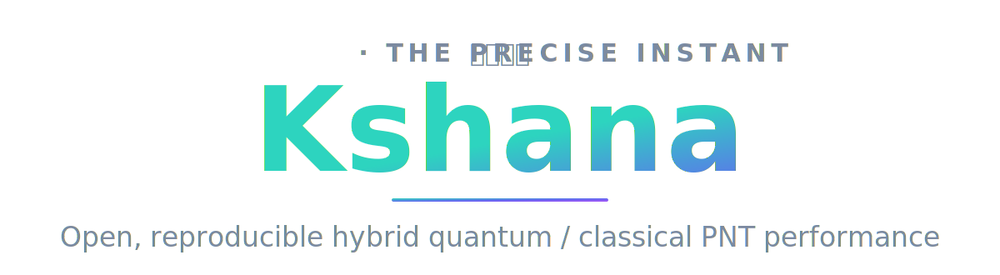
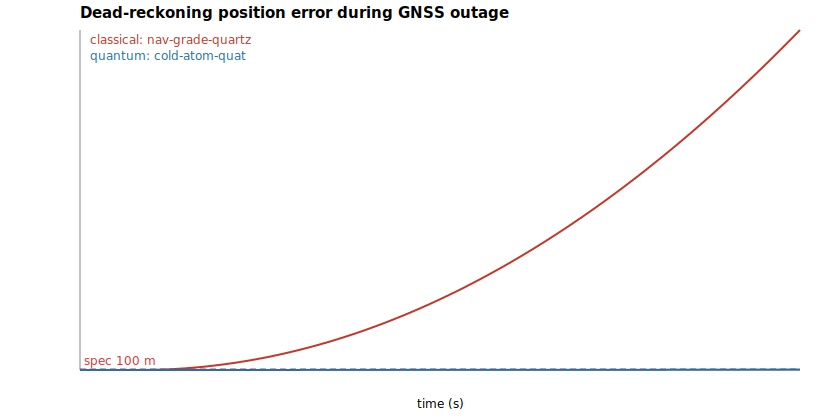
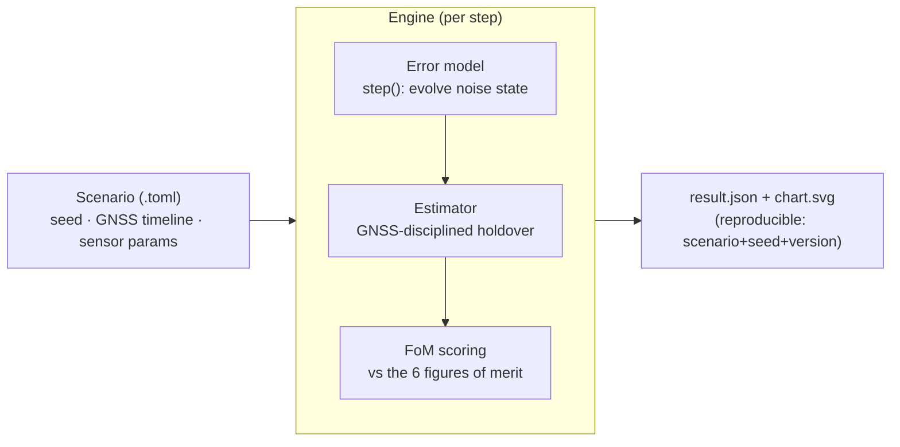
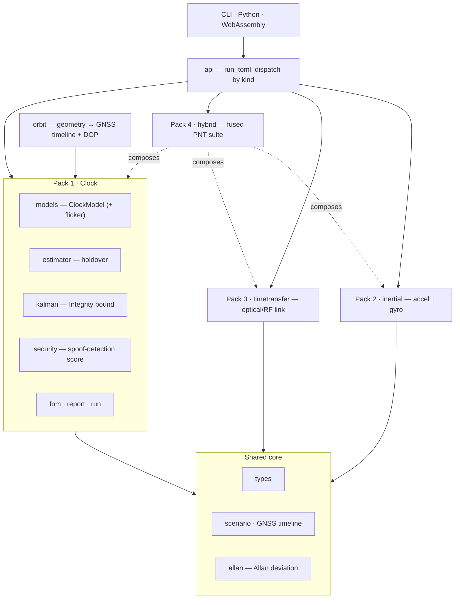

<h1 align="center">
  
</h1>

<p align="center">
  <a href="https://github.com/ashfordeOU/kshana/actions/workflows/ci.yml"></a>
  <a href="https://github.com/ashfordeOU/kshana/releases"></a>
  <a href="LICENSE"></a>
  <a href="Cargo.toml"></a>
</p>

<p align="center">
  <strong>Kshana</strong> (क्षण, Sanskrit: <em>"the precise instant"</em>) is an open, reproducible
  simulator for <strong>hybrid quantum/classical PNT</strong> — positioning, navigation, and timing.
</p>

It quantifies, in hard and reproducible numbers, what quantum clocks, quantum
inertial sensors, and optical time-transfer buy a navigation system over classical
PNT — scored against the operational figures of merit that matter for resilient
navigation. Every result is reproducible from `scenario + seed + engine version`,
and every sensor parameter is traceable to a published source.

*Free and open source under Apache-2.0, professionally developed and maintained by
Ashforde OÜ — commercial support, integration, and proprietary extensions available.*

> **Status: research-grade, v0.6.0.** Four sensor packs that each report all six
> operational figures of merit (including a clock-aided spoof-detection security
> score, with an active spoofing-attack demonstrator), a joint Kalman fusion
> estimator and an integrity bound, multi-constellation geometry-derived GNSS
> availability *and* position accuracy (dilution of precision) from Keplerian orbits —
> synthetic Walker or real two-line element sets — with optional eccentricity and J2
> drift, a full IMU Allan-variance noise model, Monte Carlo confidence bands,
> trade-study parameter sweeps, and a shareable HTML scorecard — all calibrated to
> published data and validated against the standard relations, with optional Python and
> WebAssembly bindings and a browser playground. Read [`docs/VALIDATION.md`](docs/VALIDATION.md)
> before citing any number — each noise term is labelled `validated` or `not modeled`,
> and optical-clock figures are *space goals on ground hardware* (no strontium optical
> clock has flown).

> **Try it in your browser:** the [playground](web/) runs the engine client-side as
> WebAssembly — pick a scenario, edit the parameters, and see the result, with nothing
> uploaded. Build it locally with `./web/build.sh` (see [`web/README.md`](web/README.md)),
> or publish it to GitHub Pages via the `pages` workflow.

> **New to this?** In plain terms: GPS-style satellite signals tell things *where they
> are* and *what time it is*. When those signals are lost (jammed, blocked, or out of
> view in space), a system has to keep going on its own onboard clock and motion
> sensors — and they slowly drift. "Quantum" clocks and sensors drift far more slowly.
> Kshana measures, in honest numbers, **how much longer a quantum-equipped system can
> coast** before it exceeds its accuracy limits. New readers should start with the
> [plain-language primer](docs/CONCEPTS.md) and the [glossary](docs/GLOSSARY.md).

---

## Contents

- [Why](#why) · [What it is / is not](#what-it-is--is-not) · [Results](#results)
- [Install & build](#install--build) · [Usage](#usage) ([Python](#python), [WebAssembly](#webassembly))
- [Scenario format](#scenario-format) · [Output](#output) · [Architecture](#architecture)
- [Repository layout](#repository-layout) · [Validation & honesty](#validation-reproducibility--honesty)
- [Documentation](#documentation) · [FAQ](#faq) · [Troubleshooting](#troubleshooting)
- [Roadmap](#roadmap) · [Contributing](#contributing) · [Citing](#citing) · [License](#license)
- [Support & professional services](#support--professional-services) · [References](#key-references)

## Why

Resilient PNT depends on holding position and time when GNSS is denied or jammed.
Quantum sensors promise far slower drift during those outages. There is no good
**open** tool to quantify that advantage honestly and reproducibly — so primes,
agencies, and labs each rebuild private one-offs. Kshana aims to be the neutral,
citable reference for exactly this question.

The engine knows nothing about "quantum" vs "classical": each sensor is an
**error model** plugged into a common pipeline, so a quantum and a classical
device are compared *apples-to-apples* on the same scenario, with independent
noise realizations.

## What it is / is not

**It is:** a deterministic engine that runs a GNSS-outage scenario, evolves
calibrated sensor error models, runs a holdover/dead-reckoning estimator, and
scores the result against six figures of merit, emitting a JSON result and an SVG
chart.

**It is not:** flight hardware, a quantum-payload design, or a full GNSS receiver.
Quantum-hardware fidelity comes from published error models, not from this tool.

## Results

Each scenario compares a quantum sensor against its classical counterpart through a
~1.8 h GNSS outage. Numbers are reproducible (`scenario + seed + version`).

<p align="center">
  
  <br><em>Dead-reckoning position error during a GNSS outage: the quantum sensor (blue)
  stays flat near the spec; the classical sensor (red) diverges to tens of kilometres.
  Generated by Kshana from <code>scenarios/imu-deadreckoning.toml</code>.</em>
</p>

| Pack | Scenario | Quantum | Classical |
|------|----------|---------|-----------|
| **1 — Clock holdover** | `clock-holdover.toml` (20 ns spec) | optical clock holds the full outage | CSAC breaches the spec mid-outage |
| **2 — Inertial dead-reckoning** | `imu-deadreckoning.toml` (100 m spec) | cold-atom: **~41 m**, holds full outage | nav-grade: breaches in **~350 s** → tens of km |
| **3 — Time transfer** (optical inter-satellite link) | `timetransfer.toml` | optical: **~0.3 mm** ranging | RF (TWSTFT): **~150 mm** ranging |
| **4 — Hybrid fusion** (capstone) | `hybrid-pnt.toml` | full position+timing for the whole outage | **position-limited at ~350 s** |

The capstone shows the fusion thesis: optical inter-satellite time-transfer keeps even
a classical *clock* locked, isolating the *inertial* sensor as the classical suite's
weak link — i.e. quantum inertial + optical timing together.

A further scenario, `orbit-gnss-challenged.toml`, derives GNSS availability from
**orbital geometry** rather than hand-authored windows: a spacecraft inside the GNSS
shell is propagated against a GPS-like Walker constellation, and the visible-satellite
count (line-of-sight, Earth-occultation, elevation mask) sets the fix state at each
step. Over a day the user is in fix only ~59% of the time; the quantum clock holds a
5 ns timing solution through every gap (availability **1.0**), the chip-scale clock
only **~0.83**.

## Install & build

Requires a Rust toolchain (≥ 1.75; developed on 1.93).

```bash
git clone https://github.com/AshfordeOU/kshana
cd kshana
cargo build --release
cargo test          # all tests pass
```

## Usage

Run any scenario; the CLI dispatches on the scenario's `kind` field and writes a
`<scenario>.result.json` and a `<scenario>.chart.svg` next to it:

```bash
cargo run -- scenarios/clock-holdover.toml
cargo run -- scenarios/imu-deadreckoning.toml
cargo run -- scenarios/timetransfer.toml
cargo run -- scenarios/hybrid-pnt.toml
cargo run -- scenarios/orbit-gnss-challenged.toml
```

Example output (clock holdover — note the Integrity and Security figures of merit):

```
scenario c827e5d40d25 | quantum holdover 6600s p95 0.0ns integrity 1.000 security 0.997 | classical holdover 2610s p95 19.7ns integrity 1.000 security 0.000
wrote scenarios/clock-holdover.result.json and scenarios/clock-holdover.chart.svg
```

The optical clock's tight detection floor keeps `security 0.997`; the chip-scale
clock's own noise over the monitoring window exceeds the 20 ns spec, so it has no
spoof-detection margin (`security 0.000`). The orbit scenario additionally reports a
geometry block — fraction of samples with a fix, and best/median PDOP and position
accuracy — alongside the clock result.

### Python

An optional Python extension (PyO3, abi3) wraps the same engine. Build and install
it with [maturin](https://www.maturin.rs/):

```bash
pip install maturin
maturin develop --features python   # or: maturin build --features python
```

```python
import json, kshana

result = json.loads(kshana.run(open("scenarios/clock-holdover.toml").read()))
print(result["quantum"]["fom"]["integrity"])

# json, svg, and a one-line summary at once:
result_json, chart_svg, summary = kshana.run_full(open("scenarios/orbit-gnss-challenged.toml").read())
print(kshana.version(), summary)
```

Wheels are built for Linux, macOS, and Windows by the `wheels` workflow on each
release tag.

### WebAssembly

The engine also runs in the browser via [wasm-pack](https://rustwasm.github.io/wasm-pack/):

```bash
wasm-pack build --target web -- --features wasm
```

```js
import init, { run, chart_svg, version } from "./pkg/kshana.js";
await init();
const result = JSON.parse(run(tomlText));
console.log(version(), result.classical.fom.timing_p95_ns);
```

## Scenario format

Scenarios are declarative TOML. A top-level `kind` selects the pack
(`clock` is the default if omitted; `inertial`, `timetransfer`, `hybrid`, `orbit`).
Common fields: `seed`, a `[time]` grid, a `[gnss]` availability timeline (the outage
driver), and per-sensor blocks with `provenance` strings citing the source of every
figure. Example (clock):

```toml
seed = 42
threshold_ns = 20.0
[time]
step_s = 10.0
duration_s = 7200.0
[gnss]
windows = [
  { t0 = 0.0,   t1 = 600.0,  state = "nominal" },  # 10 min GNSS sync
  { t0 = 600.0, t1 = 7200.0, state = "denied"  },  # ~1.8 h outage
]
[clock_quantum]
id = "optical-sr-lattice"
provenance = "Strontium optical lattice clock, space-oriented goal sigma_y(1s)=1e-15 (arXiv:1503.08457)"
y0 = 5.0e-17
q_wf = 1.0e-30   # white FM:  q_wf = sigma_y(1s)^2
q_rw = 0.0       # random-walk FM
drift = 0.0      # linear aging (per second)
[clock_classical]
id = "csac-sa45s"
provenance = "Microchip SA65 / SA.45s CSAC datasheet sigma_y(1s)=3e-10"
y0 = 5.0e-10
q_wf = 9.0e-20
q_rw = 0.0
drift = 0.0
```

Optional fields (off when absent): a clock may add `flicker_floor` (1/f FM Allan
floor); an inertial sensor may add `gyro_bias` and `q_arw` (gyro bias and angular
random walk), and `bias_instability` and `q_aa` (the Allan bias-instability floor and
acceleration random walk), completing the IMU Allan-variance noise model. A
clock-holdover scenario may add `runs` (> 1) to run a **Monte Carlo ensemble** — each
figure of merit is then reported as a mean with a 5th–95th-percentile spread and the
chart shades the error confidence band (see `scenarios/clock-ensemble.toml`).

A `fusion` scenario (same blocks as `hybrid`) runs a single joint Kalman filter as the
navigator — fusing the clock and position states, disciplined by GNSS and aided by
optical time transfer — and reports fused holdover with a joint-covariance integrity
(see `scenarios/fusion-pnt.toml`).

A `spoof` scenario injects a ramping false-time spoof (an `[attack]` block with
`start_s` and `rate_ns_per_s`) and runs each clock's integrity monitor, reporting
whether and when the spoof is detected and whether it reaches the spec undetected — a
concrete demonstration of the Security figure of merit (see `scenarios/spoof-attack.toml`).

A `sweep` scenario runs a **trade study**: it varies one `parameter` (`threshold_ns`,
`duration_s`, `quantum_q_wf`, or `classical_q_wf`) from `start` to `stop` over `steps`
points on a `lin` or `log` `scale`, records a `metric` (e.g. `holdover_s`) for both
clocks, and charts the two curves. The base scenario goes under `[base]` (see
`scenarios/sweep-clock-stability.toml`).

An `orbit` scenario derives the `[gnss]` timeline from geometry instead of authoring
it — give a `[user]` orbit, a `[constellation]`, an elevation `mask_deg`, and the two
clock blocks. It also reports position accuracy from the satellite geometry; the
optional `sigma_uere_m` (1-sigma user-equivalent range error, default 1 m) scales the
position dilution of precision into a position sigma. The user orbit may be made
**eccentric** with `eccentricity` and `argp_deg`, and `j2 = true` adds Earth-oblateness
secular drift (see `scenarios/orbit-molniya.toml`). The constellation can instead be a
**real one**: give `[constellation]` a `tle` block of two-line element sets and the
satellites are parsed from it (see `scenarios/orbit-real-tle.toml`). Add one or more
`[[constellations]]` blocks for **multi-GNSS** (e.g. GPS + Galileo; see
`scenarios/orbit-multignss.toml`):

```toml
kind = "orbit"
seed = 7
threshold_ns = 5.0
mask_deg = 10.0
sigma_uere_m = 1.0           # optional; position sigma = position-DOP * this
[time]
step_s = 60.0
duration_s = 86400.0
[user]                       # spacecraft (altitude in km, angles in deg)
altitude_km = 8000.0
inclination_deg = 0.0
[constellation]              # Walker-delta GNSS (GPS-like)
altitude_km = 20180.0
inclination_deg = 55.0
planes = 6
sats_per_plane = 4
phasing_f = 1.0
[clock_quantum]  # ... as above
[clock_classical]  # ... as above
```

See `scenarios/` for one example of every kind.

## Output

The result artifact is versioned, self-describing JSON: per-step time series, the
scored figures of merit, the active model specs (with provenance), the seed, and a
**scenario hash** — so any chart can be reproduced from the file. The figures of
merit follow the standard operational PNT figures of merit:

| Figure of merit | How Kshana computes it |
|-----------------|------------------------|
| Positioning / Timing Performance | RMS + 95th-percentile error over the outage |
| Autonomy | holdover duration — time in-spec after GNSS loss |
| Resilience | error-growth slope during the outage |
| Availability | fraction of the run with an in-spec solution |
| Integrity | protection-level containment — fraction of outage samples whose error stays inside the Kalman filter's k-sigma bound (clock pack) |
| Security | clock-aided spoof-detection score — how far below the timing spec a time-spoof can be flagged by cross-checking GNSS time against the clock's own coasted prediction (clock and orbit packs) |

New to these terms? Each is defined in plain language in the [glossary](docs/GLOSSARY.md).

## Architecture

One engine; each sensor pack plugs in via a common error-model interface. See
[`docs/ARCHITECTURE.md`](docs/ARCHITECTURE.md) for the full set of diagrams.





## Repository layout

```
kshana/
├── src/
│   ├── types.rs        # Seconds, TimeGrid, ModelSpec
│   ├── scenario.rs     # GNSS timeline, clock scenario config
│   ├── models.rs       # ErrorModel trait, ClockModel (white FM, RWFM, aging)
│   ├── estimator.rs    # HoldoverEstimator (quadratic offset+aging removal)
│   ├── fom.rs          # figure-of-merit scoring
│   ├── allan.rs        # overlapping Allan deviation
│   ├── kalman.rs       # two-state Kalman clock estimator + integrity bound
│   ├── report.rs       # result schema, scenario hash, SVG chart (clock)
│   ├── run.rs          # clock + orbit-clock run pipelines
│   ├── inertial.rs     # Pack 2: inertial dead-reckoning (accel + gyro) + FoMs
│   ├── timetransfer.rs # Pack 3: optical/RF time-transfer link
│   ├── hybrid.rs       # Pack 4: combined PNT suite + ISL clock-aiding
│   ├── orbit.rs        # orbit propagation + GNSS line-of-sight visibility
│   ├── api.rs          # scenario dispatch shared by the CLI and bindings
│   ├── python.rs       # optional PyO3 extension (feature = "python")
│   ├── wasm.rs         # optional wasm-bindgen module (feature = "wasm")
│   └── main.rs         # CLI
├── scenarios/          # cited scenarios (one per pack + a geometry-driven one)
├── scripts/            # reproducibility + repo-hygiene guards
├── docs/               # CONCEPTS, ARCHITECTURE, VALIDATION, GLOSSARY, assets/
├── .github/workflows/  # CI gate, release, and wheel-build pipelines
├── pyproject.toml      # Python packaging (maturin)
├── CHANGELOG.md        # Keep a Changelog + SemVer
└── CONTRIBUTING.md
```

## Documentation

| Document | For whom | What's in it |
|----------|----------|--------------|
| [Concepts primer](docs/CONCEPTS.md) | everyone, start here | what Kshana does and why, from zero to the physics |
| [Playground](web/README.md) | everyone | run the engine in your browser (WebAssembly); build &amp; deploy notes |
| [Glossary](docs/GLOSSARY.md) | everyone | plain-language definitions of every term |
| [Architecture](docs/ARCHITECTURE.md) | developers / reviewers | module map, engine pipeline, dispatch, and diagrams |
| [Validation status](docs/VALIDATION.md) | reviewers / citers | what is `validated` vs `not modeled`, with evidence |
| [Changelog](CHANGELOG.md) | everyone | released history (Keep a Changelog + SemVer) |
| [Contributing](CONTRIBUTING.md) | contributors | build, guards, test/citation discipline, DCO |
| [Code of Conduct](CODE_OF_CONDUCT.md) | community | expected conduct (Contributor Covenant) |
| [Security policy](SECURITY.md) | reporters | how to report a vulnerability; dual-use note |

## Validation, reproducibility & honesty

- Every noise term is calibrated to a **published, cited** figure and validated
  against the standard relation (Allan deviation for clocks; Groves' dead-reckoning
  error growth for inertial; the timing→ranging conversion for time transfer). Status
  per term is tracked in [`docs/VALIDATION.md`](docs/VALIDATION.md) as `validated` or
  `not modeled` — nothing is presented as validated that is not.
- **Reproducible by construction:** `scenario + seed + engine version → identical
  bits`. `scripts/check-reproducible.sh` enforces it; quantum and classical runs use
  independent seeds so their noise is uncorrelated.
- Maturity is stated honestly: optical-clock and optical-link figures are *targets /
  ground-demonstrator* results, not flown.

## FAQ

**Do I need to understand quantum physics to use this?**
No. If you can run a command line you can run Kshana. Start with the
[plain-language primer](docs/CONCEPTS.md); look terms up in the [glossary](docs/GLOSSARY.md).

**Is this a quantum-hardware design or flight software?**
No. It is a performance *simulator*. Quantum-hardware fidelity comes from published
error models, not from this tool. See [What it is / is not](#what-it-is--is-not).

**Are the quantum results realistic, or marketing?**
Every parameter is cited to a datasheet or paper, every model is validated against a
textbook relation, and maturity is labelled honestly in
[VALIDATION.md](docs/VALIDATION.md) — including that no strontium optical clock has
flown. The engine is neutral: quantum and classical are the same code with different
published numbers.

**Can I trust two runs to agree?**
Yes — runs are deterministic: `scenario + seed + engine version → bit-identical output`,
enforced by `scripts/check-reproducible.sh`.

**Can I use it from Python or in a browser?**
Yes — see [Python](#python) and [WebAssembly](#webassembly). Both call the same engine.

**How do I model my own sensor?**
Write a scenario `.toml` with your sensor's published figures in the `provenance`
fields. See [Scenario format](#scenario-format) and the examples in `scenarios/`.

**Is it free for commercial use?**
Yes, under Apache-2.0. Optional commercial support and proprietary extensions are
available — see [Support](#support--professional-services).

## Troubleshooting

**`cargo build` fails on an old toolchain.** Kshana needs Rust ≥ 1.75. Update with
`rustup update`.

**Building the Python extension fails to link on macOS** (`Undefined symbols … _Py…`).
A Python extension resolves its symbols at load time. `maturin` sets the right linker
flag automatically — use `maturin develop --features python` rather than a bare
`cargo build`.

**The Python build complains the interpreter is newer than PyO3 knows.** Set
`PYO3_USE_ABI3_FORWARD_COMPATIBILITY=1` (abi3 wheels are forward-compatible across
CPython versions).

**WebAssembly build can't find the target.** Install it once with
`rustup target add wasm32-unknown-unknown`, then `wasm-pack build --target web -- --features wasm`.

**Where did my output go?** Each run writes `<scenario>.result.json` and
`<scenario>.chart.svg` next to the input `.toml`. These are git-ignored by design.

## Roadmap

See [`CHANGELOG.md`](CHANGELOG.md) for released history and the `[Unreleased]`
section for what's next (higher-fidelity SGP4 orbit propagation). An active
spoofing-attack demonstrator, multi-constellation availability, a full IMU
Allan-variance noise model, a joint Kalman fusion estimator, real constellation
geometry from TLEs, an HTML scorecard report, a clock-aided spoof-detection Security
score across all four packs, geometry-derived GNSS availability *and* position
accuracy (dilution of precision) from Keplerian orbits with eccentricity and J2 drift,
Monte Carlo confidence bands, trade-study parameter sweeps, an in-browser WebAssembly
playground, and optional Python (PyO3) and WebAssembly (wasm-bindgen) bindings have
landed on `main`.

## Contributing

See [`CONTRIBUTING.md`](CONTRIBUTING.md). In short: tests pass (`cargo test`), the
two guard scripts pass, Conventional Commits, and a `CHANGELOG.md` `[Unreleased]`
entry for every user-visible change. Participation is governed by our
[Code of Conduct](CODE_OF_CONDUCT.md). To report a security issue, see the
[Security policy](SECURITY.md) — please do not open a public issue for vulnerabilities.

## Citing

If you use Kshana in academic or technical work, please cite it. Machine-readable
metadata is in [`CITATION.cff`](CITATION.cff) (GitHub renders a "Cite this repository"
button from it); cite the version you used (e.g. `v0.6.0`).

## License

Apache-2.0 — see [`LICENSE`](LICENSE). Contributions are accepted under the same
license (inbound = outbound); sign commits off per the Developer Certificate of
Origin with `git commit -s`.

**Trademark.** "Kshana" and its marks are trademarks of Ashforde OÜ. The license
covers the code, not the name — please rename forks and derivative distributions.

## Support & professional services

Kshana is free and open source under Apache-2.0 and **professionally developed and
maintained by Ashforde OÜ** (Estonia). The open engine is complete and usable on its
own. For organisations that need more, Ashforde OÜ offers:

- **Commercial support & integration** — embedding Kshana in your toolchain, custom
  scenarios, and priority fixes.
- **Custom sensor models** — calibrated to your hardware, including export-sensitive
  resilience models maintained in a private overlay.
- **Kshana Pro** — proprietary model-based systems-engineering and programme tooling
  that plugs into the open engine to complete the workflow.
- **Training & consulting** on quantum/classical PNT performance analysis.

This is the open-core model: the engine is, and stays, openly licensed; the sustaining
business is expertise, support, and the proprietary extensions — not license fees.
Contact **contact@ashforde.org**.

## Key references

- Riley, *Handbook of Frequency Stability Analysis* — [NIST SP 1065](https://tf.nist.gov/general/pdf/2220.pdf) (Allan-deviation relations).
- Origlia, Schiller, Bongs et al. — [arXiv:1503.08457](https://arxiv.org/abs/1503.08457) (strontium optical lattice clock, space-oriented goal).
- Oelker et al., *Nature Photonics* (2019) — [JILA PDF](https://jila-pfc.colorado.edu/sites/default/files/2019-09/Oelker-Sr%20record%20stability_2019-Nature_Photonics.pdf) (laboratory Sr clock, 4.8×10⁻¹⁷).
- Templier et al., *Science Advances* (2022) — [arXiv:2209.13209](https://arxiv.org/abs/2209.13209) (hybrid quantum accelerometer triad).
- Groves, *Principles of GNSS, Inertial, and Multisensor Integrated Navigation* — [IEEE AESS tutorial (UCL Discovery)](https://discovery.ucl.ac.uk/id/eprint/1470141/) (dead-reckoning error growth).
- Giorgetta et al., *Nature Photonics* 7, 434 (2013) — [arXiv:1211.4902](https://arxiv.org/abs/1211.4902); Deschênes et al., *Phys. Rev. X* 6, 021016 (2016) — [APS](https://journals.aps.org/prx/abstract/10.1103/PhysRevX.6.021016) (optical two-way time-frequency transfer).
- Optical inter-satellite time-transfer concept — see Giorgetta and Deschênes above.
