<!-- The images under docs/assets/readme/ are generated from real engine runs by
     tools/gen_readme_assets.py (light and dark variants); regenerate them with
     `python3 tools/gen_readme_assets.py --kshana <path to kshana>` and check with `--check`.
     The Kshana Studio screenshots under docs/assets/readme/studio/ are taken from the
     running Studio by tools/capture_studio_shots.mjs and recorded in studio/SHOTS.json. -->

<p align="center">
  <picture>
    <source media="(prefers-color-scheme: dark)" srcset="docs/assets/readme/kshana-logo-dark.svg">
    <source media="(prefers-color-scheme: light)" srcset="docs/assets/readme/kshana-logo-light.svg">
    
  </picture>
</p>

<p align="center">
  <strong>Kshana · <span lang="sa">क्षण</span> · <em>the precise instant</em></strong><br>
  An open-source simulator for PNT (positioning, navigation and timing) resilience.
</p>

<p align="center">
  <a href="https://github.com/ashfordeOU/kshana/actions/workflows/ci.yml"></a>
  <a href="docs/COVERAGE.md"></a>
  <a href="#evidence"></a>
  <a href="https://sonarcloud.io/summary/overall?id=ashfordeOU_kshana"></a>
  <a href="https://github.com/ashfordeOU/kshana/releases"></a>
  <a href="LICENSE"></a>
  <br>
  <a href="https://doi.org/10.5281/zenodo.20528627"></a>
  <a href="#editions"></a>
  <a href="https://crates.io/crates/kshana"></a>
  <a href="https://pypi.org/project/kshana/"></a>
  <a href="https://www.npmjs.com/package/kshana"></a>
</p>

<p align="center">
  <a href="https://kshana.dev">Open Kshana Studio</a> ·
  <a href="#install">Install</a> ·
  <a href="#capabilities">Capabilities</a> ·
  <a href="#evidence">Evidence</a> ·
  <a href="#research">Research</a> ·
  <a href="docs/CONCEPTS.md">Documentation</a> ·
  <a href="#cite">Cite</a>
</p>

<picture>
  <source media="(prefers-color-scheme: dark)" srcset="docs/assets/readme/hero-dark.svg">
  <source media="(prefers-color-scheme: light)" srcset="docs/assets/readme/hero-light.svg">
  
</picture>

## Rehearse the minute GNSS goes dark

Kshana replays jamming, spoofing and clock holdover when GNSS (Global Navigation Satellite
System) signals fail, and tells you how long a system keeps time and position inside its
budget, and which clock or sensor buys the most margin. It is one Rust engine. It runs in a
terminal, a notebook, an IDE (integrated development environment), an AI (artificial
intelligence) assistant, or in your browser.

Every run is reproducible bit for bit from the scenario, the seed and the engine version.
Every capability carries one of three labels in a machine-checked ledger: **VALIDATED** (an
independent external oracle agrees), **MODELLED** (internally consistent, and said out loud)
or **PARTNER** (a hardware partner owns it).

> **Status: v0.29.3.** A validated, reproducible simulation substrate for PNT resilience.
> Timing and holdover come first, because that domain is the best validated. Kshana is a
> study and trade-off instrument: not a radio-frequency (RF) signal simulator, not a GNSS
> receiver and not a flight product. New to the field? Start with the
> [plain-language primer](docs/CONCEPTS.md) and the [glossary](docs/GLOSSARY.md).

## Kshana Studio

Open [kshana.dev/studio](https://kshana.dev/studio/) and the whole engine runs in your
browser, compiled to WebAssembly. Nothing to install, and nothing is uploaded. The Studio has
two views of the same engine, and a switch in the header moves between them, keeping the
scenario, the view and any settings you changed.

**The Simple view** is where the Studio opens. It starts from questions (how many satellites
can I see, can I trust my position fix, how long can a clock keep time, what does a jammer do
to my receiver) and from a map of everything the engine can do, each area with its share of
validated methods. Open a scenario and the answer comes first: one plain sentence, written for
what that scenario measures, then its key figures and a chart. At most five settings are on
show, the ones that change the answer most; the rest wait under **Advanced settings**.
**How this is computed** explains the method, and **For researchers** gives the engine's own
figures, the scenario file, the code to run it from Python and the citation.

<picture>
  <source media="(prefers-color-scheme: dark)" srcset="docs/assets/readme/studio/studio-task-dark.jpg">
  <source media="(prefers-color-scheme: light)" srcset="docs/assets/readme/studio/studio-task-light.jpg">
  
</picture>

**The Advanced view** is the full dashboard: the scenario library, five numbered steps
(Choose, Set, Run, Read results, Share or export), the key figures with PASS and FAIL chips
where the run states a threshold, and every panel: overview, charts, maps, replay, the
engine's report and exports. One search box reaches scenarios, domains and the fields inside
them, and you can pin up to four runs and compare them side by side.

<details>
<summary>The Simple view's opening screen, and the Advanced view after a run</summary>

<br>

<picture>
  <source media="(prefers-color-scheme: dark)" srcset="docs/assets/readme/studio/studio-home-dark.jpg">
  <source media="(prefers-color-scheme: light)" srcset="docs/assets/readme/studio/studio-home-light.jpg">
  
</picture>

<picture>
  <source media="(prefers-color-scheme: dark)" srcset="docs/assets/readme/studio/studio-advanced-dark.jpg">
  <source media="(prefers-color-scheme: light)" srcset="docs/assets/readme/studio/studio-advanced-light.jpg">
  
</picture>

</details>

The Studio's source and its build notes are in [`web/README.md`](web/README.md).

### The site

The rest of [kshana.dev](https://kshana.dev) is built from this repository's own files and
engine runs: missions, capabilities, the evidence ledger, the published research and the
editions.

<picture>
  <source media="(prefers-color-scheme: dark)" srcset="docs/assets/readme/site/site-strip-dark.jpg">
  <source media="(prefers-color-scheme: light)" srcset="docs/assets/readme/site/site-strip-light.jpg">
  
</picture>

## Capabilities

One engine covers the whole failure chain, from the first jammed satellite to the last
nanosecond of clock holdover. The engine has 75 scenario kinds; `kshana kinds` lists
them and [`docs/SCENARIOS.md`](docs/SCENARIOS.md) documents every field.

| Capability | What it answers |
|---|---|
| [Spectrum](docs/SPECTRUM.md) | how a jammer takes the GNSS L band, band by band, second by second |
| [Clocks and timing](docs/TELECOM-TIMING.md) | how long each clock holds time after GNSS is lost |
| [Constellations around any body](docs/CONSTELLATION-DESIGN.md) | coverage, dilution of precision and availability around the Earth, the Moon or Mars |
| [Solar system](docs/SOLAR-SYSTEM.md) | where every planet is, and the light time of any link |
| [Low-Earth-orbit navigation](docs/LEO-PNT.md) | a pass, a link, a navigation message and a fused fix, stage by stage |
| [Campaigns](docs/CAMPAIGNS.md) | a chained mission, a sweep or a Monte Carlo ensemble in one scenario |
| [Animation](docs/ANIMATION.md) | a run's time series as an animated drawing, a player or frames |
| [Reports](docs/REPORTS.md) | every figure with its unit and its label, in HTML (HyperText Markup Language) and JSON (JavaScript Object Notation) |
| [Interoperability exports](docs/INTEROP.md) | orbits and geometry for other tools: SP3, CCSDS OMM and OEM, CZML, KML, GeoJSON, STK and SigMF |

The export formats in full: SP3 is Standard Product 3; CCSDS OMM and OEM are the Orbit
Mean-elements and Orbit Ephemeris Messages of the Consultative Committee for Space Data
Systems; CZML and KML are the Cesium and Keyhole Markup Languages; STK is Systems Tool Kit;
SigMF is the Signal Metadata Format.

<picture>
  <source media="(prefers-color-scheme: dark)" srcset="docs/assets/readme/campaign-timeline-dark.svg">
  <source media="(prefers-color-scheme: light)" srcset="docs/assets/readme/campaign-timeline-light.svg">
  
</picture>

<details>
<summary>Each capability, drawn from a real run: the L-band waterfall, the coverage map, the solar system and a low-Earth-orbit pass</summary>

<br>

<picture>
  <source media="(prefers-color-scheme: dark)" srcset="docs/assets/readme/lband-waterfall-dark.svg">
  <source media="(prefers-color-scheme: light)" srcset="docs/assets/readme/lband-waterfall-light.svg">
  
</picture>

<picture>
  <source media="(prefers-color-scheme: dark)" srcset="docs/assets/readme/coverage-map-dark.svg">
  <source media="(prefers-color-scheme: light)" srcset="docs/assets/readme/coverage-map-light.svg">
  
</picture>

<picture>
  <source media="(prefers-color-scheme: dark)" srcset="docs/assets/readme/solar-system-dark.svg">
  <source media="(prefers-color-scheme: light)" srcset="docs/assets/readme/solar-system-light.svg">
  
</picture>

<picture>
  <source media="(prefers-color-scheme: dark)" srcset="docs/assets/readme/leo-pass-dark.svg">
  <source media="(prefers-color-scheme: light)" srcset="docs/assets/readme/leo-pass-light.svg">
  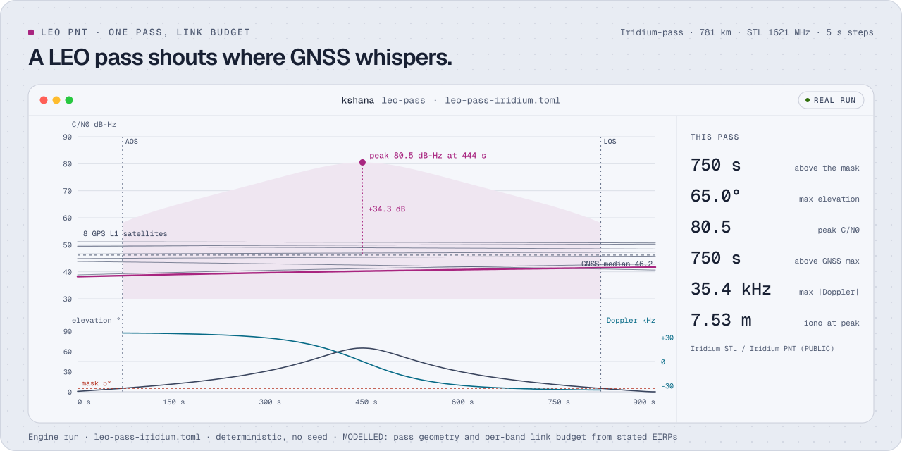
</picture>

Run any of them with `kshana example <scenario> > s.toml && kshana s.toml`: the scenarios
are `l-band-waterfall-jamming`, `constellation-multi-gnss-coverage`, `solar-system-tour`
and `leo-pass-iridium`.

</details>

<details>
<summary>The full capability table, domain by domain</summary>

The full domain-by-domain detail follows; for a per-capability maturity ledger see
[`docs/CAPABILITY.md`](docs/CAPABILITY.md) and [`docs/VALIDATION.md`](docs/VALIDATION.md).

| Domain | Capability |
|--------|------------|
| **Orbit & geometry** | SGP4/SDP4 propagation (validated to 4.12 mm against all 666 AIAA 2006-6753 vectors); real two-line elements (a committed, date-stamped Celestrak `gps-ops` snapshot) or synthetic Walker-delta constellations whose mean elements realise the `i:T/P/F` formula to under 1 km over a 24 h propagation; multi-constellation visibility, **dilution of precision — geometric, position, horizontal, vertical and time (GDOP/PDOP/HDOP/VDOP/TDOP), validated to 1e-6 against gnss_lib_py 1.0.4, Stanford NAV Lab** (Navigation and Autonomous Vehicles Laboratory), and GNSS availability; a gradient-free constellation-design optimiser, streets-of-coverage minimum-satellite sizing, a multi-constellation comparison tool, and a Walker **design sweep** that tabulates coverage / PDOP / revisit-time over a planes × satellites grid and reports the Pareto-optimal designs. |
| **Numerical propagator** | A **Cowell** numerical propagator (`src/propagator.rs`) complementing the analytic SGP4/SDP4 path, with a hierarchical **seven-perturbation** force model (`src/forces.rs`): two-body + the full **J2–J6 zonal** field (the Earth-oblateness zonal harmonic coefficients J2 to J6; the exact analytic gradient of its disturbing potential), an optional **EGM2008 tesseral spherical-harmonic geopotential to degree/order 70** (Earth Gravitational Model 2008; `src/gravity_sh.rs`; real NGA — US (United States) National Geospatial-Intelligence Agency — coefficients, Holmes–Featherstone normalized-Legendre recurrence, cross-checked against the closed-form Legendre functions and the analytic ∇V identity), **epoch-driven Sun and Moon third-body** gravity (a built-in low-precision ephemeris, no DE/SPK — Development Ephemeris / SPICE Spacecraft and Planet Kernel — kernel), **solar-radiation pressure** (cannonball model with a conical umbra+penumbra shadow), **atmospheric drag** (Vallado piecewise-exponential density, co-rotating atmosphere), the **post-Newtonian Schwarzschild relativistic correction**, and the **Lense–Thirring frame-dragging** term (IERS — International Earth Rotation and Reference Systems Service — Conventions 2010 §10, linear in Earth's angular momentum, ~1–2 orders below Schwarzschild) — driven by a choice of two adaptive integrators (RK4 — fourth-order Runge–Kutta — step-doubling or the **Dormand–Prince RK5(4)** embedded pair). **Validated against Orekit 12.2** (CS GROUP, Apache-2.0) `NumericalPropagator`/`DormandPrince853` — 275 epochs across LEO (low Earth orbit) + GTO (geostationary transfer orbit), the conservative-force tiers agreeing to a worst-case **\|Δr\| 0.08 m over 24 h** (`tests/numerical_cowell_propagator_reference.rs`); the atmospheric-drag tier is characterised separately (≈ 333 m / 24 h) and the absolute Sun/Moon-ephemeris and density inputs stay honestly **Modelled**. Additional internal evidence (not external validation): the unperturbed orbit is checked against the exact universal-variable Kepler solution to **sub-metre over 24 h**, energy/angular-momentum conserve to ~1e-9, and each perturbation matches a hand-derived closed-form signature. |
| **Maneuvers & trajectory design** | Impulsive ΔV nodes with 6×6 covariance propagation (ECI — Earth-centred inertial — / LVLH — local vertical, local horizontal — execution-error frames), finite-burn integration checked against the closed-form **Tsiolkovsky** rocket equation to < 0.01 %, an **Izzo-2015** single-revolution **Lambert** solver, an exact universal-variable **Kepler** propagator, and a **porkchop** (launch × arrival) C3 (launch energy) / arrival-V∞ sweep emitted as a JSON contour grid — the performance-simulation layer above GMAT/Orekit, with every Lambert output round-tripped against two-body truth and the porkchop minimum checked against the analytic Hohmann floor. |
| **Time systems & reference frames** | IERS leap-second **UTC / TAI / TT / UT1** scales (Coordinated Universal Time, International Atomic Time, Terrestrial Time, and the Earth-rotation time Universal Time 1), a Julian-date API (application programming interface), the IAU-2000 (International Astronomical Union) **Earth Rotation Angle** (ERA), GMST-based (Greenwich Mean Sidereal Time) **TEME ↔ ECEF** (true equator, mean equinox ↔ Earth-centred, Earth-fixed) with WGS-84 (World Geodetic System 1984) geodetic frames, IAU 2006 precession (Fukushima–Williams), full **IAU 2000A/2000B nutation**, IERS **polar motion**, and the equinox-free **CIO-based IAU 2006/2000A GCRS↔ITRS** reduction (CIO = Celestial Intermediate Origin) — all validated **bit-for-bit** against the SOFA/ERFA vectors, and **independently cross-checked against ANISE** (the pure-Rust NAIF/SPICE reimplementation; NAIF = the Navigation and Ancillary Information Facility of NASA, the US National Aeronautics and Space Administration): kshana's GCRS→ITRS vs ANISE's ITRF93 (International Terrestrial Reference Frame 1993) from JPL's `earth_latest_high_prec.bpc`, the same IERS Earth-orientation parameters fed to both, agree to **≤ 0.86 m on the ground / ≤ 3.6 m at GNSS orbit** (max 0.028″) across eight epochs 2020–2023. |
| **Inertial** | Three-axis strapdown INS — quaternion attitude, WGS-84 NED (north-east-down) mechanization, coning/sculling compensation, and a deterministic IMU error model (scale-factor, misalignment, g-sensitivity, quantization, drift); a **first-principles cold-atom-interferometer accelerometer** (Mach–Zehnder phase, quantum projection noise, contrast decay, vibration coupling) that *derives* the velocity-random-walk coefficient; and a sequential-importance-resampling **particle filter** for map-aided (terrain-/gravity-referenced) GPS-denied navigation. |
| **Alt-PNT (GPS-denied)** | A cold-atom **gravimeter measurement model** whose white-noise floor (`σ = ASD/√τ`, ASD = amplitude spectral density) is derived from the CAI accelerometer physics; a low-degree, fully-normalised **spherical-harmonic gravity-anomaly field** (checked against the closed-form Legendre functions and a hand-derived single-term anomaly) plus synthetic mascons; the **gravity-functional synthesis kernel** (`gravity_sh::gravity_magnitude` / `gravity_disturbance_mgal`) — the "map reader" a gravity-aided navigator matches against — is validated against the **GRS80 normal-gravity standard** (Geodetic Reference System 1980), reproducing the closed-form Somigliana normal gravity and the published γ_e / γ_p to **3.5e-12** and producing a physically-bounded disturbance map from the real ICGEM (International Centre for Global Earth Models) **EGM2008** field (RMS — root mean square — ≈ 26 mGal, max ≈ 89 mGal at d/o 70; `tests/icgem_gravity_reference.rs`); and a **gravity-map-matching particle filter** that recovers a GPS-denied track from the anomaly sequence it flies through. It extends to **terrain-referenced navigation** (TERCOM/SITAN — terrain contour matching / Sandia Inertial Terrain-Aided Navigation — against an SRTM (Shuttle Radar Topography Mission) `.hgt` DEM (digital elevation model), `src/altpnt/terrain.rs`), an **IGRF-14 geomagnetic main field** (14th-generation International Geomagnetic Reference Field) to degree/order 13 (`src/igrf.rs`, checked against the tilted-dipole closed form and ∇V finite differences), and a **combined gravity + magnetic + terrain** navigator that fuses all three scalar channels through one particle filter (information is additive — no channel makes the fix worse). A **60-minute GPS-denied benchmark** (a ~700 km / one-hour outage where the inertial solution drifts to ~70 km) is recovered to **~145 m (< 500 m)** by a hierarchical coarse-to-fine matcher — the ESA NAVISP (Navigation Innovation and Support Programme) *Quantum Wayfarer* target. |
| **Fusion** | Loosely-coupled 15-state GNSS/INS error-state EKF (extended Kalman filter) with closed-loop feedback (the `gnss-ins` pack); a **tightly-coupled** pseudorange update that keeps correcting with fewer than four satellites; a coupled **clock + position** filter; a general **unscented (sigma-point) Kalman** estimator for strongly nonlinear measurements; a tightly-coupled GNSS/INS **UKF navigator** (pseudorange + Doppler) whose force-model orbital coast is self-consistency-checked to **0.77 m RMS** over a 30-minute curving LEO pass that includes a 120-second GNSS outage (a filter-consistency figure, not an external-oracle validation — this navigator stays MODELLED); and a full **17-state tightly-coupled GNSS/INS UKF** (position, velocity, attitude error, accelerometer and gyro biases, clock bias and drift) whose **quantum-CAI dead-reckoning** coasts a 120-second outage on the cold-atom accelerometer's derived velocity-random-walk. |
| **Orbit determination** | Recovery of an orbital state `[r, v]` from ground-station range tracking, composing the two-body + J2 force model and RK4 integrator with a **Gauss–Newton batch** corrector (`determine_orbit_batch`, sub-metre / mm·s⁻¹ from noiseless ranges, ~2 m at a 5 m noise floor) and a **sequential** unscented-filter variant (`determine_orbit_sequential`). |
| **Observability & estimation theory** | A general, reusable **Fisher-information / Cramér–Rao** layer (`src/fim.rs`): the information matrix M = HᵀWH, the **Cramér–Rao lower bound**, observability **rank and datum-defect null space** (Moore–Penrose pseudo-inverse), and **D/A/E/T-optimal** experiment-design scalars from a symmetric Jacobi eigensolver. **Validated** — eigenvalues vs `numpy.linalg.eigh`, the CRLB covariance vs σ²(XᵀX)⁻¹ via `numpy.linalg.inv`, and GNSS DOP from the information matrix, all matched to **1e-9** (`tests/fim_observability_reference.rs`), and additionally cross-checked against the **Kay (1993)** closed-form bounds with Monte-Carlo CRLB attainment. It underpins the DOP engine, the passive-geolocation CRLB, and the lunar absolute-station **observability theorem** (below). |
| **Lunar & cislunar** | An Earth–Moon **circular restricted three-body (CR3BP)** propagator in the rotating frame — conserved Jacobi constant and all five Lagrange points (`src/cr3bp.rs`) — now with a **6×6 state-transition matrix (STM) and a single-shooting differential corrector** (`cr3bp_jacobian`, `propagate_state_stm`, `differential_correct_halo`) that produces genuinely periodic **halo / NRHO** (near-rectilinear halo orbit) orbits: the STM is validated against finite differences, corrected orbits close to machine precision, and seeding the published apolune state reproduces the **L2 southern 9:2 NRHO** (L2 = the second Earth–Moon Lagrange point; the Gateway orbit) at period ≈ 6.57 d / perilune ≈ 3,250 km, consistent with the published ≈ 6.56 d / ≈ 3,370 km (a CR3BP — circular, Sun-free — solution, **not** validated against a real LANS (Lunar Augmented Navigation Service)/Gateway ephemeris; the selenocentric MCI/MCMF (Moon-centred inertial / Moon-centred, Moon-fixed) transform of the corrected orbit is a follow-on); plus **LunaNet / LNIS** (LunaNet Interoperability Specification) cislunar PNT geometry (MCI↔MCMF reduction, selenographic coordinates) with a **lunar south-pole ARAIM** pass that honestly surfaces the integrity gap: a ~30 m σ_URE (user range error) drives the protection level well above a 50 m alert limit (`src/lunar.rs`, `scenarios/lunanet-araim.toml`); and a **surface-beacon DOP augmentation** (`src/lunar_beacon.rs`) showing how a few surveyed surface ranging beacons supply the low-elevation, wide-azimuth line-of-sight rows an all-overhead orbit-only set lacks — collapsing the ill-conditioned south-polar GDOP and, via a root-sum-square error budget, the realized position accuracy in metres (reusing the gnss_lib_py-validated DOP kernel and the airless-horizon visibility closed form; the dilution-of-precision analysis is written up in [arXiv:2607.06212](https://arxiv.org/abs/2607.06212)). |
| **Lunar PNT suite** | A modelled lunar/cislunar navigation suite layered on the CR3BP core, each a runnable `kind`: **Lunar Coordinate Time** (`lunar-time-offset`, `src/lunar_time.rs` — the secular LTC/TCL − TT rate (LTC = Lunar Coordinate Time; TCL = its French form, Temps-Coordonnée Lunaire) from the self-potential difference + kinetic term, reported with the published 56–59 µs/day band); a geodetic **lunar VLBI** (very-long-baseline interferometry) delay observable (`lunar-vlbi`, `src/lunar_vlbi.rs` — an Earth-baseline near-field two-range-difference delay + rate, cross-checked against the same-codebase plane-wave Δ-DOR (delta differential one-way ranging) in the far-field limit, partials finite-difference-verified); a **joint multi-technique OD + clock** batch estimator (`lunar-joint-od-clock`, `src/lunar_combination.rs` — a Gauss–Newton fit fusing VLBI + lunar-local ranges + inter-satellite ranges) carrying a **Fisher-information observability** result: internal ranging alone leaves a six-degree-of-freedom rigid-body **datum defect**, so a surface station's *absolute* position is unobservable until an Earth-frame tie is added — an Earth-baseline **VLBI** delay *restores* observability for a sparse constellation and *sharpens* the Cramér–Rao bound for a rich one, the absolute datum closing at **three** non-collinear Earth stations (the observability result written up in [arXiv:2607.02566](https://arxiv.org/abs/2607.02566)); **reference-frame realisation** (`lunar-frame-realisation`, `src/lunar_frame_realise.rs` — a 7-parameter Helmert datum fit + IAU 2015 WGCCRE orientation tie — WGCCRE = the IAU Working Group on Cartographic Coordinates and Rotational Elements); a **Moonlight/LCNS-class service-volume** analysis (LCNS = Lunar Communications and Navigation Services; `moonlight-service-volume`, `src/lunar_service.rs` — DOP / coverage / availability + a generalised lunar ARAIM HPL/VPL (horizontal/vertical protection level) envelope, reusing the gnss_lib_py-validated DOP kernel and the LunaNet σ_URE≈30 m machinery); **lunar differential PNT** (`lunar-differential-pnt`, `src/lunar_dpnt.rs` — a lunar differential-GNSS / satellite-based-augmentation-system (SBAS) analogue: exact common-mode clock cancellation + first-order spatial decorrelation vs baseline, reusing the DO-229E SBAS protection level — DO-229E being the RTCA (formerly the Radio Technical Commission for Aeronautics) minimum operational performance standard for SBAS receivers); and a **LunaNet/IOAG-aligned interoperability export** (IOAG = Interagency Operations Advisory Group; `lunar-interop-export`, `src/lunar_interop.rs` — CCSDS-OEM (Orbit Ephemeris Message) + lunar-time-scale round-trip in the IAU 2015 lunar body frame, wrapped in the KIF envelope). All **MODELLED** against internal consistency / reference implementations from **illustrative public-source parameters** — **not** validated against real VLBI/Gateway tracking, **not** affiliated with or endorsed by any agency, no TRL (technology readiness level) / heritage claim. |
| **Deep-space & Mars PNT** | An open **radiometric navigation engine**: iterative light-time + **Shapiro** relativistic delay, two-/one-/three-way **Doppler & range** (Moyer two-leg), coherent transponder turnaround ratios, regenerative/PN (pseudo-noise) ranging (CCSDS 414, the pseudo-noise ranging standard), and **Δ-DOR** plane-of-sky (CCSDS 506, the Delta-DOR standard), with solar-plasma/tropo/iono media; **CCSDS-TDM (503)** tracking-data-message parse + emit; a **reduced-dynamic Square-Root Information Filter** (RTN — radial, transverse, normal — empirical accelerations + a 3-state onboard clock + Mars atmospheric drag) that does **Mars-LMO orbit determination to ≈ 0.2 m** in a synthetic closed loop; a joint **one-way + two-way fusion** estimator; a multi-body dynamics core (`Body{μ, re, zonals, gravity, IAU-pole}`, Mars GMM-3 (Goddard Mars Model 3) gravity, an IAU body-fixed Mars frame, a pluggable `EphemerisProvider` seam, two-part Julian dates + TT↔TDB (Barycentric Dynamical Time)); and the **`mars-pnt`** relay-PNT scenario (a MARCONI areostationary relay constellation) with an end-to-end **GSE performance simulator** (GSE = ground-support equipment) (geometry → link budget → observables → SRIF → covariance). **Simulation-validated** (covariance / closed-loop figures of merit); the Sun-central Mars dynamics are cross-checked against JPL **DE440** (137 m @ 1-day arc, `xval/anise-mars-od`). Real DSN/ESTRACK tracking-data validation is on the roadmap. |
| **Solar system & any-body PNT** | A kernel-free **whole-solar-system ephemeris** (`src/ephem.rs`, `src/ephem_provider.rs`): every planet from the JPL **Standish Keplerian elements** (Table 1, 1800–2050 AD; Tables 2a/2b, 3000 BC–3000 AD) with each planet's published nominal error, the Earth and Moon split by the lunar series, and Phobos, Deimos, Io, Europa, Ganymede, Callisto and Titan from JPL mean elements and the IAU (International Astronomical Union) rotation model; **any body relative to any other** in the ICRF (International Celestial Reference Frame). `Body` now carries **GM (gravitational parameter), radii, J2 (the second zonal harmonic) where published and the IAU pole and prime meridian for eighteen bodies**. The **`solar-system`** kind reports positions, velocities, constants, **light time and one-/two-way range** between any two bodies (the existing radiometric light-time solver, with the solar Shapiro delay) and an orbit track per body — enough to draw an interactive solar system; the **`body-pnt`** kind positions an orbiter or a lander **around any body** (`scenarios/mars-orbit-pnt.toml`, `scenarios/europa-surface-pnt.toml`) with a local Walker constellation, the dilution-of-precision and Gauss–Newton machinery, and a deep-space range from Earth. **Validated** against JPL Horizons (DE441, JPL Development Ephemeris 441): Mercury–Saturn and the Earth from Table 1 within twice the nominal error (worst 1.87×), all eight planets from Tables 2a/2b (worst 1.71×), and the Earth–Mars/Jupiter light time. **Modelled**: Uranus and Neptune from Table 1 (2.0× and 5.2× the stated error against DE441), Pluto, the moons, and the `body-pnt` navigation results. |
| **Fused MEO + LEO PNT** | `src/leo_fusion/`: system-agnostic LEO positioning, navigation and timing over any constellation (Walker shells, element sets, GNSS presets) and any signal (carrier, chip rate, C/N0 envelope, signal-in-space range error), with optional one-file presets carrying their sources (Xona Pulsar X1/X5, Iridium STL, Starlink signals of opportunity, CentiSpace, a representative C-band system, the ATOMIC zero-clock ephemeris model). **`leo-pvt`**: batch **Doppler positioning** from range rate (single- and multi-satellite, clock-drift and velocity states, single-pass along/cross-track geometry and the mirror solution), **joint GNSS + LEO weighted least squares** with per-system inter-system biases and caller-supplied per-signal sigmas, the DOP against the number of LEO satellites, **polar and Arctic** coverage, and **LEO time transfer to UTC** against C/N0 and the oscillator. **`leo-ppp`**: a float PPP (precise point positioning) EKF (extended Kalman filter) with GNSS only and with LEO, its convergence time and a chi-square NEES consistency test. **`ntn-positioning`**: 5G non-terrestrial-network positioning from the Cramér-Rao bound of the bandwidth. **Validated**: the LEO Doppler envelope against the published Iridium and Xona figures. **Modelled**: the rest, with the PPP trend compared against Li et al. (2019) — see [`docs/LEO-PNT-FUSION.md`](docs/LEO-PNT-FUSION.md). |
| **Integrity** | Snapshot and solution-separation (ARAIM-style) RAIM — receiver autonomous integrity monitoring — with horizontal/vertical protection levels (HPL/VPL), fault detection & exclusion, and Stanford integrity diagrams; an explicit integrity-risk-budget **multiple-hypothesis solution separation (MHSS)** protection level, including the **dual-/multi-constellation constellation-wide fault mode** (EU (European Union) ARAIM / DO-316, the RTCA performance standard for GPS airborne equipment with aircraft-based augmentation), exercised on a real GPS + Galileo snapshot (`scenarios/araim-gps-galileo.toml`). The protection level applies the one-sided **nominal-bias** projection `b_k = Σ_i|s_i|·b_nom` per fault mode and the **integrity** sigma σ_URA (user range accuracy; distinct from the accuracy σ_URE, user range error) from the Integrity Support Message — see [`docs/ARAIM_REFERENCE.md`](docs/ARAIM_REFERENCE.md). The detection kernel (the χ²/non-central-χ²/normal thresholds and K-multipliers) is **externally validated against SciPy** across 171 cases (`tests/raim_reference.rs`); the geometry reuses the gnss_lib_py-validated DOP kernel. The ARAIM MHSS integrity-risk *budget allocation* itself has no published numeric oracle and stays honestly Modelled. |
| **Augmentation (SBAS)** | **SBAS / WAAS protection levels** (WAAS = the Wide Area Augmentation System) in the DO-229E weighted-least-squares form (precision-approach and en-route K-factors) and the **L1/L5 dual-frequency ionosphere-free** combination (L1 and L5 being two GPS civil signal bands; IS-GPS-705, the GPS interface specification for the L5 signal, γ₁₅ ≈ 1.793) that underpins DO-316 — `src/sbas.rs`. The protection-level algorithm is **externally validated against the RTKLIB SBAS-PL fork** (RTKLIB = the open real-time-kinematic positioning library; PL = protection level) (`zsiki/rtklib_ws` `waasprotlevels()`, Siki & Takács 2017, DO-229D — the previous revision of DO-229 — App. J) run on **real EGNOS data** (European Geostationary Navigation Overlay Service), reproducing its HPL to < 2e-3 m (`tests/sbas_reference.rs`); gLAB (the GNSS Laboratory tool suite) v6.0.0 confirmed the identical convention. |
| **Clock & timing** | Two-state Kalman holdover (Joseph-form covariance, NIS/NEES — normalised innovation squared / normalised estimation error squared — consistency health); Allan-family stability (ADEV / MDEV / TDEV / HDEV / MTIE — Allan, modified Allan, time and Hadamard deviation, and maximum time interval error) with noise-type-specific confidence intervals and a full **IEEE-1139 five-coefficient power-law fit** (IEEE Std 1139, the Institute of Electrical and Electronics Engineers frequency-and-time metrology definitions) — the estimators are validated on real hardware against **Stable32**: a **real 5071A caesium primary standard vs a hydrogen maser** (556,990 phase samples, 16 averaging factors, OADEV/OHDEV — overlapping Allan/Hadamard deviation — to 1e-3; `tests/cs5071a_reference.rs`) and the **canonical Stable32 PHASE.DAT** regression series (139 averaging factors, OADEV/MDEV/TDEV to 1e-3; `tests/phasedat_reference.rs`); the ADEV/MDEV/TDEV estimators and the telecom **MTIE** wander metric are additionally cross-checked against the **independent allantools 2024.06** library to **< 1e-9** on the NIST SP 1065 series (`tests/mtie_reference.rs`, `tests/mdev_tdev_reference.rs`); geometric corrections (Sagnac, GNSS common-view); and the operational transfer methods — **TWSTFT** (two-way satellite time and frequency transfer) with the BIPM (International Bureau of Weights and Measures) Sagnac closed form, **GNSS common-view**, **PPP** (precise point positioning) ionosphere-free time transfer, a free-space **optical** link with turbulence scintillation, and an inverse-variance **clock-ensemble (paper) timescale** below the best contributing clock. A **GNSS-denied clock-holdover calculator** (`src/holdover.rs`) exposes the closed-form van-Loan coast-error growth as a *holdover-to-threshold* inversion — how long a clock free-runs before its timing error exceeds budget — across representative classical and quantum-clock classes; **modelled** (cross-checked against the multi-step `clock_state` covariance recursion), and honest that for a very stable clock the holdover to a tight threshold is set by the *assumed* long-tau noise floor, not the cited ADEV. A **conditional Timing Protection Level** (`src/tpl.rs`) extends holdover to spoofing: a bound on the *undetected* time error, given an independent cross-check, that composes a k-sigma monitor floor, the van-Loan coast variance over the detection latency, and a CUSUM (cumulative-sum) time-to-alarm. Calibrated on a real recorded spoof (JammerTest 2024) and reproducible via `cargo run --example tpl_jammertest`; **MODELLED** composition (no integrity-risk-per-hour budget), conditional on detection — there is no finite *unconditional* bound. |
| **GNSS measurement domain** | Forward pseudorange / Doppler synthesis with **Klobuchar** (broadcast) and **IONEX / TEC-grid** (IONosphere map EXchange format / total electron content; measured) ionosphere — including an IONEX file parser, time interpolation between maps, and the thin-shell slant-obliquity mapping — **Saastamoinen + Niell** troposphere, and snapshot RAIM (HPL/VPL). |
| **Resilience** | Link-budget **jamming** (J/S → effective C/N₀ → loss of lock — jammer-to-signal ratio, carrier-to-noise-density ratio — with the anti-jam spectral-separation factor `Q` now **derived from the actual signal and jammer power spectra** via `src/navsignal.rs` — `Q = 1/(R_c·κ)`, cross-checked in CI against the previous representative constant); a stochastic **time-spoof detector** (Neyman–Pearson / χ²₁ energy test with closed-form and Monte-Carlo P_fa/P_md and a Security figure of merit (FoM) of 1 − P_md); and a **multi-layer spoof detector** fusing a RAIM-consistency parity test (with the common-mode blind spot modelled honestly), an RF AGC-power (automatic gain control) monitor, and a signal-quality (SQM — signal-quality monitoring, early-minus-late) monitor; and a **quantum-inertial dead-reckoning error budget** (`QuantumNavBudget`, `src/inertial/quantum_imu.rs`) composing the cold-atom-interferometer white-noise velocity-random-walk with residual bias (cross-checked against the independent `AccelModel` integrator) and scale-factor error into a position-drift-over-holdover figure — the inertial twin of the clock holdover. A **framework-aligned resilience-scoring engine** (`src/resilience/`) maps an architecture's simulated behaviour to per-dimension sub-scores across the DHS RPCF categories (the US Department of Homeland Security Resilient PNT Conformance Framework), then studies the **decision-stability** of any single composite score or maturity Level under a Dirichlet weighting simplex and a five-threat ensemble — Kendall-τ rank instability, top-1 winner flip rate, and common-mode **diversity collapse** (Hill-N2), with an integrity-hashed assurance report (35 hand-derived oracle tests). Reproducible via `cargo run --example resilience_report`; **MODELLED** synthetic architectures, a self-assessment aligned to RPCF v2.0, **not** a certification. See [`docs/RESILIENCE-CROSSWALK.md`](docs/RESILIENCE-CROSSWALK.md). |
| **Passive RF geolocation** | **TDOA/FDOA emitter geolocation** (time-/frequency-difference of arrival; `src/geolocation.rs`) — locate a jammer or spoofer (or an opportunistic source for reverse-PNT) from **time-difference-of-arrival** hyperboloids across a receiver network, solved by Gauss–Newton least squares; adding **frequency-difference-of-arrival** with moving receivers jointly recovers the emitter's position *and* velocity, with the **Cramér–Rao** bound on the position covariance derived from the network geometry. **MODELLED** (internal-consistency oracles: forward→inverse round-trips, the J·CRLB = I identity, GDOP monotonicity, and the estimator attaining its own CRLB under Monte-Carlo) — a point-source line-of-sight model, no multipath / NLOS (non-line-of-sight), receiver-clock-bias, or refraction terms. |
| **Nav-signal & code tracking** | The **signal level** between the link budget and the measurement domain (`src/navsignal.rs`): unit-area **power spectral densities** (PSDs) for **BPSK-R(n)** (binary phase-shift keying with rectangular chips) and **sine-BOC(m,n)** (binary offset carrier); the **spectral-separation coefficient** (SSC) κ = ∫ G_s·G_i df, which **derives the anti-jam `Q`** the jamming model uses (`Q = 1/(R_c·κ)`) from the actual signal/jammer spectra instead of a representative constant; the **RMS (Gabor) bandwidth** (BOC > BPSK — the ranging-information / Cramér–Rao measure); the **coherent early–late DLL code-tracking thermal-noise jitter** (DLL = delay-lock loop; Kaplan & Hegarty; ~sub-metre for C/A — the GPS coarse/acquisition code — at 45 dB-Hz); and the **multipath error envelope** (coherent EML, early-minus-late — narrow-correlator suppression). Validated against closed-form anchors (BPSK self-SSC = 2/(3·R_c), unit-area PSDs, sub-metre C/A jitter). This is signal-**performance** analysis, **not** antenna / RF-payload hardware design (a payload partner's role). |
| **Interoperability** | **RINEX-3** multi-GNSS broadcast-ephemeris ingestion (GPS, Galileo, QZSS — Japan's Quasi-Zenith Satellite System —, BeiDou MEO/IGSO — medium Earth orbit / inclined geosynchronous orbit — via IS-GPS-200, the GPS interface specification; GLONASS, Russia's Global Navigation Satellite System, via PZ-90 — the Russian Parametry Zemli 1990 datum — state-vector RK4) usable as a constellation source (RINEX in, PNT geometry out); a **RINEX-3** observation parser (pseudorange, carrier phase, Doppler, signal strength; the 4.00 observation layout is expected to parse but is untested, and RINEX 4 navigation files are refused by name rather than mis-decoded) that now **feeds a single-point-positioning (SPP) solver** (`pvt`) — real code observations in, a real **receiver position** out, validated on IGS data; an **SP3-c/d** precise-ephemeris reader/writer with 9th-order Lagrange interpolation; and **CCSDS OEM 2.0 + OMM** (Orbit Mean-elements Message) export for flight-dynamics tools (GMAT, Orekit, STK — Systems Tool Kit); and **CCSDS-TDM (503)** tracking-data-message parse + emit for deep-space radiometric tracking. |
| **Mission analysis (systems engineering)** | First-order mission-design budgets, each a runnable kind: two-body **launch & ascent geometry** (`launch-window` — launch azimuth `sin Az = cos i/cos lat`, minimum inclination, Earth-rotation bonus, dogleg plane-change Δv, daily opportunities; `src/launch.rs`); an **Allen–Eggers ballistic re-entry corridor** (`reentry` — peak deceleration, peak-g velocity/altitude, peak-heating velocity; `src/reentry.rs`); **Earth-observation coverage geometry** (`eo-coverage` — swath / nadir GSD (ground sample distance) / off-nadir access / revisit via the SMAD (*Space Mission Analysis and Design*) space triangle; `src/eo_payload.rs`); a **3-DOF attitude & pointing error budget** (three-degree-of-freedom; `attitude-budget` — worst-case gravity-gradient torque + RSS (root-sum-square) pointing budget; `src/attitude_budget.rs`); **ground-station pass prediction** (`passes` — AOS/TCA/LOS, acquisition of signal / time of closest approach / loss of signal, max elevation, access time; `src/passes.rs`); and a **one-way link budget** over the CCSDS 401 / DSN 810-005 link equation (the CCSDS radio-frequency and modulation standard / the Deep Space Network link design handbook; `link-budget` — FSPL (free-space path loss), C/N₀, Eb/N₀ (energy-per-bit to noise-density ratio), margin, closure; `src/linkbudget.rs`). **MODELLED** first-order analytic budgets — the pre-hardware layer below STK/GMAT/Basilisk, not a 6-DoF or radiometric replacement. |
| **Decision analysis & trade-off (MCDA)** | A full **multi-criteria decision-analysis** (MCDA) suite (`src/mcda/`) spanning all four method families — value aggregation (**WSM**, **WPM**, **WASPAS** — weighted sum model, weighted product model, weighted aggregated sum product assessment), distance-to-ideal (**TOPSIS**, Technique for Order of Preference by Similarity to Ideal Solution), compromise programming (**VIKOR**, from the Serbian for multi-criteria optimisation and compromise solution), and outranking (**PROMETHEE II**, Preference Ranking Organization Method for Enrichment of Evaluations; **ELECTRE I**, from the French for elimination and choice expressing reality), plus ratio-system **MOORA** (Multi-Objective Optimization on the basis of Ratio Analysis) and proportional **COPRAS** (Complex Proportional Assessment) — with **AHP** (Analytic Hierarchy Process) pairwise-comparison priority weighting (Consistency Ratio), a **Pareto** non-dominated front, weight-**sensitivity** analysis, and multi-attribute **utility** scoring. The nine aggregators reproduce the independent third-party libraries **pymcdm** (WSM / WPM / WASPAS / MOORA / TOPSIS / VIKOR / PROMETHEE II) and **pyDecision** (ELECTRE I, COPRAS) to **< 1e-9**, and the AHP priority vector + Consistency Ratio match Saaty's Random-Index table and the SciPy/LAPACK principal eigensolver to < 1e-9 (`tests/mcda_*_reference.rs`). **VALIDATED** — the decision layer under the trade-study engine. |
| **Space environment** | A **space-weather environment model** (`space-weather`, `src/space_weather.rs`): solar (F10.7 / centred-81-day F10.7a — the 10.7 cm solar radio flux) and geomagnetic (Kp, the planetary K-index, with the definitional Kp↔ap table — ap being its linear planetary amplitude) activity indices, the **Jacchia-1971** exospheric temperature they drive (validated vs published solar min/mean/max), and the activity-corrected vs static thermospheric neutral density at altitude — the solar-cycle density dependence the static USSA76 (US Standard Atmosphere 1976) atmosphere omits. **MODELLED**: a calibrated first-order scale-height coupling, **not** a data-validated (NRLMSISE — the US Naval Research Laboratory Mass Spectrometer and Incoherent Scatter Radar Exosphere model) atmosphere. |
| **AI/ML evaluation & trade** | An **RF-impairment detection evaluation testbed** (`impairment-eval`, `src/impairment_eval.rs`): a labelled, parameter-grounded **synthetic** corpus (nominal / jamming / spoof-time / spoof-position / multipath), a detector-agnostic **ROC/AUC** (receiver operating characteristic / area under the curve) harness scoring any detector (energy \| agc \| sqm \| parity \| fused) with per-class Pd (probability of detection) at a target Pfa (probability of false alarm), and the in- vs out-of-distribution **optimism gap** (distribution-shift mode). Plus a **quantum-vs-classical PNT trade** (`quantum-trade`, `src/quantum_trade.rs`) quantifying a candidate clock's timing/inertial holdover benefit from a **measured-ADEV** curve vs a classical baseline, with the long-τ floor caveat carried on the artifact and a GNSS-denied resilience-vs-time envelope. The evaluation **metrics** (AUC / confusion / Pd-Pmd, Pmd being the probability of missed detection) are **validated to an exact match against scikit-learn 1.9.0** — including on **real ESA OPS-SAT telemetry** (the OPSSAT-AD anomaly-detection dataset, Ruszczak et al. 2025, CC BY 4.0 — Creative Commons Attribution 4.0), where Kshana's Mann–Whitney ROC AUC reproduces scikit-learn's `roc_auc_score` to < 1e-9 on the held-out test split and a transparent peak-count detector separates the labelled anomalies at AUC ≈ 0.85 (`tests/opssat_ad_reference.rs`) — and the trade engine's numerical **kernels** (ADEV NNLS — non-negative least squares — fit, χ² consistency bands, van-Loan clock Q) **against scipy 1.17.1**; the device-benefit numbers built on top stay **MODELLED** operating characteristics — never field/IQ (in-phase/quadrature sample) data, no good/bad verdict. Building on the testbed, a deeper **optimism-gap study** (`src/impairment_study.rs`, `impairment_ml.rs`, `eval_stats.rs`) scores a **13-detector** panel (energy/AGC/SQM/parity plus seeded logistic-regression and one-hidden-layer-MLP — multi-layer perceptron — detectors), fits in- vs out-of-distribution **scaling laws** with a permutation null, and learns a **leave-one-out predictor** of out-of-distribution degradation from in-distribution statistics (`cargo run --example optimism_study`). A **software-defined-receiver front end** (`src/sdr.rs` — raw IQ/IF (intermediate-frequency) → correlator early/prompt/late taps → SQM) and **real-data ingest adapters** (`src/realdata/` — RINEX, u-blox UBX (the u-blox binary protocol), GnssLogger, JammerTest, Yunnan, SatGrid) let the same detectors run over recordings supplied locally (no datasets are committed). The **quantum-vs-classical resilience crossover map** under parameter uncertainty (`src/crossover.rs`; `cargo run --bin crossover_study`) regenerates the inertial and clock crossover studies behind the Results figures. |
| **Quantum-Enabled PNT demonstrator** | Three runnable, **MODELLED** application areas behind the open engine, each emitting honest `TradeEvidence` + a representativeness / gaps-to-flight record (`src/representativeness.rs`): **trusted quantum time transfer** (`quantum-time-transfer`, `src/timetransfer_chain.rs` — an end-to-end optical-lattice-clock + photonic-link vs CSAC (chip-scale atomic clock) + RF two-way budget, with a reused timing protection level, a delay/replay-attack security FoM (1 − P_md), and clock-anomaly detection + CUSUM latency); **GNSS-free quantum navigation** (`quantum-gnss-free-nav`, `src/quantum_nav_od.rs` — a cold-atom-interferometer inertial coast vs a navigation-grade INS over a GNSS outage, honest that with no external fix the accelerometer bias is unobservable so the error still grows); and quantum-system **fault/anomaly detection** (`quantum-anomaly-detect`, `src/quantum_faults.rs` — a labelled fault catalogue with a bootstrap-CI (confidence-interval) ROC AUC from the externally-validated `eval_stats` and a minimum-detectable-fault at a fixed false-alarm rate). A shared **quantum device error-model library** (`src/quantum_devices.rs`) and a unified **quantum-vs-classical trade harness** (`src/qtrade.rs`) underpin them. The validated kernels they ride (eval-metrics vs scikit-learn, trade kernels vs scipy) are reused; the device-benefit numbers built on top stay **MODELLED** — **illustrative public-source** device/link parameters, models the *class*, no TRL / flight heritage / certification, no agency endorsement. |
| **Frugal engineering & integrity impact** | A **cost-per-coverage ROI** (return on investment) lens (`src/frugal.rs`) — cost per unit of delivered coverage for an architecture trade — and a **detection-miss → integrity-impact** mapping (`src/integrity_impact.rs`) that turns a monitor's missed-detection rate into its integrity-risk contribution. **MODELLED** decision-support budgets, additive. |
| **Artifact interchange** | The **Kshana Interchange Format (KIF)** (`src/interchange.rs`) — a versioned, self-describing envelope wrapping a scenario result with its kind, schema version, and MODELLED/VALIDATED labels, so a stored artifact stays self-documenting and older envelopes remain forward-compatibly readable. |

Each capability is reachable as a Rust API, a runnable scenario `kind`, or both.
Maturity per capability — *validated*, *runnable*, or *library* — is tracked in
[`docs/CAPABILITY.md`](docs/CAPABILITY.md). A **machine-checked verification matrix**
(`src/verification.rs`) renders the requirement → module → test → oracle → status
cross-reference, with unit-tested honesty invariants that permit a *validated* label
only where an independent **external** oracle backs it — and that record the
hardware/PA (product-assurance) capabilities Kshana deliberately does **not** provide.

</details>

<details>
<summary>The four sensor packs, as first published (results)</summary>

### Results

Each scenario compares a quantum sensor against its classical counterpart through a
~1.8 h GNSS outage. Numbers are reproducible (`scenario + seed + version`).

<p align="center">
  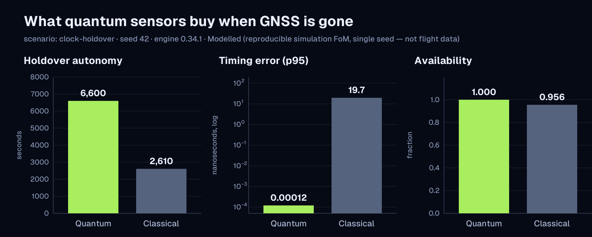
  <br><sub>What quantum sensors buy when GNSS is gone — <code>clock-holdover</code> · seed 42 · drawn at engine 0.22.0, and every figure above re-checked against the current engine on each build by <code>tests/published_figures_still_reproduce.rs</code> · <a href="docs/assets/figures/scenario-fom.svg">SVG</a></sub>
</p>

The advantage is **outage- and vibration-dependent**, with an explicit break-even where classical wins — shown honestly across the technology-readiness ladder (optical-clock figures are ground-demonstrator targets; no strontium optical clock has flown):

<p align="center">
  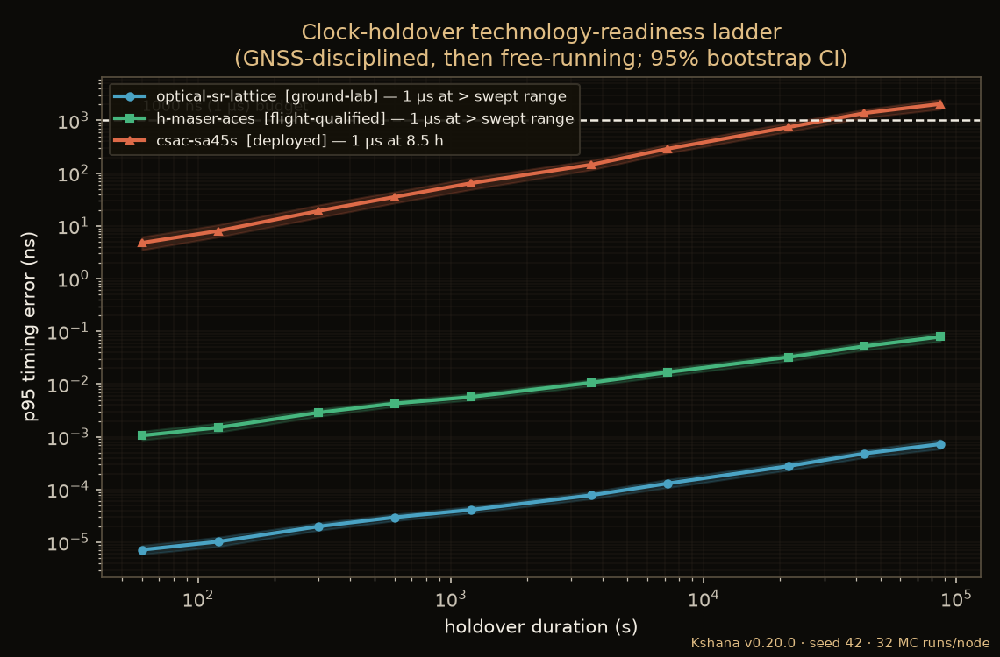
  <br>
  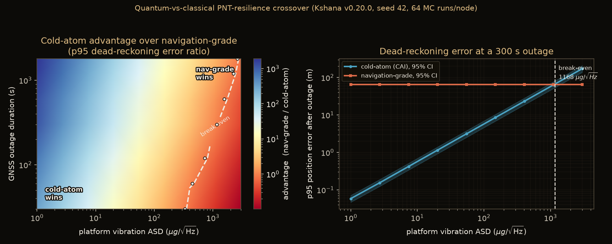
  <br><sub>Quantum-vs-classical resilience crossover — clock holdover TRL ladder (top) · inertial advantage map with break-even contour (bottom). Regenerable via <code>cargo run --release --bin crossover_study</code>.</sub>
</p>

<p align="center">
  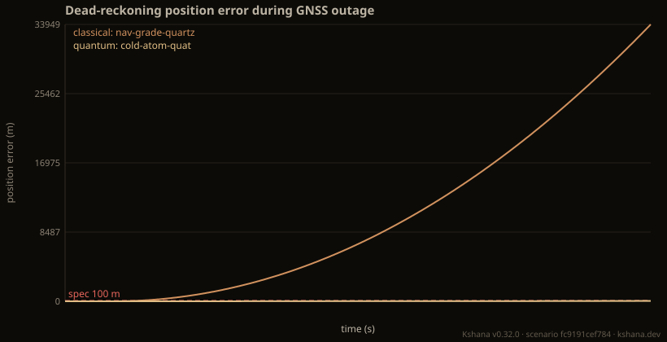
  <br><em>Dead-reckoning position error during a GNSS outage: the quantum sensor (blue)
  stays flat near the spec; the classical sensor (red) diverges to tens of kilometres.
  Generated by Kshana from <code>scenarios/imu-deadreckoning.toml</code>.</em>
</p>

| Pack | Scenario | Quantum | Classical |
|------|----------|---------|-----------|
| **1 — Clock holdover** | `clock-holdover.toml` (20 ns spec) | optical clock holds the full outage | CSAC breaches the spec mid-outage |
| **2 — Inertial dead-reckoning** | `imu-deadreckoning.toml` (100 m spec) | cold-atom: **~41 m**, holds full outage | nav-grade: breaches in **~350 s** → tens of km |
| **3 — Time transfer** (optical inter-satellite link) | `timetransfer.toml` | optical: **~0.3 mm** ranging | RF (TWSTFT): **~150 mm** ranging |
| **4 — Hybrid fusion** (capstone) | `hybrid-pnt.toml` | full position+timing for the whole outage | **position-limited at ~350 s** |

The capstone shows the fusion thesis: optical inter-satellite time-transfer keeps even
a classical *clock* locked, isolating the *inertial* sensor as the classical suite's
weak link — i.e. quantum inertial + optical timing together.

<p align="center">
  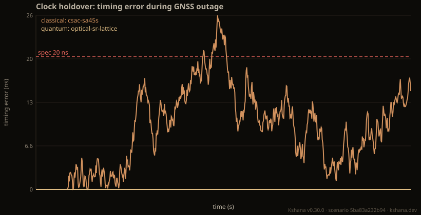
  <br><em>Clock holdover through a GNSS outage: the optical clock (blue) stays inside the
  20 ns spec for the full coast; the chip-scale clock (red) breaches it part-way.
  Generated by Kshana from <code>scenarios/clock-holdover.toml</code>.</em>
</p>

A further scenario, `orbit-gnss-challenged.toml`, derives GNSS availability from
**orbital geometry** rather than hand-authored windows: a spacecraft inside the GNSS
shell is propagated against a GPS-like Walker constellation, and the visible-satellite
count (line-of-sight, Earth-occultation, elevation mask) sets the fix state at each
step. Over a day the user is in fix only ~59% of the time; the quantum clock holds a
5 ns timing solution through every gap (availability **1.0**), the chip-scale clock
only **~0.83**.

<p align="center">
  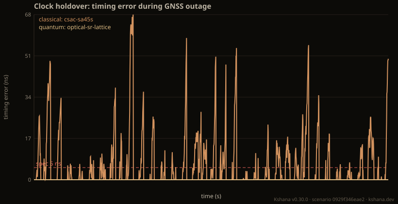
  <br><em>Timing error over a day with GNSS availability derived from orbital geometry: the
  visible-satellite count (line-of-sight, Earth-occultation, elevation mask) sets the fix
  state at each step, so the clock must coast every gap — the optical clock holds the 5 ns
  spec while the chip-scale clock breaches it. Generated by Kshana from
  <code>scenarios/orbit-gnss-challenged.toml</code>.</em>
</p>

The constellation can also be given as real two-line element sets (TLEs). A *full* TLE
(line 1 + line 2) is propagated with the full **SGP4/SDP4** model — including
atmospheric drag and the deep-space lunar-solar and 12 h / 24 h resonance terms that
matter for ~12 h GNSS orbits — validated against the official AIAA 2006-6753 vectors
to a worst-case ≈ 4 mm. `scenarios/orbit-sgp4-gps.toml` ships a **real Celestrak
`gps-ops` snapshot** of the operational GPS constellation (2021-07-28, 30 satellites)
and requires valid TLE checksums — two-line element sets are open data from the US
Space Force / 18th Space Defense Squadron catalogue, redistributed by Celestrak
(Dr T. S. Kelso, [celestrak.org](https://celestrak.org)); refresh with
`scripts/fetch_tles.sh`. A line-2-only block keeps
the analytic two-body propagation (`scenarios/orbit-real-tle.toml`); the two forms can
be mixed in one constellation. A constellation can equally be built from a block of
**RINEX-3 GPS broadcast-ephemeris** records — the format a receiver decodes —
propagated by the IS-GPS-200 user algorithm and fed through the same geometry
(`scenarios/orbit-rinex.toml`).

</details>

<details>
<summary>What it is / is not, in full</summary>

### What it is / is not

**It is:** a deterministic, dependency-light engine spanning the PNT stack — orbit
geometry, inertial navigation, GNSS/INS fusion, integrity, clocks, and timing. It
runs a scenario (often a GNSS outage), evolves calibrated sensor error models
through the appropriate estimator, and scores the result against the operational
figures of merit — emitting a reproducible JSON (JavaScript Object Notation) result and an SVG chart, from a
Rust library, a command-line interface (CLI), a Python extension, an in-browser WebAssembly module, a
**Model Context Protocol (MCP) server** for AI agents, or a **JetBrains IDE (integrated
development environment) plugin**.

**It is not:** flight hardware, a quantum-payload design, a full GNSS signal
receiver, a radio-frequency (RF) signal simulator or hardware-in-the-loop rig, or a
certified avionics product — and it does not replace MATLAB/Simulink, STK (Systems Tool
Kit) or Orekit; it sits next to them and exchanges files with them. Quantum-hardware fidelity comes from
published error models, not from this tool. The granular maturity of each
capability is documented in [`docs/CAPABILITY.md`](docs/CAPABILITY.md).

**It is not (yet):** a *full* atom-interferometry physics engine (most quantum sensors
consume published Allan/noise-budget coefficients; the CAI (cold-atom interferometer) accelerometer has a
first-principles layer — Mach–Zehnder phase, projection noise, contrast decay, and
vibration coupling, plus Coriolis and light-shift systematics — but wavefront systematics and
fringe-ambiguity resolution remain a **P2** (roadmap phase 2, the quantum physics layer)
roadmap layer, see [`ROADMAP.md`](ROADMAP.md) and [`docs/QUANTUM-MODELS.md`](docs/QUANTUM-MODELS.md));
a full GNSS *signal-acquisition* receiver (it now solves a single-point **PVT** (position, velocity and time) position
fix from real RINEX (Receiver Independent Exchange Format) code observations — validated
on real IGS (International GNSS Service) data — but does **not**
acquire or track raw signal); or a full mission-design suite (it has Lambert / porkchop /
maneuver / orbit-determination building blocks, but is the performance-simulation layer
*above* GMAT (General Mission Analysis Tool)/Orekit, not a replacement). Owning this scope is deliberate. If you need first-principles cold-atom
interferometer error budgets (e.g. CARIOQA-PMP-grade — Cold Atom Rubidium Interferometry
in Orbit for Quantum Accelerometry, Pathfinder Mission Preparation — or X-37B-style validation), see
the P2 roadmap and [get in touch](#support--professional-services) to collaborate.

</details>

### Low-Earth-orbit navigation

Low-Earth-orbit (LEO) satellites pass fast and loud. The `leo-pnt-chain` kind follows one
system through every stage: the signal, the pass and its link, the navigation message, and
the fused position, velocity and time (PVT) fix and precise point positioning (PPP). Each
stage hands its numbers to the next. See [`docs/LEO-PNT.md`](docs/LEO-PNT.md).

<picture>
  <source media="(prefers-color-scheme: dark)" srcset="docs/assets/readme/flow-leo-chain-dark.svg">
  <source media="(prefers-color-scheme: light)" srcset="docs/assets/readme/flow-leo-chain-light.svg">
  
</picture>

## How a run works

A scenario is a TOML (Tom's Obvious, Minimal Language) file: a kind, a seed and the
parameters. The engine runs it and writes the result, a chart and a report beside it, and
the exports you ask for.

<picture>
  <source media="(prefers-color-scheme: dark)" srcset="docs/assets/readme/flow-pipeline-dark.svg">
  <source media="(prefers-color-scheme: light)" srcset="docs/assets/readme/flow-pipeline-light.svg">
  
</picture>

This bundled scenario runs 2 h: 10 min of GNSS, then about 1.8 h with GNSS denied. It asks
how long a strontium optical lattice clock and a chip-scale atomic clock (CSAC) each hold
time to within 20 ns.

```bash
kshana example clock-holdover > clock-holdover.toml
kshana clock-holdover.toml
```

```text
scenario 5ba83a232b94 | quantum holdover 6600s p95 1.20e-4ns integrity 1.000 security n/a (no attack) | classical holdover 2610s p95 19.7ns integrity 1.000 security n/a (no attack)
wrote clock-holdover.result.json, clock-holdover.chart.svg, clock-holdover.report.html, and clock-holdover.report.json
```

The optical clock holds the 20 ns budget for the whole 6600 s outage; the CSAC holds it for
2610 s, and is inside the budget for 95.6% of the run against 100% for the optical clock.
`kshana example` lists every bundled scenario.

## Missions

Ten sectors ask ten different questions of the same engine. Each has bundled scenarios to
start from.

| Sector | Start with |
|---|---|
| Defence and security | `campaign-jam-spoof-holdover-integrity`, `spoof-meaconing` |
| Space, Earth orbit | `orbit-gnss-challenged`, `leo-pnt-end-to-end` |
| Moon, Mars and deep space | `lunar-relay-constellation`, `mars-orbit-pnt` |
| Aviation and drones | `small-uas-jammed-nav`, `araim-gps-galileo` |
| Maritime | `maritime-strait-jamming`, `maritime-port-approach-coast` |
| Road | `automotive-urban-canyon` |
| Rail | `rail-tunnel-coast` |
| Critical infrastructure and timing | `clock-holdover`, `clock-ensemble` |
| Telecom and 5G (the fifth generation of mobile networks) | `telecom-prtc-holdover-24h`, `leo-vertical-5g-network-timing` |
| Science and research | `sweep-clock-stability`, `quantum-pnt-demonstrator.suite` |

<details>
<summary>The question each sector asks</summary>

<br>

| Sector | The question it asks | Start with |
|---|---|---|
| **Defence and security** | How long do our navigation and timing stay trustworthy under jamming and spoofing, and which layers keep us in spec? | `campaign-jam-spoof-holdover-integrity`, `spoof-meaconing` |
| **Space: Earth orbit** | Does my spacecraft see enough navigation satellites, how long does its clock hold time between fixes, and what would a low-orbit navigation layer add? | `orbit-gnss-challenged`, `leo-pnt-end-to-end` |
| **Lunar and deep space** | Will a lander, rover or orbiter at the Moon, at Mars or further out get a trustworthy position and time? | `lunar-relay-constellation`, `mars-orbit-pnt` |
| **Aviation and drones** | After a jammer takes GNSS away, how long does my uncrewed aircraft system (UAS) stay inside its position budget, and is integrity available on my route? | `small-uas-jammed-nav`, `araim-gps-galileo` |
| **Maritime** | How far across the water does a jammer reach, would a position push be caught, and how long can a ship coast into port? | `maritime-strait-jamming`, `maritime-spoof-position-push`, `maritime-port-approach-coast` |
| **Road and automotive** | How far does a car drift under an overpass or past a roadside jammer? | `automotive-urban-canyon` |
| **Rail** | How many seconds into a tunnel can a train still tell which track it is on? | `rail-tunnel-coast` |
| **Critical infrastructure and timing** | If GNSS time is lost or spoofed, how long do a power grid, a trading venue or a data centre keep traceable time? | `clock-holdover`, `clock-ensemble` |
| **Telecom and 5G** | If the GNSS time reference is lost, does my network clock stay inside the ITU-T masks, and for how long? | `telecom-prtc-holdover-24h`, `leo-vertical-5g-network-timing` |
| **Science and research** | Can I reproduce, extend and cite a PNT result, down to the seed? | `sweep-clock-stability`, `quantum-pnt-demonstrator.suite` |

</details>

## Evidence

<p><a href="docs/SGP4-VALIDATION.md"></a></p>

<strong>116 of 232</strong> capabilities validated against independent external oracles; 112 honestly labelled Modelled.
Each row of the verification matrix names a capability, the oracle it is checked against,
the test that runs the check, and the label that follows. Continuous integration (CI) makes
it impossible to call a capability VALIDATED without an independent external oracle.

<picture>
  <source media="(prefers-color-scheme: dark)" srcset="docs/assets/readme/flow-verification-dark.svg">
  <source media="(prefers-color-scheme: light)" srcset="docs/assets/readme/flow-verification-light.svg">
  
</picture>

| Label | Rows | Meaning |
|---|---|---|
| VALIDATED | 116 | an independent external oracle agrees: real data, an independent implementation or published reference vectors |
| MODELLED | 112 | checked against analytic truth or simulation self-consistency, and said out loud |
| PARTNER | 4 | owned by a hardware partner; Kshana holds no oracle for it |

A few of the checks: all 666 AIAA (American Institute of Aeronautics and Astronautics)
2006-6753 SGP4 (Simplified General Perturbations 4) vectors to 4.12 mm; the Cowell force
model to 0.08 m against Orekit 12.2; Galileo to 0.61 m and Swarm-A to 0.10 m against real
precise ephemerides of the European Space Agency (ESA). Tests hold near 95 % line coverage of
`src/`, gated at 85 % in CI. The ledger is
[`docs/VERIFICATION-MATRIX.md`](docs/VERIFICATION-MATRIX.md), generated from
`src/verification.rs`: the [full 232-row matrix](docs/VERIFICATION-MATRIX.md), and why each
Modelled row has no external oracle in [`docs/MODELLED-RATIONALE.md`](docs/MODELLED-RATIONALE.md).

<details>
<summary>How validation works, the curated highlight table and the evidence figures</summary>

### Validation, reproducibility & honesty

- Every noise term is calibrated to a **published, cited** figure and validated
  against the standard relation (Allan deviation for clocks; Groves' dead-reckoning
  error growth for inertial; the timing→ranging conversion for time transfer). Status
  per term is tracked in [`docs/VALIDATION.md`](docs/VALIDATION.md) as `validated` or
  `not modeled` — nothing is presented as validated that is not.
- **Reproducible by construction:** `scenario + seed + engine version → identical
  bits`. `scripts/check-reproducible.sh` enforces it; quantum and classical runs use
  independent seeds so their noise is uncorrelated.
- Maturity is stated honestly: optical-clock and optical-link figures are *targets /
  ground-demonstrator* results, not flown.

### Validation at a glance

Every row is enforced by a named test in CI. This table is a **curated highlight**;
the full machine-checked matrix is **232 rows — 116 VALIDATED, 112 MODELLED, 4 PARTNER**
(`src/verification.rs`), with the complete evidence (and what is honestly *not* yet
validated) in [`docs/VALIDATION.md`](docs/VALIDATION.md) and the per-release
[`kshana-validation-summary.html`](https://github.com/ashfordeOU/kshana/releases)
artifact (generated by `cargo run --bin validation_report`, SLSA-attested — Supply-chain
Levels for Software Artifacts).

The **Status** column states the *kind* of evidence, matching the validation ladder above: **VALIDATED** = checked against an independent external oracle (real data, an independent library, or published reference vectors); **MODELLED** = checked against analytic truth or simulation self-consistency (no independent external dataset). VALIDATED describes the *method* of checking, not a pass/fail — an honest miss against real data (the LRO — Lunar Reconnaissance Orbiter — row) is still VALIDATED. `CI` rows are process guards, not figures of merit. A few real-data islands (the measured caesium clock, Stable32 PHASE.DAT, and the OPS-SAT/ICGEM checks where the raw inputs carry no redistribution licence) are **data-gated**: the test prints a skip notice and stays green when the input is absent, and the public reference numbers are committed under `tests/fixtures/`. Reproduce the raw inputs with the matching `scripts/fetch_*.sh`.

| Status | Capability | Agreement | Reference / oracle |
|--------|------------|-----------|--------------------|
| **VALIDATED** | SGP4/SDP4 propagation | 666/666 vectors, worst **4.12 mm** | AIAA 2006-6753 (Vallado `tcppver.out`) + head-to-head vs the independent `sgp4` crate |
| **VALIDATED** | Reference frames — IAU 2000A/B nutation, IAU 2006/2000A CIO chain, ERA | **bit-for-bit** (X,Y to 1e-14, s to 1e-18, ERA to 1e-12) | ERFA/SOFA `eraXys06a` · `eraC2ixys` · `eraEra00` · `eraNut00a/b` |
| **VALIDATED** | GCRS→ITRS vs an independent SPICE engine | max **0.028″** → ≤ 0.86 m ground, ≤ 3.6 m GNSS orbit | ANISE (pure-Rust NAIF/SPICE), same IERS `finals2000A` EOP, 8 epochs 2020–2023 |
| **MODELLED** | EGM2008 geopotential (degree/order 70) | acceleration = ∇V to **< 1e-6**; zonal collapse to validated J2 | NGA EGM2008 coefficients + analytic ∇V identity |
| **VALIDATED** | Gravity-functional synthesis (gravity-aided / GNSS-free nav map) | GRS80 Somigliana + γ_e/γ_p to **3.5e-12**; real EGM2008 disturbance map physical (RMS ≈ 26 mGal, d/o 70) | GRS80 (Moritz 1980, IAG — International Association of Geodesy) Somigliana normal gravity + real ICGEM EGM2008 (`tests/icgem_gravity_reference.rs`) |
| **VALIDATED** | Allan estimators (ADEV/MDEV/TDEV/HDEV) + confidence bands | reproduce reference deviations; χ² bands match | NIST SP 1065 (Riley), 1000-point Table 31/32 |
| **VALIDATED** | Allan estimators on a **real measured caesium clock** | OADEV/OHDEV to **1e-3** (observed ≤ 3e-5), 16 averaging factors | Stable32 on a real 5071A Cs vs H-maser, 556,990 pts (`tests/cs5071a_reference.rs`, data-gated) |
| **VALIDATED** | Allan estimators on the **canonical Stable32 PHASE.DAT** | OADEV/MDEV/TDEV to **1e-3** (observed ≤ 5e-5), 139 averaging factors | Stable32 reference deviations for PHASE.DAT (`tests/phasedat_reference.rs`, data-gated) |
| **MODELLED** | IMU error model — ARW / VRW / bias-instability | recovered to **< 5 %** (bias-instability < 15 %) | Analog Devices ADIS16465 datasheet; NaveGo reference profile |
| **VALIDATED** | Numerical Cowell propagator + force model (conservative tiers) | worst position error **0.08 m** over 24 h, 275 epochs (LEO + GTO) | Orekit 12.2 `NumericalPropagator`/`DormandPrince853` (CS GROUP), `tests/numerical_cowell_propagator_reference.rs` |
| **MODELLED** | Cowell drag tier + absolute Sun/Moon-ephemeris & density inputs | drag tier characterised ≈ 333 m / 24 h; unperturbed matches universal-variable Kepler sub-m, energy/momentum ~1e-9 | built-in low-precision ephemeris + analytic Kepler |
| **MODELLED** | Lambert · Tsiolkovsky · porkchop | round-trip to two-body truth; ΔV **< 0.01 %** | Izzo 2015 · rocket equation · analytic Hohmann floor |
| **MODELLED** | Orbit determination (Gauss–Newton batch) | sub-m / mm·s⁻¹ noiseless; ~2 m at a 5 m noise floor | two-body + J2 over an RK4 arc |
| **VALIDATED** | Force-model fit vs Galileo precise ephemeris (full-arc) | **0.61 m** 3-D RMS, 24 h, d/o-70, force-only | ESA/ESOC `ESA0MGNFIN` final orbit (E11), real `finals2000A` EOP |
| **VALIDATED** | Force-model fit vs Swarm-A precise ephemeris (reduced-dynamic) | **0.10 m** 3-D RMS (empirical-tier bound, not a measure) | ESA `SW_OPER_SP3ACOM_2_` precise orbit |
| **VALIDATED** | Force-model fit vs LRO lunar (honest miss) | **6.6 m** reduced-dynamic, *above* the 5 m target | JPL Horizons LRO (NAIF −85) + GRAIL (Gravity Recovery and Interior Laboratory) `GRGM660PRIM` |
| **MODELLED** | Deep-space Mars OD (reduced-dynamic SRIF) | **≈ 0.2 m** Mars-LMO (simulation FoM, *not* real-mission) | synthetic closed-loop OD — estimator-machinery validation |
| **VALIDATED** | Sun-central Mars dynamics vs JPL DE440 | **137 m @ 1-day arc** (grows with arc = unmodelled n-body) | JPL DE440 via ANISE (`xval/anise-mars-od`, kernel-gated) |
| **VALIDATED** | Single-point positioning vs a surveyed IGS coordinate (real observations) | **5.7 m** 3-D RMS / **1.1 m** horizontal, dual-frequency iono-free code SPP | IGS station ABMF survey + GPS broadcast ephemeris, 2018-05-13 (`tests/pvt_abmf.rs`) |
| **MODELLED** | Tightly-coupled GNSS/INS UKF | **0.77 m RMS** over a 30-min LEO pass incl. a 120 s outage | force-model coast, hand-derived |
| **MODELLED** | GPS-denied gravity-map navigation | ~70 km INS drift → **~145 m** recovered | ESA NAVISP *Quantum Wayfarer* target |
| **MODELLED** | Terrain-referenced navigation (TERCOM/SITAN) | 70 km drift → **< 500 m** (grid-resolution floor ~140 m) | SRTM `.hgt` DEM; hand-injected drift (non-circular check) |
| **MODELLED** | IGRF-14 main field (degree/order 13) | pole ~80.7°N, dipole ~29.7 µT, physical 22–67 µT band | IAGA (International Association of Geomagnetism and Aeronomy) `igrf14coeffs.txt` (Schmidt semi-normalised) |
| **MODELLED** | Nav-signal modulation & code tracking | BPSK self-SSC = **2/(3·R_c)**; unit-area PSDs; **sub-metre** C/A DLL jitter @ 45 dB-Hz | Closed-form SSC/PSD anchors + Kaplan & Hegarty DLL thermal-noise formula |
| **MODELLED** | CR3BP halo/NRHO differential corrector | STM = finite differences; orbit closes to **machine precision**; L2 9:2 NRHO **≈ 6.57 d / perilune ≈ 3,250 km** | finite-difference STM check + published L2 southern 9:2 NRHO (≈ 6.56 d / ≈ 3,370 km) — CR3BP, not a real Gateway ephemeris |
| **VALIDATED** | ARAIM dual-constellation integrity | constellation-wide fault mode on real GPS + Galileo | EU ARAIM TR (technical report) / DO-316; Celestrak `gps-ops` 2021-07-28 |
| **VALIDATED** | GNSS geometry / DOP (GDOP/PDOP/HDOP/VDOP/TDOP) | match to **1e-6 relative** across 8 geometries (well-conditioned → near-singular) | gnss_lib_py 1.0.4 (Stanford NAV Lab) — independent library (`tests/dop_reference.rs`) |
| **VALIDATED** | ML detector-evaluation metrics (AUC/ROC/confusion/Pd-Pmd/precision/F1) | **exact counts + < 1e-9** over 5 datasets × 24 thresholds | scikit-learn 1.9.0 (Pedregosa et al., JMLR — Journal of Machine Learning Research — 2011) — independent library (`tests/eval_metrics_reference.rs`) |
| **VALIDATED** | Anomaly-detection ROC AUC on **real ESA OPS-SAT telemetry** | AUC reproduces scikit-learn to **< 1e-9**; peak-count detector AUC **≈ 0.85** on the labelled test split | scikit-learn `roc_auc_score` on the OPSSAT-AD test split (Ruszczak et al. 2025, CC BY 4.0) — real OPS-SAT telemetry (`tests/opssat_ad_reference.rs`) |
| **VALIDATED** | Quantum-trade numerical kernels (ADEV NNLS fit · χ² consistency bands · van-Loan clock Q) | NNLS + Q **exact**; χ² **< 5e-4** at operating dof ≥ 48 | scipy 1.17.1 — `optimize.nnls` / `stats.chi2.ppf` / `linalg.expm` (`tests/scipy_reference.rs`) |
| **VALIDATED** | MTIE / MDEV / TDEV telecom wander metrics (ITU-T G.810/G.823/G.8261/G.811 — the International Telecommunication Union's Telecommunication Standardization Sector recommendations) | MTIE (9 averaging factors, bit-exact) and MDEV + TDEV (8 factors, **< 1e-9** relative) on the NIST SP 1065 LCG (linear congruential generator) series | allantools 2024.06 `mtie` / `mdev` / `tdev` — independent library (`tests/mtie_reference.rs`, `tests/mdev_tdev_reference.rs`) |
| **VALIDATED** | MCDA trade-study methods — all four decision families, nine externally-validated aggregators (WSM · WPM · WASPAS · MOORA · COPRAS · TOPSIS · VIKOR · PROMETHEE II · ELECTRE I) plus **AHP** pairwise-comparison priority weighting | scores / rankings / concordance matrices reproduced to **< 1e-9** | pymcdm + pyDecision (independent third-party MCDA libraries) + Saaty RI (Random Index) / SciPy-LAPACK eig (`tests/mcda_*_reference.rs`) |
| **VALIDATED** | LEO Doppler envelope from the orbit and carrier | Iridium maximum within **5 %** of the published ±36 kHz; Xona Pulsar X1 inside the published **32–34 kHz** | RNTF LEO PNT test results; Leclère, Marathe & Reid, arXiv:2509.19551 (`tests/leo_doppler_reference.rs`) |
| **MODELLED** | PPP convergence with LEO augmentation | 7.4 → 4.8 / 3.2 / 2.7 / 2.3 min with 60 / 96 / 192 / 288 LEO satellites, monotone; filter NEES inside the χ² band | trend compared with Li et al., J. Geod. 93:749 (2019) (9.6 → 7.0 / 3.2 / 2.1 / 1.3 min); constellations and noise not reproduced |
| **MODELLED** | Conditional Timing Protection Level (holdover-limited undetected time error under spoofing) | composition reproduces the multi-step `clock_state` covariance recursion; calibrated on a real recorded spoof | JammerTest 2024 (Zenodo 15911589) scalars + van-Loan / CUSUM closed forms (`examples/tpl_jammertest`) |
| **MODELLED** | PNT-resilience scoring + decision-instability | 35 hand-derived oracle tests; byte-deterministic study artifact (fixed seed) | DHS RPCF v2.0 mapping + Dirichlet / Kendall-τ / Hill-N2 closed forms — synthetic architectures, not a certification |
| **MODELLED** | RF-impairment optimism-gap study (scaling laws + leave-one-out predictor) | permutation-null significance; byte-deterministic artifact (5 seeds) | synthetic parameter-grounded corpus — the eval *metrics* are VALIDATED vs scikit-learn (above); the study is MODELLED |
| CI | Cross-platform reproducibility | bit-identical input + shape goldens on 3 OSes (operating systems) | Linux / macOS / Windows CI matrix, SHA-256 goldens |
| CI | Test coverage | **~95 % line** on `src/` excluding `src/*_data.rs` and `src/main.rs`, gated ≥ 85 % | cargo-tarpaulin (LLVM engine) |

<p align="center">
  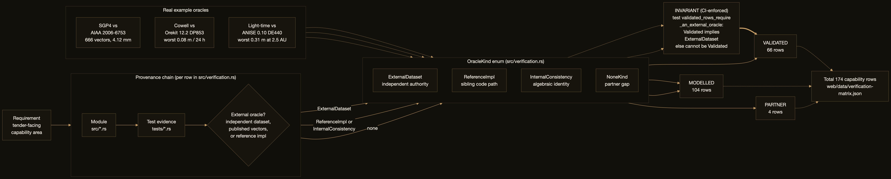
  <br><sub>How a capability earns its label — the CI-enforced invariant: no external oracle ⇒ cannot be Validated · <a href="docs/assets/diagrams/validation-provenance.svg">SVG</a></sub>
</p>

<p align="center">
  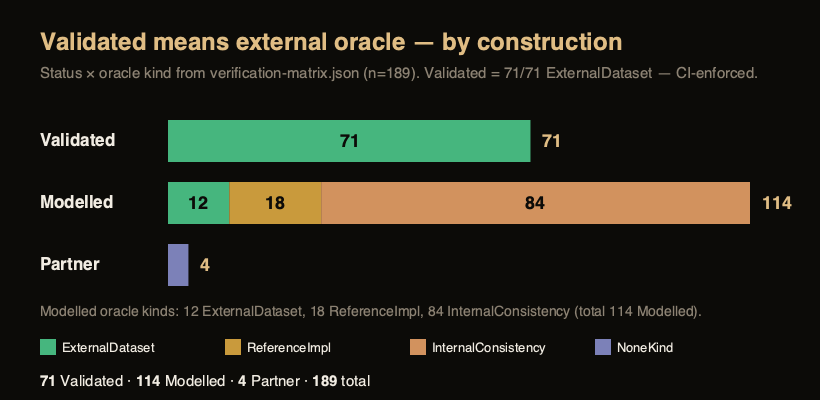
  <br>
  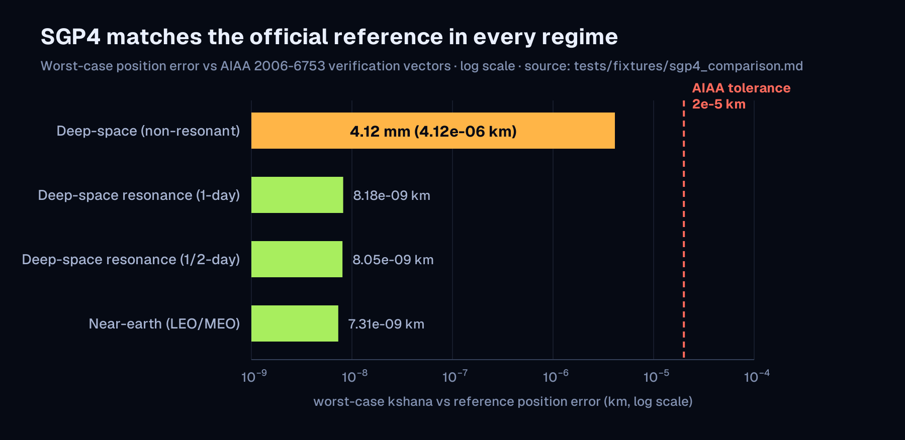
  <br><sub>Top: every Validated row is backed by an external dataset, by construction. Bottom: SGP4 matches the official reference in every regime (worst 4.12 mm). <a href="docs/assets/figures/oracle-kind-stacked.svg">SVG</a> · <a href="docs/assets/figures/sgp4-regime-bars.svg">SVG</a></sub>
</p>

<p align="center">
  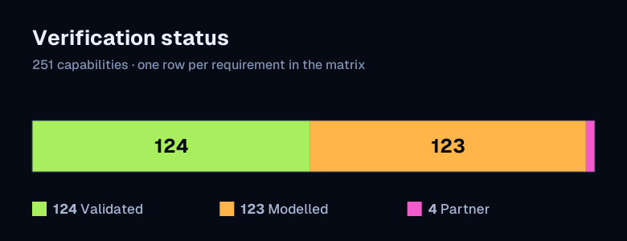
  <br><sub>116 Validated · 112 Modelled · 4 Partner — <a href="docs/assets/figures/validation-breakdown.svg">SVG</a></sub>
</p>

</details>

## Install

One line gets the command-line tool: **`cargo install kshana`**. Every channel ships
v0.29.3 from the same tagged commit.

| Channel | Install | Guide |
|---|---|---|
| Browser | open [kshana.dev](https://kshana.dev) | [Kshana Studio](web/README.md) |
| Command line | `cargo install kshana` | [Scenarios](docs/SCENARIOS.md) |
| Rust library | `cargo add kshana` | [API reference](https://docs.rs/kshana) |
| Python | `pip install kshana` | [Python API](docs/PYTHON_API.md) |
| JavaScript and WebAssembly | `npm install kshana` | [npm guide](README.npm.md) |
| AI assistant (MCP server) | `cargo install kshana-mcp` | [MCP server](mcp/kshana-mcp/README.md) |
| Docker image | `docker run --rm -i ghcr.io/ashfordeou/kshana-mcp` | [MCP server](mcp/kshana-mcp/README.md) |
| JetBrains IDE plugin | Settings → Plugins → Marketplace → "Kshana" | [JetBrains plugin](ide/jetbrains/README.md) |

<p><a href="https://plugins.jetbrains.com/plugin/32181-kshana--pnt-simulator"></a> <a href="Cargo.toml"></a></p>

MCP is the Model Context Protocol. Pin a release with `cargo install kshana --version 0.29.3`,
`pip install kshana==0.29.3` or `npm install kshana@0.29.3`. To build from source, see
[Install and build](#install--build) under Reference.

<details>
<summary>Run a scenario from Python and from WebAssembly</summary>

<br>

```python
import json, kshana

toml = open("clock-holdover.toml").read()
result = json.loads(kshana.run(toml))
print(kshana.version(), result["quantum"]["fom"]["holdover_s"], result["classical"]["fom"]["holdover_s"])
# 0.29.3 6600.0 2610.0
```

Beyond `run`, the module exposes `run_full` (JSON, SVG and the one-line summary at once),
`run_typed`, `validate_toml`, `list_kinds` / `scenario_kinds` and `error_kind`; see
[`docs/PYTHON_API.md`](docs/PYTHON_API.md).

The npm package is the whole engine compiled to WebAssembly. In Node.js, hand the binary to
`initSync`; in a browser, `await init()` fetches it (see [`README.npm.md`](README.npm.md)).

```js
import { readFileSync } from "node:fs";
import { createRequire } from "node:module";
import { initSync, run, summary, version } from "kshana";

const wasm = createRequire(import.meta.url).resolve("kshana/kshana_bg.wasm");
initSync({ module: readFileSync(wasm) });

const toml = readFileSync("clock-holdover.toml", "utf8");
const result = JSON.parse(run(toml));
console.log(version(), result.quantum.fom.holdover_s, result.classical.fom.holdover_s);
// 0.29.3 6600 2610
console.log(summary(toml));
```

</details>

## Architecture

One open engine sits at the centre, and every surface runs it: the command line, the Rust
library, Python, WebAssembly and Kshana Studio, the MCP server, the Docker image and the
JetBrains plugin. The same scenario file gives the same bytes on each. Kshana Pro sits on
top as a separate overlay that depends on the engine and never forks it.

<picture>
  <source media="(prefers-color-scheme: dark)" srcset="docs/assets/readme/architecture-dark.svg">
  <source media="(prefers-color-scheme: light)" srcset="docs/assets/readme/architecture-light.svg">
  
</picture>

<details>
<summary>Inside the engine: the domain layers and the verification ledger</summary>

<picture>
  <source media="(prefers-color-scheme: dark)" srcset="docs/assets/readme/flow-architecture-dark.svg">
  <source media="(prefers-color-scheme: light)" srcset="docs/assets/readme/flow-architecture-light.svg">
  
</picture>

**One engine, many front doors.** A single Rust core (`kshana`) runs every scenario,
reached through a CLI, a Python extension, an in-browser WebAssembly module, an **MCP
server** for AI agents, and a **JetBrains IDE plugin** — all converging on one
`api::run_toml` dispatch. Inside, the sensor packs plug into a common error-model
interface; alongside them sit a **reference-frame layer** (IAU 2006/2000A
precession–nutation and the CIO-based GCRS↔ITRS reduction), an **astrodynamics/numerical
layer** (analytic SGP4/SDP4 **and** a numerical Cowell propagator with its
EGM2008/perturbation force model, maneuver design, and orbit determination), an
**integrity/GNSS layer** (RAIM/ARAIM, SBAS, the measurement domain, jamming, cislunar),
a **fusion / alt-PNT layer** (the GNSS/INS estimators and the gravity/terrain/magnetic
map-matchers), a **deep-space & lunar layer** (radiometric Mars-PNT and the MODELLED
lunar PNT suite — LTC time, VLBI, joint OD+clock, frame realisation, service-volume,
differential PNT, interop), a **mission-analysis layer** (launch / re-entry / coverage /
pointing / pass / link budgets and the space-weather environment), and the open
**resilience & AI/ML study layer** (RPCF resilience scoring, the RF-impairment optimism
gap, and the quantum-enabled PNT demonstrator) whose reproducible artifacts ride the
validated kernels.

Two standalone, **workspace-excluded** crates sit beside the core — `mcp/kshana-mcp`
(the MCP server, built on the edition-2024 `rmcp` SDK) and `xval/anise-frames` (the
ANISE/SPICE frame cross-check, which pulls MPL-2.0 (Mozilla Public License 2.0) deps) — kept out of the published
crate's dependency graph, `Cargo.lock`, license gate, and MSRV (minimum supported Rust version) build by the root
`Cargo.toml` `exclude` list. The JetBrains plugin (`ide/jetbrains`) is a separate Kotlin
project. See [`docs/ARCHITECTURE.md`](docs/ARCHITECTURE.md) for the full set of diagrams.

The rendered diagrams (engine flow, module map, distribution) are in [`docs/ARCHITECTURE.md`](docs/ARCHITECTURE.md).

</details>

## AI assistant

[`kshana-mcp`](mcp/kshana-mcp/) is an MCP server: your assistant runs the actual engine and
reads back its JSON, instead of guessing the maths. Each of its fourteen tools is a thin wrapper
over a public function of the `kshana` library, so no simulation logic lives in the server.

```bash
cargo install kshana-mcp                          # from crates.io
docker run --rm -i ghcr.io/ashfordeou/kshana-mcp  # or the container image, no Rust toolchain
```

Then register it in your assistant's MCP client configuration:

```json
{
  "mcpServers": {
    "kshana": {
      "command": "/Users/you/.cargo/bin/kshana-mcp",
      "args": [],
      "env": {}
    }
  }
}
```

<p><a href="https://glama.ai/mcp/servers/ashfordeOU/kshana"></a></p>

Per-client set-up is in [`docs/integrations.md`](docs/integrations.md). The server is listed
in the official MCP registry as `io.github.ashfordeOU/kshana-mcp`.

<details>
<summary>The fourteen tools</summary>

<br>

| Tool | What it does |
|---|---|
| `run_scenario` | run a scenario from its TOML; returns the summary and the full result JSON, and the chart on request |
| `list_scenario_kinds` | the 75 built-in scenario kinds, with their required and optional fields |
| `validate_scenario` | parse a TOML and detect its kind, without running |
| `list_example_scenarios` · `get_example_scenario` | the bundled reference scenarios with what each shows, and the TOML of one, so an assistant starts from a scenario that runs |
| `report_scenario` | a run's report: every figure with its unit and its VALIDATED or MODELLED label, the events and a reproducibility record, as JSON or a printable HTML (HyperText Markup Language) page |
| `animate_scenario` | a run's time series as an animated SVG (Scalable Vector Graphics) drawing, an HTML player or numbered frames |
| `list_export_formats` · `export_interop` | which interoperability formats apply to a scenario, and the export as CZML (Cesium Language), KML (Keyhole Markup Language), GeoJSON, an STK (Systems Tool Kit) ephemeris or SigMF (Signal Metadata Format) |
| `import_route` | a GeoJSON route written into a scenario that flies a waypoint track |
| `export_sp3` · `export_omm` · `export_oem` | an orbit scenario as SP3-c (Standard Product 3), a CCSDS (Consultative Committee for Space Data Systems) Orbit Mean-elements Message, or an Orbit Ephemeris Message |
| `export_table_csv` | a run's reproducibility table as CSV (comma-separated values), for the kinds that define one |

</details>

## Editions

The whole engine is free. Kshana Pro and custom studies are for programmes that need more,
and every paid route starts with a message: there are no prices here.

| | Free | Kshana Pro | Custom study |
|---|---|---|---|
| What it is | the whole open engine, all 75 scenario kinds, no feature gate | a proprietary overlay on the same engine, under contract | a MODELLED PNT-resilience study of your system, done for you |
| Licence | AGPL-3.0 (GNU Affero General Public License, version 3), or a commercial licence | proprietary | contract |
| How to start | [install](#install) or open [kshana.dev](https://kshana.dev) | [request a Pro evaluation](mailto:contact@ashforde.org?subject=Kshana%20Pro%20evaluation) | [request a study](mailto:contact@ashforde.org?subject=Kshana%20custom%20study) |

What Pro is, in the words of [`docs/PRO.md`](docs/PRO.md):

> **A strict superset of open Kshana.** Pro depends on the open engine as a library and
> never forks it. Every open scenario kind runs in Pro unchanged, and an open scenario runs
> in Pro with no licence at all.
>
> **No new physics.** Pro adds no physical model and changes none. Every Pro number comes
> from runs of the open engine, so a Pro figure is as trustworthy as the open scenario kind
> it came from, and never more.

Pro answers a programme's next questions: which design to fly (a design optimiser and its
Pareto front), how sure the answer is (uncertainty and sensitivity), and whether the mission
meets its requirements (a mission dossier, requirements traceability, trade studies, a
scenario regression check, clock digital twins, a study dossier and an on-premises
service). It also watches a campaign of figures and fails a pipeline when one gets worse,
tests candidate signal plans against the open satellite-navigation signals in both
directions (spectrum coexistence), and queues studies in an on-premises job service with a
hash-chained delivery ledger. Each is described, with what it produces and what it does not do, in
[`docs/PRO.md`](docs/PRO.md). Nothing Pro produces is a certification, and a custom study is
not a certification either.

<details>
<summary>What Kshana Pro reads from the open engine, and support from Ashforde OÜ</summary>

<br>

**What Kshana Pro builds on.** Every part of Pro works from the open engine and leaves
it unchanged:

- **The design optimiser, the uncertainty study and the mission dossier** run open-engine
  scenarios through the engine's public interface and compute every number from the runs'
  results. Each output keeps the VALIDATED, MODELLED or PARTNER tier the open engine gave
  each figure, never a higher one.
- **Clock digital twins** use the open engine's clock model and its Allan-deviation
  estimator: a twin is calibrated to the device's published Allan budget, then checked by
  estimating the twin's Allan deviation with the open estimator.
- **Trade studies** run every architecture option as an open-engine scenario, unchanged,
  and rank the options on a figure of merit read from each run's result.
- **Campaign watch** reads its figures from the results of open-engine runs of the
  scenarios in a pack, and compares them with the previous passing run.
- **Spectrum coexistence** reads every physical number from open-engine runs of the
  `leo-signal` and `constellation-design` kinds, and adds only the sum over the satellites
  in view and the ranking of the plans.
- **The on-premises job service** runs open and Pro scenarios through the same engine and
  stores each result as the run returned it.
- **Evidence packs** record, for each run, the scenario hash the open engine stamps on
  its result, so a figure in a pack can be reproduced by re-running its scenario.
- **Systems-engineering and programme tooling.** Kshana Pro's model-based
  systems-engineering (MBSE) and programme tooling checks a programme's requirements
  against runs of the open engine: it imports requirements as comma-separated values
  (CSV), or as a documented subset of the Requirements Interchange Format (ReqIF) or of
  Systems Modeling Language version 2 (SysML v2) text, evaluates each acceptance
  criterion, with its unit, against the values a run wrote, and produces a verification
  cross-reference matrix (VCRM), a SysML v2 model, a change-impact report and an offline
  evidence pack. It re-runs and recomputes nothing, and reads only what the open engine
  publishes: each run's `result.json` (the fields a criterion names, their units, the
  reproducibility stamp of scenario hash, seed, engine version and schema version, and
  the run's label and figure tiers), its `report.json` (kind, reproducibility record and
  capability labels), the scenario file (its hash, kind, seed and parameters), the
  field-units schema (each field's unit, provenance and evidence tier) and the
  verification matrix (each capability's VALIDATED, MODELLED or PARTNER label).

### Support & professional services

Kshana is free and open source under the AGPL-3.0 and **professionally developed and
maintained by Ashforde OÜ** (Estonia). The open engine is complete and usable on its
own. For organisations that need more, Ashforde OÜ offers:

- **Commercial support & integration** — embedding Kshana in your toolchain, custom
  scenarios, and priority fixes.
- **Custom sensor models** — calibrated to your hardware, including export-sensitive
  resilience models maintained in a private overlay.
- **Kshana Pro** — proprietary model-based systems-engineering (MBSE) and programme
  tooling that checks a programme's requirements against runs of the open engine and
  produces a verification cross-reference matrix (VCRM), a Systems Modeling Language
  version 2 (SysML v2) model, a change-impact report and an offline evidence pack. It
  re-runs nothing and reads only the engine's published outputs: each run's `result.json`
  and `report.json`, the scenario file, the field-units schema and the verification
  matrix's labels (the full list is under [Editions](#editions)).
- **Kshana Pro design, uncertainty and mission tooling** — the Pareto front of a design
  space, uncertainty and sensitivity over thousands of runs, and a one-command mission
  dossier with a verification matrix and a PDF; see [`docs/PRO.md`](docs/PRO.md).
- **Kshana Pro campaign watch, spectrum coexistence and job service** — a pipeline that
  fails when a watched figure gets worse, signal plans tested against the open
  satellite-navigation signals in both directions, and an on-premises job queue with a
  hash-chained delivery ledger; see [`docs/PRO.md`](docs/PRO.md).
- **Training & consulting** on quantum/classical PNT performance analysis.

This is the open-core model: the engine is, and stays, openly licensed; the sustaining
business is expertise, support, and the proprietary extensions — not license fees.
Contact **contact@ashforde.org** · [ashforde.org](https://ashforde.org).

</details>

## Research

Studies built on the open engine are published on arXiv. Each names the engine command
behind it, so its numbers can be regenerated from a committed scenario or study example.

<picture>
  <source media="(prefers-color-scheme: dark)" srcset="docs/assets/readme/research-dark.svg">
  <source media="(prefers-color-scheme: light)" srcset="docs/assets/readme/research-light.svg">
  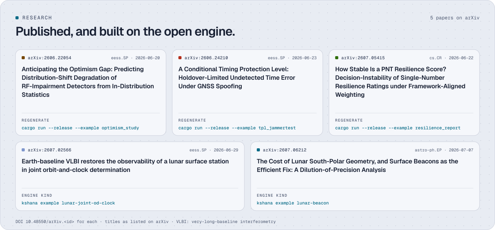
</picture>

| Paper | What it shows | Engine command |
|---|---|---|
| [*Anticipating the Optimism Gap: Predicting Distribution-Shift Degradation of RF-Impairment Detectors from In-Distribution Statistics*](https://arxiv.org/abs/2606.22054)<br><sub>arXiv:2606.22054 · [doi:10.48550/arXiv.2606.22054](https://doi.org/10.48550/arXiv.2606.22054)</sub> | The drop in a GNSS interference detector's score once conditions shift can be predicted from in-distribution statistics alone, on an open synthetic testbed and then on open field recordings. | `cargo run --release --example optimism_study -- paper-artifacts/optimism-study.json` |
| [*A Conditional Timing Protection Level: Holdover-Limited Undetected Time Error Under GNSS Spoofing*](https://arxiv.org/abs/2606.24210)<br><sub>arXiv:2606.24210 · [doi:10.48550/arXiv.2606.24210](https://doi.org/10.48550/arXiv.2606.24210)</sub> | A GNSS timing receiver under spoofing has no finite unconditional bound on undetected time error, so the paper gives a conditional one, calibrated on a recorded over-the-air spoof from the public JammerTest 2024 campaign. | `cargo run --release --example tpl_jammertest` |
| [*How Stable Is a PNT Resilience Score? Decision-Instability of Single-Number Resilience Ratings under Framework-Aligned Weighting*](https://arxiv.org/abs/2607.05415)<br><sub>arXiv:2607.05415 · [doi:10.48550/arXiv.2607.05415](https://doi.org/10.48550/arXiv.2607.05415)</sub> | A single composite resilience score is a stable basis for a decision only where one design dominates; where designs contend, re-weighting alone can change the winner. | `cargo run --release --example resilience_report -- paper-artifacts/resilience-study.json` |
| [*Earth-baseline VLBI restores the observability of a lunar surface station in joint orbit-and-clock determination*](https://arxiv.org/abs/2607.02566)<br><sub>arXiv:2607.02566 · [doi:10.48550/arXiv.2607.02566](https://doi.org/10.48550/arXiv.2607.02566)</sub> | Ranging inside a lunar constellation leaves a surface station's absolute position unobservable; a very-long-baseline interferometry (VLBI) delay from Earth restores it when the constellation is sparse, and sharpens it when it is rich. | the `lunar-joint-od-clock` kind: `kshana example lunar-joint-od-clock > s.toml && kshana s.toml` |
| [*The Cost of Lunar South-Polar Geometry, and Surface Beacons as the Efficient Fix: A Dilution-of-Precision Analysis*](https://arxiv.org/abs/2607.06212)<br><sub>arXiv:2607.06212 · [doi:10.48550/arXiv.2607.06212](https://doi.org/10.48550/arXiv.2607.06212)</sub> | Planned constellations of four to six satellites give poor geometry at the lunar south pole, and a few surface ranging beacons fix it far more cheaply than more satellites. | the `lunar-beacon` kind: `kshana example lunar-beacon > s.toml && kshana s.toml` |

The three study examples write byte-deterministic artifacts (fixed seeds) that record their
engine version, seeds and a configuration hash. The two lunar papers are built on the
MODELLED lunar suite; their geometry and dilution-of-precision claims are also cross-checked
against separate oracles in `tests/validate_p*.rs`. More in
[Reproducible study artifacts](#reproducible-study-artifacts) under Reference.

## Cite

If you use Kshana in academic or technical work, please cite the version you used, with the
scenario and seed. [`CITATION.cff`](CITATION.cff) holds the machine-readable metadata, and
GitHub shows a "Cite this repository" button from it. Every release is archived on Zenodo;
the concept DOI (Digital Object Identifier)
[10.5281/zenodo.20528627](https://doi.org/10.5281/zenodo.20528627) always resolves to the
latest version.

> Baweja, C. (2026). *Kshana — a PNT-resilience simulator with quantum-sensor performance models*. [Ashforde OÜ](https://ashforde.org). https://doi.org/10.5281/zenodo.20528627

The papers above:

> Baweja, C. (2026). *Anticipating the Optimism Gap: Predicting Distribution-Shift Degradation of RF-Impairment Detectors from In-Distribution Statistics*. arXiv:2606.22054. https://doi.org/10.48550/arXiv.2606.22054
>
> Baweja, C. (2026). *A Conditional Timing Protection Level: Holdover-Limited Undetected Time Error Under GNSS Spoofing*. arXiv:2606.24210. https://doi.org/10.48550/arXiv.2606.24210
>
> Baweja, C. (2026). *How Stable Is a PNT Resilience Score? Decision-Instability of Single-Number Resilience Ratings under Framework-Aligned Weighting*. arXiv:2607.05415. https://doi.org/10.48550/arXiv.2607.05415
>
> Baweja, C. (2026). *Earth-baseline VLBI restores the observability of a lunar surface station in joint orbit-and-clock determination*. arXiv:2607.02566. https://doi.org/10.48550/arXiv.2607.02566
>
> Baweja, C. (2026). *The Cost of Lunar South-Polar Geometry, and Surface Beacons as the Efficient Fix: A Dilution-of-Precision Analysis*. arXiv:2607.06212. https://doi.org/10.48550/arXiv.2607.06212

## Licence

Kshana is dual-licensed: the GNU **AGPL-3.0-only** ([`LICENSE`](LICENSE)), or a
**commercial licence** from Ashforde OÜ for closed integration that the AGPL does not suit.
[`LICENSING.md`](LICENSING.md) explains which applies. Contributions are licensed inbound
under the AGPL and also grant Ashforde OÜ the right to include them in the commercial
edition; sign off each commit with `git commit -s` (see [`CONTRIBUTING.md`](CONTRIBUTING.md)).
"Kshana" and its marks are trademarks of Ashforde OÜ: the licence covers the code, not the
name, so please rename forks.

## Reference

The long material, collapsed. Every document is listed in [Documentation](#documentation).

<details>
<summary>Install & build from source</summary>

### Install & build

Requires a Rust toolchain (≥ 1.85, the `rust-version` in Cargo.toml; developed on 1.93).

```bash
git clone https://github.com/ashfordeOU/kshana
cd kshana
cargo build --release
cargo test          # all tests pass
```

</details>

<details>
<summary>Usage: the command line in full</summary>

### Usage

Run any scenario; the CLI dispatches on the scenario's `kind` field and writes
`<scenario>.result.json`, `<scenario>.chart.svg`, `<scenario>.report.html` and
`<scenario>.report.json` next to it — plus `<scenario>.table.csv` for the kinds that
publish a table. The report (a HyperText Markup Language (HTML) page and a JSON document
with the same content) carries an executive summary, every input with its unit, the
results and charts, a campaign's sweep, Monte Carlo or chain tables, an events timeline,
the VALIDATED / MODELLED / PARTNER label and source of every capability the run used,
what is not modelled, and a reproducibility record (engine version, Secure Hash
Algorithm 256-bit (SHA-256) digests, seed, platform and the exact command). It prints to
a clean PDF (Portable Document Format) file from the browser on A4 or Letter paper; the
engine writes no PDF itself. See [`docs/REPORTS.md`](docs/REPORTS.md).

```bash
cargo run -- scenarios/clock-holdover.toml
cargo run -- scenarios/imu-deadreckoning.toml
cargo run -- scenarios/timetransfer.toml
cargo run -- scenarios/hybrid-pnt.toml
cargo run -- scenarios/orbit-gnss-challenged.toml
cargo run -- scenarios/orbit-sgp4-gps.toml
cargo run -- scenarios/orbit-rinex.toml
cargo run -- scenarios/integrity-raim.toml

# Export a propagated constellation to an SP3-c precise-ephemeris file:
cargo run -- scenarios/orbit-sgp4-gps.toml --export-sp3 gps.sp3

# Export the constellation's mean elements to a CCSDS OMM catalogue (one OMM
# message per TLE-defined satellite, with its real NORAD id / COSPAR designator):
cargo run -- scenarios/orbit-sgp4-gps.toml --export-omm gps.omm

# Export the velocity-carrying state to a CCSDS OEM 2.0 ephemeris (GMAT/Orekit/STK):
cargo run -- scenarios/orbit-sgp4-gps.toml --export-oem gps.oem

# Export the geometry for a globe, a map or a mission-analysis tool: CZML, KML,
# GeoJSON, STK .e, or SigMF for the spectrum kind (every format that applies):
cargo run -- scenarios/jamming-demo.toml --export all
```

`--export <czml|kml|geojson|stk|sigmf|all|list>` writes CZML (the Cesium Language), KML
(Keyhole Markup Language), GeoJSON (Request for Comments 7946), Ansys STK (Systems Tool Kit) `.e`
ephemerides and SigMF (Signal Metadata Format) recordings next to the scenario, and
`--import-route <route.geojson>` feeds a GeoJSON line into the track-flying kinds. Each
format is validated against its published specification, and a scenario a format does
not apply to says why: see [docs/INTEROP.md](docs/INTEROP.md).

**Other CLI modes** — lint a scenario, feed real Earth-orientation data, or run a whole suite:

```bash
# Lint a scenario without running it (checks the kind + required fields):
cargo run -- --validate scenarios/integrity-raim.toml

# Feed a real IERS Earth-orientation file (finals2000A) for frame precision:
cargo run -- scenarios/orbit-sgp4-gps.toml --eop tests/fixtures/agency/eop/finals2000A_2022001.txt

# Run a SUITE of scenarios into one aggregated, stamped study artifact
# (writes <suite>.study.json + <suite>.study.html next to the manifest):
cargo run -- --study scenarios/quantum-pnt-demonstrator.suite.toml

# Animate a run's time series: an animated SVG, a self-contained HTML player, and a
# numbered SVG frame sequence with manifest.json (see docs/ANIMATION.md):
cargo run -- scenarios/campaign-jam-spoof-holdover-integrity.toml --animate all
```

**Animation export.** `--animate svg|html|frames|all` writes `<scenario>.animation.svg`
(Cascading Style Sheets (CSS) keyframes, no script), `<scenario>.animation.html` (play, pause, scrub, speed and
synced panels, with no external asset) and `<scenario>.frames/` (`frame_0000.svg`, … plus
`manifest.json` with the frames per second and duration). A campaign plays its phases and
alarms, a spectrum run its waterfall; the theme follows `prefers-color-scheme` and
`prefers-reduced-motion` shows the finished picture. It renders the run's own samples,
byte-identical on a re-run, and adds no evidence. See [docs/ANIMATION.md](docs/ANIMATION.md).

A **suite** manifest is a small TOML (Tom's Obvious, Minimal Language) file — a `title` and a `scenarios = [ … ]` array of
scenario paths — that the engine runs in turn, folding every result (with its
MODELLED / VALIDATED labels) into one self-describing study artifact. See
[`scenarios/quantum-pnt-demonstrator.suite.toml`](scenarios/quantum-pnt-demonstrator.suite.toml).

**Interoperability role.** Kshana is the *performance-simulation* layer that sits
alongside the post-processing toolchain, not a replacement for it: feed its **RINEX**
output into RTKLIB or gLAB for a position solution, and use its **SP3** output as a
precise-orbit product for tools like Ginan — Kshana answers *what resilience a given
PNT architecture buys* before you have real signals, in formats those tools already
ingest (`--export-sp3`, or `export_sp3 = true` in an `orbit` scenario, writes
`<scenario>.sp3`). The same orbit can be published as standards-track **CCSDS OMM**
mean elements (`--export-omm`, or `export_omm = true`, writes `<scenario>.omm`) —
one OMM 502.0 KVN (keyword = value notation) message per TLE-defined satellite, carrying each object's real
NORAD (North American Aerospace Defense Command) catalogue number, COSPAR (Committee
on Space Research) international designator, and epoch, for any
OMM-aware consumer instead of a bespoke two-line element set.

Example output (clock holdover — note how the Integrity and Security figures of merit are reported):

```
scenario 5ba83a232b94 | quantum holdover 6600s p95 1.20e-4ns integrity 1.000 security n/a (no attack) | classical holdover 2610s p95 19.7ns integrity 1.000 security n/a (no attack)
wrote scenarios/clock-holdover.result.json, scenarios/clock-holdover.chart.svg, scenarios/clock-holdover.report.html, and scenarios/clock-holdover.report.json
```

The optical clock's 95th-percentile (p95) timing error is 1.20e-4 ns: the summary
prints small values with significant digits rather than rounding them to `0.0`.
`security` reads `n/a (no attack)` because this scenario configures no attack, so there
is nothing to detect. The JSON result still carries each clock's analytic
spoof-detectability bound in `fom.security` (0.997 for the optical clock, 0.000 for the
chip-scale atomic clock, whose own noise over the monitoring window exceeds the 20 ns
spec), and its `figure_tiers` block marks that figure `applicable: false`. The `spoof`
scenario kind scores detection against an injected attack. `figure_tiers` also gives
every reported figure its verification tier — VALIDATED (checked against an external
oracle) or MODELLED — and the verification-matrix row the tier is read from. The orbit
scenario additionally reports a geometry block — fraction of samples with a fix, and
best/median position dilution of precision (PDOP) and position accuracy — alongside the
clock result.

> **Read these two numbers carefully.** `security` is an *analytic spoof-detectability
> bound* derived from each clock's stability — it is meaningful only against a
> configured spoofing scenario and is **not** a multi-satellite RAIM detector. `integrity`
> here is the filter's *self-consistency* (fraction of outage samples inside its own k-sigma
> bound), **not** an aviation HPL/VPL integrity figure. See
> [`docs/INTEGRITY.md`](docs/INTEGRITY.md).
>
> For genuine receiver-autonomous integrity, the **`integrity` scenario kind**
> (`scenarios/integrity-raim.toml`) runs real snapshot and solution-separation
> (ARAIM-style) RAIM over the propagated constellation geometry: it computes
> horizontal/vertical **protection levels (HPL/VPL)** per epoch and reports the
> fraction of epochs that meet the configured alert limits, with a Stanford
> integrity diagram for error-vs-PL (protection level) classification.

#### Reproducible study artifacts

Four open studies each regenerate a byte-deterministic artifact (fixed seed) from one
command — the numbers behind the quantum-vs-classical crossover, RF-impairment
optimism-gap, PNT-resilience-scoring, and timing-protection-level studies:

```bash
# Quantum-vs-classical resilience crossover map (writes paper/crossover/*.json):
cargo run --release --bin crossover_study -- paper/crossover

# RF-impairment optimism-gap study (13-detector panel, scaling laws, LOO predictor):
cargo run --release --example optimism_study -- paper-artifacts/optimism-study.json

# Framework-aligned PNT-resilience scoring + decision-instability study:
cargo run --release --example resilience_report -- paper-artifacts/resilience-study.json

# Conditional Timing Protection Level, calibrated on a real recorded spoof:
cargo run --release --example tpl_jammertest
```

Each artifact records its engine version, seeds, and a config hash and carries an honest
MODELLED/VALIDATED label. The real-data probes (`*_probe`) run the same pipeline over
recordings you supply locally; no datasets are shipped in the repo. The RF-impairment
optimism-gap study is written up in the preprint
[arXiv:2606.22054](https://arxiv.org/abs/2606.22054), and the conditional timing
protection level (`tpl_jammertest` above) in the preprint
[arXiv:2606.24210](https://arxiv.org/abs/2606.24210) (see [Cite](#cite)).

The published lunar-PNT studies ([arXiv:2607.06212](https://arxiv.org/abs/2607.06212)
surface-beacon DOP and [arXiv:2607.02566](https://arxiv.org/abs/2607.02566) VLBI
observability) have their geometry, dilution-of-precision, real-time frame /
Earth-orientation-parameter (EOP) prediction, distant-retrograde-orbit and RF-ranging
claims independently cross-checked in
`tests/validate_p*.rs` against separate oracles (`scipy.special.j1`, an independent NumPy
`(HᵀH)⁻¹` DOP solve, a NumPy re-parse of the same IERS `finals2000A` rows, and the
NASA/JPL Three-Body Periodic Orbit Database). These are additional regression checks over
the **modelled** lunar suite; they do not change the machine-checked matrix count.

</details>

<details>
<summary>Scenario format</summary>

### Scenario format

Scenarios are declarative TOML. A top-level `kind` selects the pack — **fifty** in
all (`clock` is the default if omitted): `inertial`, `timetransfer`, `hybrid`, `hybrid-ukf`, `fusion`,
`gnss-ins`, `orbit`, `ephemeris`, `gnss-sim`, `integrity`, `lunar-integrity`, `lunar-time-offset`, `spoof`,
`spoof-detect`, `jamming`, `sweep`, `sweep-nd`, `gravity-map`, `terrain-nav`, `terrain-slam`,
`combined-altpnt`, `pvt`, `mars-pnt`, `impairment-eval` (AI/ML RF-impairment detection
evaluation testbed — labelled synthetic corpus + detector-agnostic ROC/AUC harness +
in/out-of-distribution optimism gap), `quantum-trade` (quantum-vs-classical PNT
trade with measured-ADEV ingestion + GNSS-denied resilience envelope; MODELLED),
`space-weather` (solar/geomagnetic indices + Jacchia-71 exospheric temperature +
activity-driven thermospheric density over the static atmosphere; MODELLED),
`oem-interop` (CCSDS OEM import/round-trip bridge for GMAT/Orekit/STK ephemerides;
MODELLED), the mission-analysis trio `launch-window` (two-body launch azimuth /
plane-change / opportunities), `reentry` (Allen-Eggers ballistic re-entry corridor),
`eo-coverage` (EO swath / GSD / access / revisit geometry), `space-packet` (CCSDS
133.0 TM/TC — telemetry/telecommand — Space Packet framing — exact bit layout, round-trip verified), and
`attitude-budget` (3-DOF gravity-gradient torque + RSS pointing error budget),
`passes` (ground-station rise/set pass prediction — AOS/TCA/LOS, max elevation,
access), and `link-budget` (one-way CCSDS/DSN link equation — FSPL / Eb·N₀ /
margin / closure); `telecom-timing` (holdover time error, MTIE and TDEV checked
against ITU-T masks); `spectrum` (the whole GNSS L band as one power spectral density:
a frequency-by-time waterfall under a scripted continuous-wave, narrowband, chirp or
matched-noise jammer timeline, per-band jammer-to-signal ratio and effective
carrier-to-noise density from the spectral separation coefficient, and Signal Metadata
Format (SigMF) recording input and output with Welch spectral estimates; the signal
spectra VALIDATED against textbook values, the jammer scenario MODELLED; see
[`docs/SPECTRUM.md`](docs/SPECTRUM.md); the same kind draws UHF, S and C band panels with
designed low Earth orbit signals); `leo-signal` (low Earth orbit positioning, navigation and
timing signal designs for any system: band-limited spectra, code-tracking jitter and ranging
accuracy, acquisition search and time, spectral separation against GPS and Galileo, jammer
tolerance and a UHF-to-C band trade, from public presets such as Xona Pulsar, Iridium,
Starlink and CentiSpace or inline designs; the closed forms and the LEO Doppler VALIDATED, the
designs MODELLED; see [`docs/LEO-SIGNAL.md`](docs/LEO-SIGNAL.md)); `solar-system` (the Sun, planets, Pluto, the Moon and seven major
moons at one epoch — positions, constants, light times and orbit tracks; planet positions
VALIDATED against JPL Horizons) and `body-pnt` (positioning around any of those bodies with a
local navigation constellation and a deep-space link from Earth; MODELLED); `campaign` (existing kinds composed into a chained mission timeline
with state handed between phases, a parameter sweep, a seeded Monte Carlo ensemble, or
several scenarios under one shared condition; MODELLED, see
[docs/CAMPAIGNS.md](docs/CAMPAIGNS.md)); `constellation-design` (Walker delta and star
patterns, element lists and multi-shell designs with GPS, Galileo, BeiDou and GLONASS
presets, and coverage and dilution of precision over a latitude/longitude grid; the
generator and GPS global DOP VALIDATED against the published service documents, see
[`docs/CONSTELLATION-DESIGN.md`](docs/CONSTELLATION-DESIGN.md)); `leo-pass` (a low Earth
orbit (LEO) positioning, navigation and timing (PNT) satellite pass and its link budget band by
band, from any constellation and any signal design: look angles, Doppler and Doppler rate,
ITU-R rain, gas, scintillation and building entry loss, carrier-to-noise density against the
MEO GNSS satellites in view, the first-order ionosphere and ionosphere-free pairs, and a
low-energy fix budget, ionosphere sounding from every band pair, and spoofing monitors by
Doppler and pass-geometry consistency and by cross-band consistency; the ITU-R terms and the
static-user Doppler envelope VALIDATED, the pass MODELLED, see
[`docs/LEO-PASS.md`](docs/LEO-PASS.md)); `leo-navmsg` (the broadcast
ephemeris and clock message of a low Earth orbit (LEO) PNT satellite, for any orbit and
carrier: a fitter from an integrated truth orbit to the Galileo Keplerian set, that set
with along-track, cross-track and radial correction polynomials, the Liu et al. 2025
22-parameter model or the ATOMIC zero-clock ECEF polynomial; signal-in-space range error
(SISRE) versus fit interval and update period, a mid-pass update continuity check,
Kshana's own documented binary frame with a CRC-24Q cyclic redundancy check and a quantisation budget, and a
RINEX-4-style block labelled a Kshana extension; the SISRE weights, the Galileo user
algorithm and CRC-24Q VALIDATED, the fits MODELLED; optional presets for Xona Pulsar,
Iridium, Starlink, CentiSpace, a representative C-band system, ATOMIC and Celeste IOD; see
[`docs/LEO-NAVMSG.md`](docs/LEO-NAVMSG.md)); the **fused MEO + LEO
PNT** trio `leo-pvt` (Doppler positioning from low-Earth-orbit (LEO) range rate, joint
GNSS + LEO pseudorange fixes with inter-system biases and the DOP against the number of LEO
satellites, polar and Arctic coverage, and LEO time transfer to UTC — over any constellation,
with optional presets such as Xona Pulsar, Iridium and Starlink signals of opportunity; the
LEO Doppler envelope VALIDATED against published Iridium and Xona figures), `leo-ppp`
(precise point positioning convergence with GNSS only and with LEO augmentation, compared
with Li et al. 2019) and `ntn-positioning` (5G non-terrestrial-network positioning from the
Cramér-Rao bound of the signal bandwidth), MODELLED apart from that envelope, see
[`docs/LEO-PNT-FUSION.md`](docs/LEO-PNT-FUSION.md); `leo-pnt-chain` (one LEO-PNT system end to
end: a `leo-signal` design carried by a `leo-pass` band, the pass's C/N0 and the navigation
message's signal-in-space range error handed to a fused `leo-pvt` fix and `leo-ppp`
convergence, every hand-off listed; MODELLED, see
[`docs/LEO-PNT.md`](docs/LEO-PNT.md#end-to-end-leo-pnt-chain), which is also the overview of
every LEO-PNT kind and scenario, including the resilience campaigns, one scenario per
experiment focus area and one per end-user vertical); the **lunar-PNT suite** `lunar-vlbi`, `lunar-joint-od-clock`,
`lunar-frame-realisation`, `moonlight-service-volume`, `lunar-differential-pnt`,
`lunar-interop-export`; the **Quantum-Enabled PNT demonstrator**
`quantum-time-transfer`, `quantum-gnss-free-nav`, `quantum-anomaly-detect`; and the
**signal-security, cislunar & layered-resilience** research kinds `lunar-attack-surface`,
`realtime-frame-eop`, `lunar-time-budget`, `hybrid-optical-rf`, `cislunar-observability`,
`conflict-resilience` — the mission-analysis trio and these later kinds all MODELLED
(each with a validated closed-form core; see the matrix).
Common fields: `seed`, a `[time]` grid, a `[gnss]` availability timeline (the outage
driver), and per-sensor blocks with `provenance` strings citing the source of every
figure. Example (clock):

```toml
seed = 42
threshold_ns = 20.0
[time]
step_s = 10.0
duration_s = 7200.0
[gnss]
windows = [
  { t0 = 0.0,   t1 = 600.0,  state = "nominal" },  # 10 min GNSS sync
  { t0 = 600.0, t1 = 7200.0, state = "denied"  },  # ~1.8 h outage
]
[clock_quantum]
id = "optical-sr-lattice"
provenance = "Strontium optical lattice clock, space-oriented goal sigma_y(1s)=1e-15 (arXiv:1503.08457)"
y0 = 5.0e-17
q_wf = 1.0e-30   # white FM:  q_wf = sigma_y(1s)^2
q_rw = 0.0       # random-walk FM
drift = 0.0      # linear aging (per second)
[clock_classical]
id = "csac-sa45s"
provenance = "Microchip SA65 / SA.45s CSAC datasheet sigma_y(1s)=3e-10"
y0 = 5.0e-10
q_wf = 9.0e-20
q_rw = 0.0
drift = 0.0
```

Optional fields (off when absent): a clock may add `flicker_floor` (1/f FM — frequency
modulation — Allan floor); an inertial sensor may add `gyro_bias` and `q_arw` (gyro bias and angular
random walk), and `bias_instability` and `q_aa` (the Allan bias-instability floor and
acceleration random walk) — together a **single-axis (1-DOF) accelerometer error
budget** (VRW/ARW — velocity/angular random walk — and bias-instability). This is the error budget the shipped
`inertial` scenario *pack* runs. Separately, the library now carries a verified
**3-axis strapdown navigator** (`src/inertial/{attitude,mechanization,imu_errors}.rs`):
quaternion attitude with coning/sculling compensation, a full NED mechanization
(Earth-rate and transport-rate terms, WGS-84 Somigliana gravity), and a
deterministic IMU error model in which **scale-factor, misalignment,
g-sensitivity, quantization, and rate-ramp are modelled** (IEEE Std 952-1997, the IEEE
gyro specification and test-procedure standard, §A.2; Groves 2013 §4.3). That 3-axis path is now **wired into a runnable
loosely-coupled GNSS/INS pack** (`kind = "gnss-ins"`): a 15-state error-state EKF
disciplines the strapdown solution against noisy fixes while GNSS is up, then
coasts through the outage, reporting the fused horizontal error against the
open-loop free-INS coast. A **tightly-coupled pseudorange** update is also
available (it forms the innovation in the range domain, so it keeps correcting
with fewer than four satellites). A
clock-holdover scenario may add `runs` (> 1) to run a **Monte Carlo ensemble** — each
figure of merit is then reported as a mean with a 5th–95th-percentile spread and the
chart shades the error confidence band (see `scenarios/clock-ensemble.toml`).

A `fusion` scenario (same blocks as `hybrid`) runs **two independent Kalman estimators**
— one for the clock state, one for the position state — disciplined by GNSS and aided by
optical time transfer, and reports a combined holdover FoM. The two blocks share no
cross-covariance: this is a stacked pair of error budgets, **not** a true coupled
clock+position joint filter (cross-block covariance is a roadmap item). See
`scenarios/fusion-pnt.toml`.

A `spoof` scenario injects a time-spoof — one of four `[attack.shape]` kinds
(`linear_ramp`, `step_jump`, `meaconing`, `replay`; a bare `rate_ns_per_s` is still
accepted as a linear ramp) — and runs each clock's spoof detector. The detector is a
two-sided **χ²₁ energy / Neyman–Pearson test** on the clock-aided monitor statistic:
the threshold is set from a target false-alarm budget `target_pfa`, and the
**missed-detection probability `P_md`** is reported both closed-form and by
Monte-Carlo (`mc_runs` trials per hypothesis — the two agree to a few ×1/√N). The
**Security figure of merit is `1 − P_md`** at the operationally-harmful (spec)
magnitude, so a quiet clock that catches a spec-sized spoof scores ≈ 1 and a noisy
one that often misses it scores lower (see `scenarios/spoof-attack.toml`,
`scenarios/spoof-meaconing.toml`).

A `gnss-sim` scenario is a **measurement-domain** simulation: for each visible
satellite it synthesises the pseudorange `ρ = geometric range + c·δt_rx − c·δt_sv +
I + T + noise + multipath` and the L1 Doppler, with the **Klobuchar** single-frequency
ionosphere (`[iono]`, IS-GPS-200 §20.3.3.5.2.5) and the **Saastamoinen** zenith
troposphere projected by the **Niell (1996)** mapping function (`[tropo]`). The
residuals feed **snapshot RAIM** for per-epoch HPL/VPL, and every satellite's
pseudorange, Doppler, C/N₀, and iono/tropo corrections are emitted in the JSON
`gnss_measurements` array. It is a forward simulator (it generates measurements from
a known truth), not a receiver/solver — a zero-noise run reproduces geometry plus the
corrections to sub-millimetre (see `scenarios/gnss-sim-raim.toml`).

A `jamming` scenario models RF interference as a **link budget**: a `[jammer]`
(ECEF position, transmit `power_dbw`, type) raises the jammer-to-signal ratio at a
`[receiver]` watching a Walker `[constellation]`. From the geometry (free-space
path loss and the per-direction receive-antenna gain) it computes each satellite's
`J/S`, the **effective C/N₀** via the standard anti-jam equation (despreading
processing gain × the spectral-separation factor `Q`; Kaplan & Hegarty §9.4), and
flags loss of lock below a configurable tracking threshold — reporting an
`availability_under_jamming` figure of merit. A 10 W broadband jammer at 1 km
denies the receiver entirely (J/S ≈ 72 dB); the same jammer at 100 km only
degrades the links (see `scenarios/jamming-demo.toml`).

A `sweep` scenario runs a **trade study**: it varies one `parameter` (`threshold_ns`,
`duration_s`, `quantum_q_wf`, or `classical_q_wf`) from `start` to `stop` over `steps`
points on a `lin` or `log` `scale`, records a `metric` (e.g. `holdover_s`) for both
clocks, and charts the two curves. The base scenario goes under `[base]` (see
`scenarios/sweep-clock-stability.toml`).

A `sweep-nd` scenario generalises this to **any pack and any number of axes**: it
varies dotted TOML keys of a `[base]` scenario (of any `kind`) over the Cartesian
product of `[[axes]]`, re-runs each grid node, and records `metrics` given as
dotted JSON paths into the result (e.g. `classical.fom.holdover_s`). It works for
every pack because it operates at the TOML/result boundary; native runs evaluate
the grid in parallel (no extra dependency, wasm falls back to sequential) and the
output is deterministic and row-major (see `scenarios/sweep-nd-inertial.toml`).

An `orbit` scenario derives the `[gnss]` timeline from geometry instead of authoring
it — give a `[user]` orbit, a `[constellation]`, an elevation `mask_deg`, and the two
clock blocks. It also reports position accuracy from the satellite geometry; the
optional `sigma_uere_m` (1-sigma user-equivalent range error, default 1 m) scales the
position dilution of precision into a position sigma. The user orbit may be made
**eccentric** with `eccentricity` and `argp_deg`, and `j2 = true` adds Earth-oblateness
secular drift (see `scenarios/orbit-molniya.toml`). The constellation can instead be a
**real one**: give `[constellation]` a `tle` block of two-line element sets and the
satellites are parsed from it (see `scenarios/orbit-real-tle.toml`). Add one or more
`[[constellations]]` blocks for **multi-GNSS** (e.g. GPS + Galileo; see
`scenarios/orbit-multignss.toml`):

```toml
kind = "orbit"
seed = 7
threshold_ns = 5.0
mask_deg = 10.0
sigma_uere_m = 1.0           # optional; position sigma = position-DOP * this
[time]
step_s = 60.0
duration_s = 86400.0
[user]                       # spacecraft (altitude in km, angles in deg)
altitude_km = 8000.0
inclination_deg = 0.0
[constellation]              # Walker-delta GNSS (GPS-like)
altitude_km = 20180.0
inclination_deg = 55.0
planes = 6
sats_per_plane = 4
phasing_f = 1.0
[clock_quantum]  # ... as above
[clock_classical]  # ... as above
```

The **GPS-denied alt-PNT** kinds navigate with no GNSS at all, matching a measured field
sequence against a map through a particle filter. A `gravity-map` scenario flies a track
through a spherical-harmonic gravity-anomaly field and recovers it from a cold-atom
gravimeter's reading (`scenarios/gps-denied-gravity-nav.toml`); a `terrain-nav` scenario
does the same against an SRTM elevation DEM (TERCOM/SITAN, `scenarios/terrain-nav.toml`);
and a `combined-altpnt` scenario fuses **gravity + IGRF magnetic + terrain** in one filter
(`scenarios/combined-altpnt.toml`).

A `lunar-integrity` scenario evaluates **cislunar** PNT: it runs a lunar south-pole
ARAIM protection-level pass against a LunaNet/LNIS relay set and honestly reports the
integrity gap — a ~30 m lunar σ_URE drives the protection level well above a 50 m alert
limit, so the service is *unavailable* under aviation-style integrity rules
(`scenarios/lunanet-araim.toml`).

A `lunar-time-offset` scenario reports the **relativistic Earth–Moon clock rate** — the
basis of a Lunar Coordinate Time scale (LTC/TCL). A first-principles post-Newtonian
identity sums the self-potential difference (IAU `L_G` geoid potential minus the Moon's
surface self-potential) and the Moon's kinetic (second-order Doppler) term to a secular
rate of ≈ 57 µs/day, reported with the published 56–59 µs/day band; it also gives the
accumulated LTC−TT offset over a horizon and an inverse-variance ensemble (a lunar
paper-clock). **MODELLED** — the headline figure is *reference-dependent* (Earth geoid
vs lunar selenoid, averaging window), which is why a band, not a single certified
number, is reported (`scenarios/lunar-time-offset.toml`).

See `scenarios/` for at least one worked example of every kind (75 kinds, 138 scenario
`.toml` files + 1 suite manifest — several kinds ship more than one example). Not every
kind has a file named after it: `lunar-integrity` → `scenarios/lunanet-araim.toml` and
`gravity-map` → `scenarios/gps-denied-gravity-nav.toml` are two of several such.
List the dispatchable kinds at any time with `cargo run -- --validate <file>`
errors, the Python `list_kinds()`, or the MCP `list_scenario_kinds` tool.

</details>

<details>
<summary>Output</summary>

### Output

The result artifact is versioned, self-describing JSON: per-step time series, the
scored figures of merit, the active model specs (with provenance), the seed, a
**scenario hash** — so any chart can be reproduced from the file — and, for each clock,
an `adev_curve` (`[{tau_s, adev, n_samples, noise, edf, ci_lo, ci_hi}]`): the overlapping
Allan deviation across octave-spaced averaging times — the standard way to read a clock's
stability — now with a **noise-type-specific 95% confidence band** per point (the record's
power-law type is identified from its modified-Allan slope, and the χ² interval uses the
matching NIST SP 1065 effective degrees of freedom). The browser playground renders it as a
log-log "Clock stability (ADEV)" chart. (MDEV, TDEV, and HDEV are available as library
estimators; the exported result curve is the overlapping ADEV.) Every field, with units and a
source pointer, is documented in [`docs/SCHEMA.md`](docs/SCHEMA.md).

**Every chart is self-describing.** The browser playground, the CLI's `*.chart.svg`
export, and the HTML (HyperText Markup Language) scorecard all stamp each chart image with a footer reading
`Kshana v<version> · scenario <hash> · kshana.dev`. The `scenario <hash>` is the first
12 hex characters of the run's **scenario hash** — a SHA-256 (the 256-bit Secure Hash Algorithm) digest over the canonical scenario
definition (seed, thresholds, model parameters, GNSS windows, …); the integrity and lunar
reports, which carry no hash of their own, fall back to a SHA-256 of the scenario source.
It is the **same fingerprint** shown in the one-line summary and the result JSON, so a
saved or pasted chart always carries its version, the exact scenario that produced it (for
bit-for-bit reproduction), and the source — change any input and the hash changes.

The figures of merit follow the standard operational PNT figures of merit:

| Figure of merit | How Kshana computes it |
|-----------------|------------------------|
| Timing Performance (clock/orbit packs) | clock-phase error RMS + 95th-percentile over the outage, in **nanoseconds** (`timing_rms_ns`) — a timing metric, not position |
| Positioning Performance (inertial/hybrid packs) | 1-DOF position-error RMS + 95th-percentile over the outage, in **metres** (`pos_rms_m`); single-axis. A single run is flagged `monte_carlo: false`; set `runs = N` for a Monte Carlo ensemble that reports each metric's mean, spread, and bootstrap 95% CI (confidence interval). Still **not** a 2-D CEP/2DRMS (circular error probable / twice the distance root mean square) or DOP-weighted accuracy (those need the 3-axis model — roadmap) |
| Autonomy | holdover duration — time in-spec after GNSS loss (grid-quantised: a lower bound) |
| Resilience | error-growth slope during the outage |
| Availability | fraction of the run with an in-spec solution |
| Integrity | filter **self-consistency** — fraction of outage samples whose error stays inside the Kalman filter's own k-sigma bound. **Not** an aviation HPL/VPL/RAIM integrity figure (see [`docs/INTEGRITY.md`](docs/INTEGRITY.md)) |
| Security | **analytic spoof-*detectability* bound** from clock stability — how small/slow a time-spoof a single-clock consistency monitor could flag. Meaningful only with a configured attack; **not** a multi-satellite RAIM detector |

New to these terms? Each is defined in plain language in the [glossary](docs/GLOSSARY.md).

</details>

<details>
<summary>Repository layout</summary>

### Repository layout

```
kshana/
├── src/                                       # the kshana core crate (library + CLI)
│   ├── api.rs · main.rs · lib.rs              # typed dispatch (75 kinds) + CLI + crate root
│   ├── python.rs · wasm.rs                    # optional PyO3 / wasm-bindgen bindings
│   ├── types.rs · scenario.rs · allan.rs      # shared core (time grid, GNSS timeline, Allan)
│   │
│   ├── models.rs · estimator.rs · kalman.rs   # Pack 1 — clock holdover + integrity
│   ├── security.rs · detection.rs · spoof.rs · spoof_monitors.rs  # spoof detection
│   ├── filter_health.rs · fom.rs · fom_label.rs · report.rs · chart.rs · run.rs  # health · FoM scoring + labelling · output
│   ├── suite.rs · study.rs                     # scenario suites + aggregated multi-scenario study artifacts (`--study`)
│   ├── inertial/                              # Pack 2 — strapdown INS (attitude · mechanization · imu_errors · quantum_imu)
│   ├── timetransfer.rs · timetransfer_adv.rs · timegeo.rs  # Pack 3 — TWSTFT/CV/PPP/optical, Sagnac
│   ├── hybrid.rs · ensemble.rs · sweep.rs     # Pack 4 — fused PNT, Monte-Carlo, trade sweeps
│   │
│   ├── timescales.rs · jd2.rs · ephem.rs      # time systems, two-part JD, Sun/Moon ephemeris
│   ├── precession.rs · nutation.rs · cio.rs   # IAU 2006/2000A precession-nutation + CIO GCRS↔ITRS
│   ├── frames.rs · *_data.rs                  # TEME↔ECEF + generated nutation/CIO/EGM2008/IGRF tables
│   │
│   ├── orbit.rs · sgp4.rs · tle.rs · walker.rs   # geometry, SGP4/SDP4, TLE, Walker design
│   ├── propagator.rs · forces.rs · gravity_sh.rs · integrator.rs  # Cowell + perturbations (EGM2008 d/o70, GR) + RK4/DOPRI
│   ├── maneuver.rs · batch_ls.rs · orbit_determination.rs  # burns/Lambert/porkchop, Gauss-Newton, OD
│   ├── cr3bp.rs · lunar.rs · lunar_frame.rs · lunar_od.rs  # Earth–Moon CR3BP + halo/NRHO STM corrector, cislunar/LunaNet ARAIM, MCI↔MCMF, lunar OD
│   ├── lunar_time.rs · lunar_vlbi.rs · lunar_combination.rs · lunar_frame_realise.rs · lunar_service.rs · lunar_dpnt.rs · lunar_interop.rs  # MODELLED lunar PNT suite — LTC time · geodetic VLBI · joint OD+clock · frame realisation · Moonlight service-volume · differential PNT · LunaNet/IOAG interop export
│   ├── body.rs · mars_frame.rs · ephem_provider.rs · radiometric.rs · ccsds_tdm.rs  # deep-space: multi-body · Mars frame · ephemeris seam · radiometric obs + CCSDS-TDM
│   ├── deepspace_od.rs · clock_state.rs · mars_atmos.rs · mars_pnt.rs · linkbudget.rs · gse_sim.rs  # SRIF OD · onboard clock · Mars drag · relay-PNT · link budget · GSE sim
│   │
│   ├── fusion/                                # GNSS/INS — EKF · UKF · tightly_coupled(17) · coupled · closed_loop
│   ├── raim.rs · sbas.rs                      # RAIM/ARAIM HPL/VPL, SBAS DO-229E PLs + L1/L5 iono-free
│   ├── gnss_sim.rs · ionex.rs · pvt.rs · jamming.rs  # measurement domain · ionosphere maps · single-point positioning · jamming
│   ├── navsignal.rs                            # nav-signal PSD (BPSK-R/BOC) · spectral-separation → anti-jam Q · DLL code-tracking jitter · multipath envelope
│   ├── gravimeter.rs · igrf.rs · mapmatch.rs · particle_filter.rs · altpnt/  # gravity/magnetic/terrain alt-PNT
│   ├── rinex.rs · rinex_obs.rs · glonass.rs · sp3.rs · oem.rs · omm.rs · permalink.rs  # interop formats
│   ├── launch.rs · reentry.rs · eo_payload.rs · attitude_budget.rs · passes.rs · space_packet.rs  # mission-analysis budgets + CCSDS Space Packet
│   ├── space_weather.rs · holdover.rs · tpl.rs   # space-weather environment · GNSS-denied clock-holdover calculator · conditional Timing Protection Level (under spoofing)
│   ├── resilience/                              # framework-aligned PNT-resilience scoring + decision-instability study (RPCF · Dirichlet · Kendall-τ · diversity collapse · assurance report)
│   ├── impairment_eval.rs · impairment_study.rs · impairment_ml.rs · eval_stats.rs  # AI/ML RF-impairment eval testbed · optimism-gap study · LR/MLP detectors · bootstrap/DeLong/Spearman stats
│   ├── sdr.rs · realdata/                       # software-defined-receiver front end (IQ/IF → E/P/L taps → SQM) + real-data ingest adapters (RINEX · UBX · GnssLogger · JammerTest · Yunnan · SatGrid)
│   ├── crossover.rs · quantum_trade.rs · frugal.rs · integrity_impact.rs  # quantum-vs-classical crossover map · PNT trade · cost-per-coverage ROI · integrity impact
│   ├── quantum_devices.rs · quantum_faults.rs · quantum_nav_od.rs · qtrade.rs · timetransfer_chain.rs · representativeness.rs  # Quantum-Enabled PNT demonstrator — device error models · fault catalogue · GNSS-free quantum OD · unified trade harness · quantum time-transfer chain · representativeness / gaps-to-flight ledger
│   ├── interchange.rs · verification.rs          # KIF artifact envelope · machine-checked verification matrix
│   └── bin/crossover_study.rs · bin/validation_report.rs  # crossover-study artifact generator · release validation-summary HTML
│
├── mcp/kshana-mcp/        # standalone, workspace-EXCLUDED crate — the MCP server (+ Dockerfile, server.json)
├── ide/jetbrains/         # standalone Kotlin/Gradle IntelliJ-Platform plugin
├── xval/                  # standalone, workspace-EXCLUDED external cross-checks: anise-{frames,lunar-od,mars-od,service-geometry} (Rust ANISE/SPICE DE440) + orekit-passes (Java Orekit)
│
├── examples/            # reproducible study generators: tpl_jammertest · resilience_report · optimism_study + real-data probes (jammertest_probe · yunnan_probe · satgrid_probe · texbat_probe · ingest_realdata)
├── paper-artifacts/     # byte-deterministic study artifacts, regenerable from examples/ (optimism-study.json · resilience-study.json); raw datasets stay out
├── scenarios/            # one cited .toml per kind + geometry-driven + GPS-denied
├── scripts/              # reproducibility + repo-hygiene + SBOM guards
├── docs/                 # CONCEPTS, ARCHITECTURE, CAPABILITY, VALIDATION, PROVENANCE, GLOSSARY, …
├── web/                  # the WebAssembly playground + kshana.dev site
├── tools/                # table generators (EGM2008 · IGRF · nutation · CIO) + fetch_tles.sh
├── .github/workflows/    # ci · release · publish · wheels · pages · mcp-publish · jetbrains-plugin · frame-xval
├── pyproject.toml        # Python packaging (maturin)
├── CHANGELOG.md          # Keep a Changelog + SemVer
└── CITATION.cff · ROADMAP.md · CONTRIBUTING.md · SECURITY.md
```

</details>

<details>
<summary>FAQ (frequently asked questions)</summary>

### FAQ

**Do I need to understand quantum physics to use this?**
No. If you can run a command line you can run Kshana. Start with the
[plain-language primer](docs/CONCEPTS.md); look terms up in the [glossary](docs/GLOSSARY.md).

**Is this a quantum-hardware design or flight software?**
No. It is a performance *simulator*. Quantum-hardware fidelity comes from published
error models, not from this tool. See [What it is / is not](#what-it-is--is-not).

**Are the quantum results realistic, or marketing?**
Every parameter is cited to a datasheet or paper, every model is validated against a
textbook relation, and maturity is labelled honestly in
[VALIDATION.md](docs/VALIDATION.md) — including that no strontium optical clock has
flown. The engine is neutral: quantum and classical are the same code with different
published numbers.

**Can I trust two runs to agree?**
Yes — runs are deterministic: `scenario + seed + engine version → bit-identical output`,
enforced by `scripts/check-reproducible.sh`.

**Can I use it from Python or in a browser?**
Yes — see [Install](#install): the Python and WebAssembly examples are under it. Both call the same engine.

**How do I model my own sensor?**
Write a scenario `.toml` with your sensor's published figures in the `provenance`
fields. See [Scenario format](#scenario-format) and the examples in `scenarios/`.

**Is it free for commercial use?**
Yes — under the AGPL-3.0, including in commercial settings, as long as you honour the
AGPL's copyleft (notably: if you modify Kshana and offer it over a network, you must
offer those users your modified source). If that does not suit you — e.g. you need to
embed Kshana in a proprietary product or run a closed network service — a commercial
licence is available from Ashforde OÜ; see [`LICENSING.md`](LICENSING.md) and
[Support](#support--professional-services).

</details>

<details>
<summary>Troubleshooting</summary>

### Troubleshooting

**`cargo build` fails on an old toolchain.** Kshana needs Rust ≥ 1.85. Update with
`rustup update`.

**Building the Python extension fails to link on macOS** (`Undefined symbols … _Py…`).
A Python extension resolves its symbols at load time. `maturin` sets the right linker
flag automatically — use `maturin develop --features python` rather than a bare
`cargo build`.

**The Python build complains the interpreter is newer than PyO3 knows.** Set
`PYO3_USE_ABI3_FORWARD_COMPATIBILITY=1` (abi3 wheels are forward-compatible across
CPython versions).

**WebAssembly build can't find the target.** Install it once with
`rustup target add wasm32-unknown-unknown`, then `wasm-pack build --target web -- --features wasm`.

**Where did my output go?** Each run writes `<scenario>.result.json`,
`<scenario>.chart.svg`, `<scenario>.report.html` and `<scenario>.report.json` next to
the input `.toml`, and
`<scenario>.table.csv` too for the kinds that publish a table. All of them are
git-ignored by design.

</details>

<details>
<summary>Versioning & releases</summary>

### Versioning & releases

Kshana follows [Semantic Versioning](https://semver.org). While pre-1.0 the public
scenario/result schema may still change; breaking changes are called out explicitly in
the [`CHANGELOG.md`](CHANGELOG.md). Every result is reproducible from
`scenario + seed + engine version`.

**Every `vX.Y.Z` tag publishes all channels automatically, in one order** — the full
test suite runs on the tagged commit first, nothing is published until it passes, and
afterwards the pipeline checks that each registry really serves the new version
([`docs/RELEASING.md`](docs/RELEASING.md)). The channels:

| Channel | Install / get | Contents |
|---------|---------------|----------|
| [crates.io](https://crates.io/crates/kshana) | `cargo install kshana` · `kshana = "0.28"` | Rust library + CLI |
| [crates.io](https://crates.io/crates/kshana-mcp) | `cargo install kshana-mcp` | the MCP server |
| [PyPI (Python Package Index)](https://pypi.org/project/kshana/) | `pip install kshana` | abi3 wheels (Linux/macOS/Windows) + sdist (source distribution) |
| [npm](https://www.npmjs.com/package/kshana) | `npm install kshana` | WebAssembly module + JS wrapper |
| [ghcr.io](https://github.com/ashfordeOU/kshana/pkgs/container/kshana-mcp) | `docker run -i ghcr.io/ashfordeou/kshana-mcp` | multi-arch OCI (Open Container Initiative) image — no toolchain needed |
| official MCP registry | auto-discovered by MCP clients | `io.github.ashfordeOU/kshana-mcp` |
| [JetBrains Marketplace](https://plugins.jetbrains.com/plugin/32181-kshana--pnt-simulator) | IDE → Plugins → search "Kshana" | the **Kshana — PNT simulator** IDE plugin |
| [GitHub Releases](https://github.com/ashfordeOU/kshana/releases) | download | the `kshana` command-line binary for Linux x86-64, macOS (Apple silicon and Intel) and Windows x86-64, the `kshana-mcp` binary, a CycloneDX **SBOM**, **SLSA** build provenance, an HTML validation summary and a `SHA256SUMS` checksum file |
| [Zenodo](https://doi.org/10.5281/zenodo.20528627) | DOI | a citable archive of every release |
| [kshana.dev](https://kshana.dev) | open in a browser | Kshana Studio, the in-browser WebAssembly app, rebuilt from each release tag (so the version it shows is the version it runs) |

The MCP server's crate / image / registry version tracks the engine (it bundles the
library); the JetBrains plugin versions independently (it shells out to your installed
`kshana` binary).

</details>

<details>
<summary>Roadmap</summary>

### Roadmap

See [`ROADMAP.md`](ROADMAP.md) for the phased roadmap, [`CHANGELOG.md`](CHANGELOG.md)
for released history, and [`docs/CAPABILITY.md`](docs/CAPABILITY.md) for the
per-capability roadmap. The priority order is: **timing and holdover evidence for
critical infrastructure first** (telecom masks, longer holdover with ageing and flicker
noise, ingestion of measured clock data); **the neutral quantum-vs-classical trade method
second** (results labelled MODELLED until a partner's measured data promotes them); and
**lunar / cislunar and deep-space navigation maintained**, not expanded as the lead. The **ITRF-precise frame reduction** is now delivered — the
full CIO-based IAU 2006/2000A GCRS↔ITRS chain (polar motion + sub-arcsecond nutation),
validated bit-for-bit against SOFA/ERFA and independently cross-checked against ANISE
(pure-Rust SPICE) to ≤ 3.6 m at GNSS orbit. Near-term items include tightly-coupled carrier-phase fusion and surfacing the
loosely-/tightly-coupled GNSS/INS navigator across more packs; the **deep-space / Mars
radiometric-navigation** engine landed in v0.17.0 (simulation-validated). The
**quantum physics layer** is a **P2** item: the CAI accelerometer is now simulated from
first principles (Mach–Zehnder phase, projection noise, contrast decay, vibration
coupling), while the clock/time-transfer sensors are still driven by published
Allan/noise-budget coefficients. GMST-based TEME&harr;ECEF, the IERS
leap-second time systems (UTC/TAI/TT/UT1), SGP4/SDP4 orbit propagation (v0.7.0,
validated against the AIAA 2006-6753 vectors), and the runnable `gnss-ins` fusion
pack have all **shipped**, and the inertial velocity is exposed downstream. An active
stochastic time-spoof detector (Neyman–Pearson / χ²₁ energy test with Monte-Carlo
P_fa/P_md and a Security FoM of 1−P_md), a link-budget jamming model (J/S → effective
C/N₀ → loss of lock), multi-constellation availability, a single-axis (1-DOF)
IMU error budget, two independent (clock + position) Kalman estimators reported as a
combined FoM, real constellation geometry from TLEs, an HTML scorecard report,
geometry-derived GNSS availability
*and* dilution of precision from Keplerian orbits with eccentricity and J2 drift,
Monte Carlo confidence bands, trade-study parameter sweeps, an in-browser WebAssembly
playground, and optional Python (PyO3) and WebAssembly (wasm-bindgen) bindings have
landed on `main`.

</details>

<details>
<summary>Contributing</summary>

### Contributing

See [`CONTRIBUTING.md`](CONTRIBUTING.md). In short: tests pass (`cargo test`), the
two guard scripts pass, Conventional Commits, and a `CHANGELOG.md` `[Unreleased]`
entry for every user-visible change. Participation is governed by our
[Code of Conduct](CODE_OF_CONDUCT.md). To report a security issue, see the
[Security policy](SECURITY.md) — please do not open a public issue for vulnerabilities.

</details>

<details>
<summary>Documentation: every document, and who it is for</summary>

### Documentation

| Document | For whom | What's in it |
|----------|----------|--------------|
| [Concepts primer](docs/CONCEPTS.md) | everyone, start here | what Kshana does and why, from zero to the physics |
| [Kshana Studio](web/README.md) | everyone | run the engine in your browser (WebAssembly); build &amp; deploy notes |
| [Glossary](docs/GLOSSARY.md) | everyone | plain-language definitions of every term |
| [Architecture](docs/ARCHITECTURE.md) | developers / reviewers | module map, engine pipeline, dispatch, and diagrams |
| [Validation status](docs/VALIDATION.md) | reviewers / citers | what is `validated` vs `not modeled`, with evidence |
| [Verification matrix](docs/VERIFICATION-MATRIX.md) | reviewers / citers | the machine-checked evidence ledger — every capability row with its status, module, test and external oracle, generated from `src/verification.rs` |
| [Modelled rationale](docs/MODELLED-RATIONALE.md) | reviewers | why each **Modelled** row has no external oracle, stated row by row |
| [Provenance](docs/PROVENANCE.md) | reviewers / citers | every sensor parameter, model, and dataset traced to its published source, in one citable table |
| [Reproducibility &amp; provenance](docs/REPRODUCIBILITY.md) | reviewers / packagers | determinism guarantees, golden-pinning, SBOM (software bill of materials), build provenance |
| [Wheel platform tags](docs/WHEEL_TAGS.md) | packagers | the abi3 Python wheel matrix — which platform tag `pip install kshana` resolves |
| [Positioning](docs/POSITIONING.md) | evaluators | where Kshana sits vs RTKLIB/gLAB (complementary), and the zero-install browser tier |
| [Kshana Pro](docs/PRO.md) | evaluators / programme managers | what the proprietary Pro overlay adds over the same engine: design optimiser, uncertainty and sensitivity, mission dossier, campaign watch, spectrum coexistence, on-premises job service, requirements traceability; what each produces and what it does not do |
| [Technical report](paper/kshana-technical-report.md) · [JOSS paper](paper/paper.md) | reviewers / citers / evaluators | the full extended research paper — architecture, per-domain models, validation, case studies, and limitations — plus the concise JOSS (Journal of Open Source Software) submission |
| [SGP4 validation](docs/SGP4-VALIDATION.md) | reviewers / citers | agreement with the AIAA 2006-6753 reference (666 states, ~4 mm) **and** a head-to-head against the independent `sgp4` crate (agree to sub-micron / 4.12 mm) |
| [Force-model validation](docs/AGENCY-ORBIT-VALIDATION.md) | reviewers / citers | the full-force engine (`src/precise_od.rs`) fit to agency ephemerides — methodology and validated residuals |
| [Real TLE guide](docs/REAL_TLE_GUIDE.md) | users | driving scenarios from real Celestrak / Space-Track constellation TLEs (vs the bundled synthetic Walker set) |
| [Integrity FoM](docs/INTEGRITY.md) | evaluators | what the `integrity` / `security` figures mean — and what they are **not** vs aviation HPL/VPL |
| [ARAIM reference](docs/ARAIM_REFERENCE.md) | reviewers / integrators | the open MHSS ARAIM protection-level implementation — the `b_k` nominal-bias projection, σ_URA vs σ_URE, and the fault-mode priors |
| [Quantum models](docs/QUANTUM.md) · [details](docs/QUANTUM-MODELS.md) | reviewers | the cold-atom-interferometer physics layer, and where coefficients are still looked up |
| [Compliance](docs/COMPLIANCE.md) | evaluators | DO-229E / DO-316 algorithm scope, and what is **not** a conformance claim |
| [Standards &amp; interoperability](docs/STANDARDS.md) | integrators | the GNSS / flight-dynamics / agency interchange formats Kshana reads and writes (RINEX, SP3, CCSDS OEM/OMM/TDM/Space-Packet, …) |
| [LEO PNT fusion](docs/LEO-PNT-FUSION.md) | users / evaluators | fused MEO + LEO positioning, navigation and timing: Doppler, joint pseudorange, PPP convergence, 5G NTN, polar coverage and LEO time transfer over any constellation; the optional presets and their public sources |
| [Campaigns](docs/CAMPAIGNS.md) | users / evaluators | composing scenarios: chained mission timelines, parameter sweeps, Monte Carlo ensembles and shared-condition runs, with the composition identities the tests pin |
| [Scenario catalogue](docs/SCENARIOS.md) | users / integrators | every dispatchable kind with its required and optional TOML fields — generated from `api::list_scenario_kinds()` |
| [Result schema](docs/SCHEMA.md) | integrators | every field of the result JSON, with units and a source pointer |
| [Python API](docs/PYTHON_API.md) | Python users | the PyO3 binding surface — calling the engine, the scenario/result types, and examples |
| [Claims vs reality](docs/CLAIMS-VS-REALITY.md) | reviewers | the overclaim-closure ledger + the CI guard (`tests/no_overclaims.rs`) that keeps it resolved |
| [Roadmap](ROADMAP.md) | everyone | the phased roadmap — what has shipped and what is next |
| [MCP server](mcp/kshana-mcp/README.md) · [JetBrains plugin](ide/jetbrains/README.md) | agents / IDE users | run Kshana from an AI assistant or a JetBrains IDE |
| [Changelog](CHANGELOG.md) | everyone | released history (Keep a Changelog + SemVer, Semantic Versioning) |
| [Contributing](CONTRIBUTING.md) | contributors | build, guards, test/citation discipline, DCO (Developer Certificate of Origin) |
| [Governance](GOVERNANCE.md) | contributors / community | how Kshana is governed — who decides, how, and the open/closed boundary |
| [Code of Conduct](CODE_OF_CONDUCT.md) | community | expected conduct (Contributor Covenant) |
| [Security policy](SECURITY.md) | reporters | how to report a vulnerability; dual-use note |

</details>

<details>
<summary>Key references</summary>

### Key references

**Validation oracles & standards** — the external authorities Kshana's checks are anchored to:

- Vallado, Crawford, Hujsak & Kelso — *Revisiting Spacetrack Report #3* ([AIAA 2006-6753](https://doi.org/10.2514/6.2006-6753); [test data](https://celestrak.org/publications/AIAA/2006-6753/)): the SGP4/SDP4 verification set Kshana matches to 4.12 mm, and the worked frame examples the TEME→ITRF chain is checked against.
- IAU [SOFA](https://www.iausofa.org/) / [ERFA](https://github.com/liberfa/erfa) — the reference time and frame routines the IAU 2000A nutation and the CIO GCRS↔ITRS reduction are validated bit-for-bit against.
- Petit & Luzum (eds.) — *IERS Conventions (2010)*, [IERS TN (Technical Note) 36](https://iers-conventions.obspm.fr/) (Earth-orientation, polar motion, and frame standards).
- Riley — *Handbook of Frequency Stability Analysis*, [NIST SP 1065](https://nvlpubs.nist.gov/nistpubs/Legacy/SP/nistspecialpublication1065.pdf) (Allan-deviation relations and the NBS14 reference series; NBS = the former US National Bureau of Standards).
- Pedregosa et al. — *scikit-learn: Machine Learning in Python*, [JMLR 12 (2011)](https://jmlr.org/papers/v12/pedregosa11a.html): the reference ROC/AUC, confusion-matrix and precision/recall/F1 implementations the RF-impairment evaluation testbed is matched to exactly (`tests/eval_metrics_reference.rs`).
- Virtanen et al. — *SciPy 1.0*, [Nature Methods 17 (2020)](https://doi.org/10.1038/s41592-019-0686-2): `optimize.nnls`, `stats.chi2` and `linalg.expm` — the reference routines the quantum-trade measured-ADEV NNLS fit, the χ² consistency bands, and the van-Loan clock process-noise covariance are validated against (`tests/scipy_reference.rs`).
- Knowles, Kanhere, Neamati & Gao — *gnss_lib_py*, [SoftwareX 27 (2024)](https://doi.org/10.1016/j.softx.2024.101811): used both as open prior art (see *Comparison & open prior art* below) and as the **independent DOP oracle** the GDOP/PDOP/HDOP/VDOP/TDOP computation is matched to 1e-6 (`tests/dop_reference.rs`).
- Montenbruck & Gill — *Satellite Orbits: Models, Methods and Applications* ([Springer](https://doi.org/10.1007/978-3-642-58351-3)): the force models behind the force-model fit to agency precise ephemerides.
- Howell — *Three-dimensional, periodic, halo orbits*, Celestial Mechanics 32(1) (1984), [doi:10.1007/BF01358403](https://doi.org/10.1007/BF01358403); Zimovan-Spreen, Howell & Davis — *Near rectilinear halo orbits and nearby higher-period dynamical structures*, Astrodynamics 6 (2022), [doi:10.1007/s42064-021-0125-x](https://doi.org/10.1007/s42064-021-0125-x) (the halo/NRHO families the CR3BP differential corrector reproduces).

**Device & method physics** — the cited sources behind the sensor models:

- Origlia, Schiller, Bongs et al. — [arXiv:1503.08457](https://arxiv.org/abs/1503.08457) (strontium optical lattice clock, space-oriented goal).
- Oelker et al., *Nature Photonics* (2019) — [doi:10.1038/s41566-019-0493-4](https://doi.org/10.1038/s41566-019-0493-4) (laboratory Sr clock, 4.8×10⁻¹⁷).
- Templier et al., *Science Advances* (2022) — [arXiv:2209.13209](https://arxiv.org/abs/2209.13209) (hybrid quantum accelerometer triad).
- Groves, *Principles of GNSS, Inertial, and Multisensor Integrated Navigation* — [IEEE AESS (Aerospace and Electronic Systems Society) tutorial (University College London Discovery repository)](https://discovery.ucl.ac.uk/id/eprint/1470141/) (dead-reckoning error growth).
- Giorgetta et al., *Nature Photonics* 7, 434 (2013) — [arXiv:1211.4902](https://arxiv.org/abs/1211.4902); Deschênes et al., *Phys. Rev. X* 6, 021016 (2016) — [APS (American Physical Society)](https://journals.aps.org/prx/abstract/10.1103/PhysRevX.6.021016) (optical two-way time-frequency transfer; the optical inter-satellite link models its non-reciprocity budget after these).
- Betz — *Binary Offset Carrier Modulations for Radionavigation*, NAVIGATION 48(4) (2001), [doi:10.1002/j.2161-4296.2001.tb00247.x](https://doi.org/10.1002/j.2161-4296.2001.tb00247.x) (the BOC modulation and spectral-separation theory behind `src/navsignal.rs`).
- Kaplan & Hegarty (eds.) — *Understanding GPS/GNSS: Principles and Applications* (3rd ed., Artech House, 2017): the anti-jam effective-C/N₀ equation and the early–late DLL code-tracking thermal-noise jitter the nav-signal and jamming models use.

**Comparison & open prior art** — the tools and surveys Kshana is positioned against:

- Humphreys et al. — [*TEXBAT*](https://radionavlab.ae.utexas.edu/texbat/) (the Texas Spoofing Test Battery; ION — Institute of Navigation — GNSS 2012): the spoofing test-battery parameters the multi-layer detector is characterised against.
- González et al. — [NaveGo](https://github.com/rodralez/NaveGo) (2017): the open, validated inertial-navigation error profiles used as the classical baseline.
- Iiyama, Casadesús Vila & Gao — [*LuPNT*](https://github.com/Stanford-NavLab/LuPNT) (ION GNSS+ 2023, Stanford NavLab): open lunar-PNT simulator.
- Knowles, Kanhere, Neamati & Gao — *gnss\_lib\_py*, SoftwareX 27 (2024), [doi:10.1016/j.softx.2024.101811](https://doi.org/10.1016/j.softx.2024.101811): open GNSS data analysis.
- Li, Zaminpardaz, Kealy & Greentree — *Quantum sensors for enhanced positioning and navigation: a comprehensive review*, GPS Solutions 30(1):62 (2026), [doi:10.1007/s10291-026-02030-y](https://doi.org/10.1007/s10291-026-02030-y).
- Bertone et al. — *Earth and Space Science* 8(6) (2021), [doi:10.1029/2020EA001454](https://doi.org/10.1029/2020EA001454): GRAIL reduced-dynamic OD, the empirical-acceleration floor the LRO fit reproduces.

</details>
