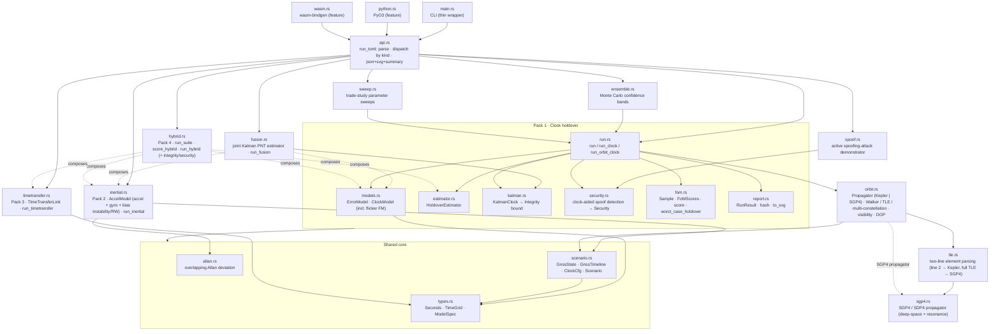
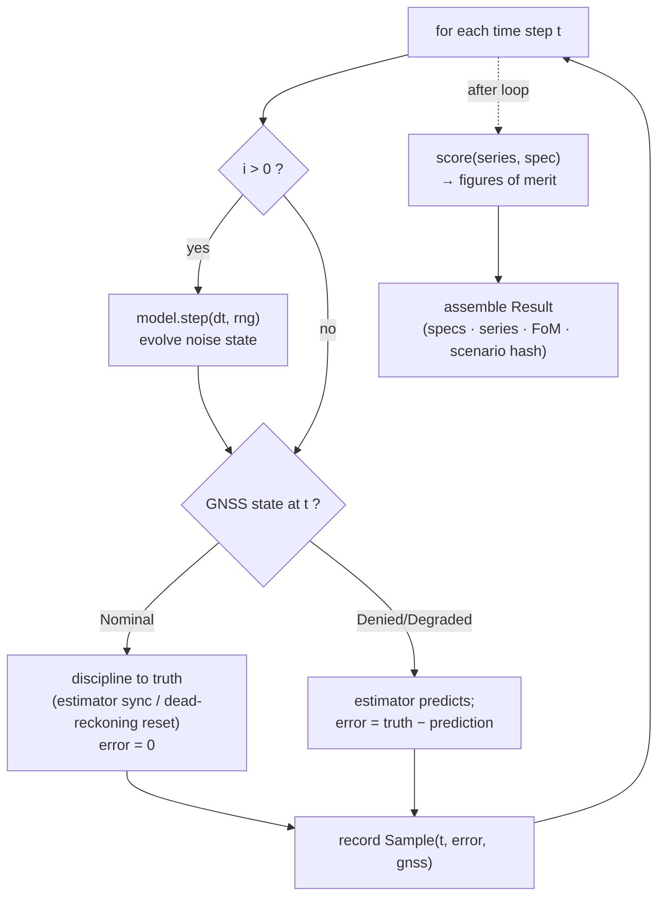
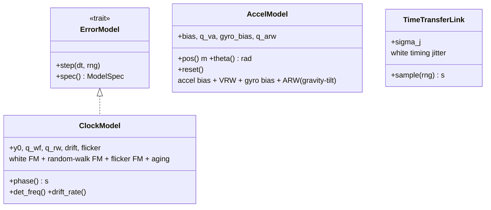
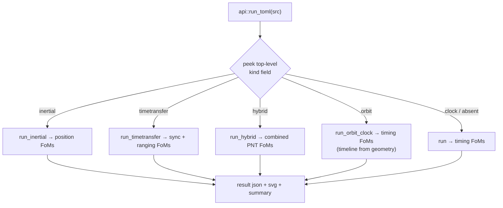
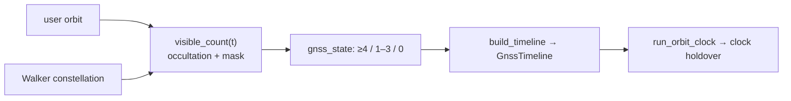

# Kshana — Architecture

Kshana is **one engine with four sensor packs**. The engine knows nothing about
"quantum" vs "classical": it drives sensor *error models* through a GNSS-outage
scenario, runs an estimator, and scores the outcome. A quantum and a classical
device are therefore compared on the same scenario, differing only in their
(published, cited) error parameters and their independent noise seeds.

This document collects the structural and behavioural diagrams. For usage see the
[README](../README.md); for what is and isn't validated see [VALIDATION](VALIDATION.md).

---

## 1. Module structure



The CLI and both bindings funnel through one `api::run_toml` entry point, so they
never drift. The packs reuse the shared core (`types`, `scenario`, `allan`); Pack 4
(`hybrid`) composes the models and estimators of Packs 1–3 rather than reimplementing
them; `orbit` derives a GNSS timeline from geometry that then feeds the Pack 1 run.

## 2. Engine pipeline (per run)

Each run steps a single sensor model through the time grid, disciplining it whenever
GNSS is nominal and letting it free-run (holdover / dead-reckoning) during the outage.



A scenario runs this pipeline twice — once for the quantum sensor, once for the
classical sensor — with **independent seeds** (`classical_seed = seed +
0x9e3779b97f4a7c15`) so the two noise realizations are uncorrelated.

## 3. The error-model interface (the extension point)

Every sensor implements the same idea: a stateful object whose `step()` advances its
internal stochastic error and whose accumulated state is read out each tick. Clocks
expose accumulated phase; accelerometers expose doubly-integrated position; links
expose per-measurement jitter.



`ModelSpec { id, kind, provenance, params }` travels into the result so every figure
in the output is traceable to the published source named in `provenance`.

Alongside the analytic `HoldoverEstimator`, the clock pack runs a two-state
(phase, frequency) Kalman filter (`KalmanClock`) whose process noise matches the
truth model. Coasting through an outage, its phase-error variance grows to exactly
`q_wf·T + q_rw·T³/3` — the analytic holdover relation — and its online 1-σ bound is
used to populate the **Integrity** figure of merit (fraction of outage samples whose
error stays inside the k-σ bound).

## 4. Dispatch (CLI and bindings)

`api::run_toml(src)` is the single entry point: it peeks the top-level `kind`,
deserializes the matching scenario, runs the pack, and returns `{ json, svg,
summary }`. The CLI writes those to files; the Python and WebAssembly bindings
return them to the host. One dispatch, no drift.



`serde` ignores the unknown `kind` field on each scenario struct, so existing
single-kind scenarios deserialize unchanged.

### Typed dispatch and the structured API

Dispatch is on a typed `ScenarioKind` enum, not a raw string match:
`ScenarioKind::classify(src)` resolves the `kind` field to a variant, and the
dispatcher matches on it exhaustively — adding a pack is a compile-checked change,
not a string typo. Three typed surfaces sit alongside the string-returning
`run_toml` (kept for the CLI and existing bindings):

- **`run_scenario(src) -> Result<RunOutput, KshanaError>`** — the typed entry, with
  a structured error taxonomy (`InvalidInput`, `NonConvergence`, `Unsupported`,
  `IoError`). Each error carries a stable `kind_tag()` so a caller can branch on the
  failure category instead of parsing the message. The bindings expose this as
  `error_kind(toml)`.
- **`list_scenario_kinds() -> Vec<ScenarioMeta>`** (and `list_scenario_kinds_json()`,
  exposed in the bindings as `list_kinds()`) — programmatic introspection: each
  kind's name, description, and required/optional fields, for UI and notebook
  auto-complete.

### Extending Kshana with an external pack

A third-party pack implements two small, semver-stable traits from `api`:

```rust
use kshana::api::{Scenario, ExternalPack, RunOutput, KshanaError, ScenarioMeta};

struct MyPack { /* deserialized scenario fields */ }

impl Scenario for MyPack {
    fn run(&self) -> Result<RunOutput, KshanaError> {
        // run the model; build { json, svg, summary }
        # unimplemented!()
    }
}

impl ExternalPack for MyPack {
    fn kind_name(&self) -> &'static str { "my-pack" }
    fn meta(&self) -> ScenarioMeta { /* name, description, fields */ }
}
```

The built-in `jamming` pack is wired through `Scenario` as the worked example;
out-of-tree packs follow the same contract without forking core (mirroring the
`ErrorModel` extension point in §3, which the private resilience overlay uses).

## 5. The hybrid capstone

The hybrid pack runs a *suite* (one clock + one inertial sensor) and requires **both**
timing and position to stay in spec; `pnt_holdover` is the time until either breaches.
Optionally an optical inter-satellite link re-syncs the **clock** during the outage —
time aiding only; position is not re-synced, because time transfer gives time, not
position. This is what isolates the inertial sensor as the limiting factor.


## 6. Geometry-derived GNSS availability

`orbit.rs` is a deterministic, dependency-free geometry layer. A `Propagator` is
either the analytic Keplerian `Orbit` (two-body, optionally secular J2) or a full
`Sgp4` propagator built from a complete two-line element set; a Walker-delta
generator produces synthetic constellations, and line-of-sight visibility = Earth
occultation + elevation mask. The visible-satellite count maps to a GNSS state
(≥4 = nominal, 1–3 = degraded, 0 = denied), and `build_timeline` turns that into the
availability timeline that drives the standard clock-holdover run. Availability is
therefore *derived from geometry* rather than hand-authored, while the run, estimator,
and scoring stay unchanged.

A constellation supplied as full TLEs is propagated with the SGP4/SDP4 model in
`sgp4.rs` (validated against the AIAA 2006-6753 vectors); line-2-only elements keep
the analytic two-body path. The two can be mixed within one constellation block.



## 7. Bindings

The core compiles unchanged to native, to a Python extension, and to WebAssembly.
The Python (`python.rs`, PyO3 abi3) and WebAssembly (`wasm.rs`, wasm-bindgen) modules
are optional, feature-gated dependencies (`--features python` / `--features wasm`):
the default build, the test suite, and the dependency-audit gate never compile or
scan them. Both call `api::run_toml`, so every surface returns identical results. The
WebAssembly module backs the browser playground in `web/` (`run`, `chart_svg`,
`summary`, `version`).

## 8. Determinism & reproducibility

- All randomness flows through a single seeded `ChaCha8Rng` per run; the step order is
  fixed, so `(scenario, seed, engine version) → identical bits`.
- The result carries a SHA-256 `scenario_hash`; `scripts/check-reproducible.sh` runs a
  reference scenario twice and asserts byte-identical output.
- The same engine compiles to native, to a Python extension, and to
  `wasm32-unknown-unknown` for in-browser runs producing the same numbers.

## 9. Deferred / future structure

Tracked in [CHANGELOG](../CHANGELOG.md) `[Unreleased]`: velocity-domain outputs from
the SGP4 propagator. The position-domain dilution of precision, the Security figure of
merit (across all four packs) with an active spoofing-attack demonstrator, eccentric/J2
orbits, real TLE and multi-constellation geometry, the full SGP4/SDP4 propagator
(deep-space and resonance, validated against the AIAA 2006-6753 vectors), a single-axis
(1-DOF) IMU error budget, a separately-observed (clock + position) joint Kalman
estimator plus a genuinely **coupled** clock+position filter with cross-block
covariance for the pseudorange case (`fusion::coupled`), Monte Carlo confidence bands,
trade-study sweeps, the HTML scorecard, and a package-publishing workflow have shipped.
A private overlay repo holds export-sensitive resilience depth; it plugs in via the
same `ErrorModel` interface without changing the public engine.
