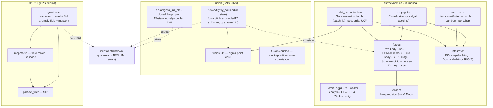
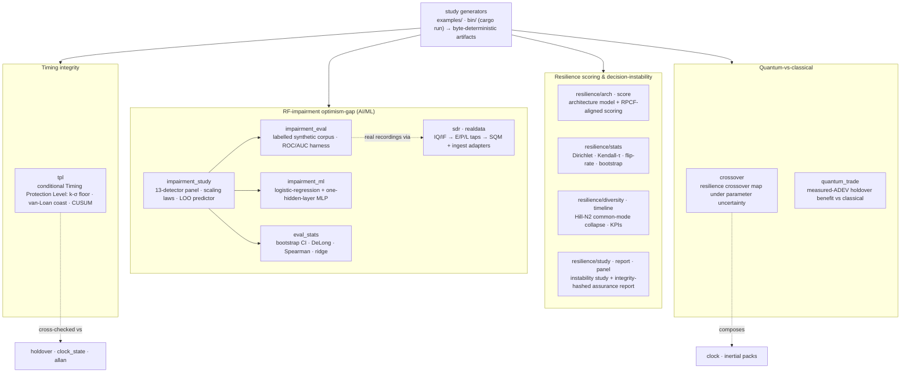
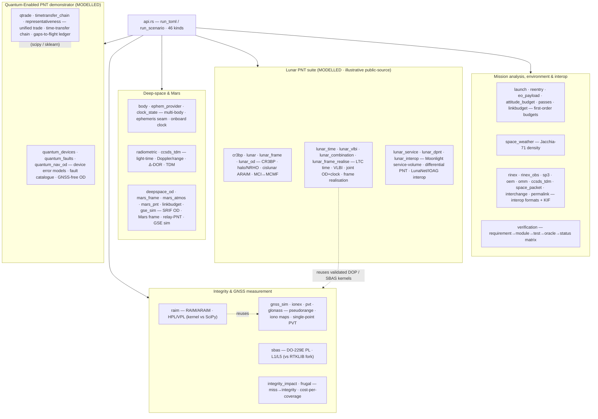
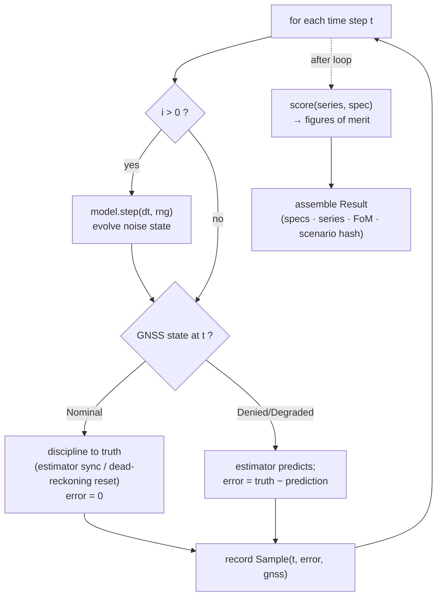
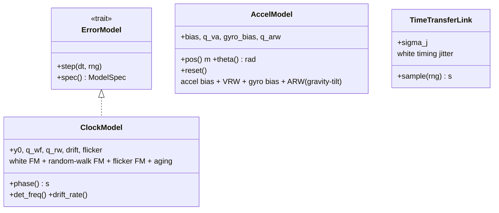
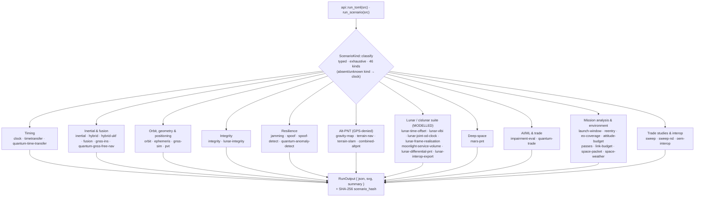
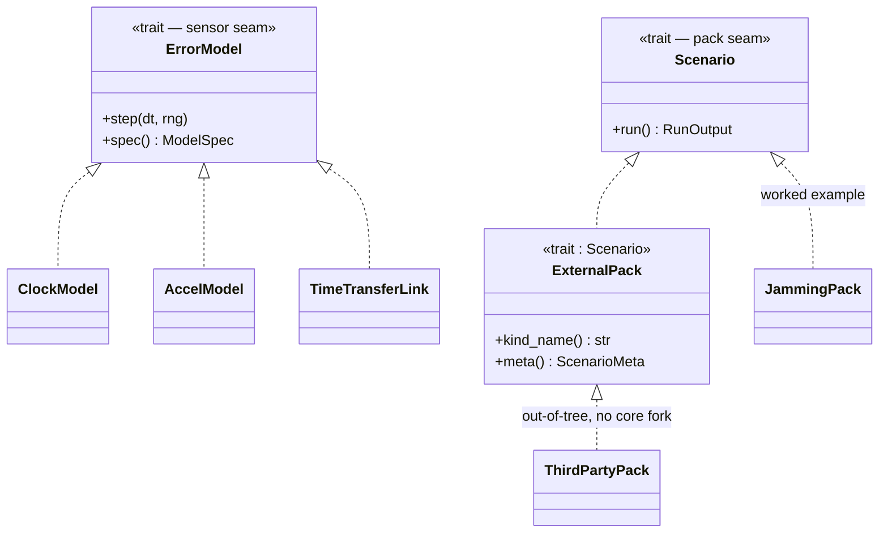
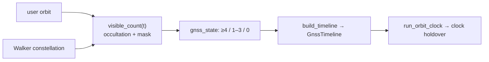
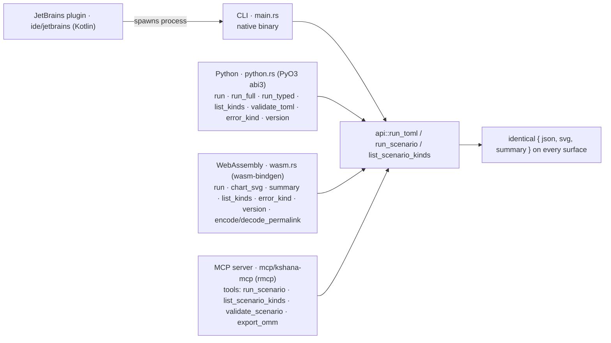

# Kshana — Architecture

Kshana is **one engine** organised in layers over a shared core: the **sensor packs**
(clock, inertial, time-transfer, hybrid); an **astrodynamics / numerical** layer (analytic
SGP4/SDP4, a numerical Cowell propagator with its seven-perturbation force model, maneuver
design, orbit determination from ground-station ranges, and the force-model fit against
agency precise ephemerides); a **time & reference-frame** layer (IERS time scales, IAU
2006/2000A precession–nutation, and the CIO GCRS↔ITRS reduction); a **fusion** layer (the
GNSS/INS estimators); and the **integrity, resilience, alt-PNT and lunar** layers
(RAIM/ARAIM/SBAS, jamming and multi-layer spoof detection, gravity/terrain/magnetic
map-matching, and cislunar PNT). Across all of them the engine knows nothing about
"quantum" vs "classical": it drives
sensor *error models* through a GNSS-outage scenario, runs an estimator, and scores the
outcome. A quantum and a classical device are therefore compared on the same scenario,
differing only in their (published, cited) error parameters and their independent noise
seeds.

This document collects the structural and behavioural diagrams. §1 is the sensor-pack
core; §1a maps the astrodynamics, fusion, and alt-PNT layers added since. For usage see
the [README](../README.md); for what is and isn't validated see
[VALIDATION](VALIDATION.md); for the per-capability maturity table see
[CAPABILITY](CAPABILITY.md).

---

## 1. Module structure

```mermaid
flowchart TD
    main["main.rs<br/>CLI (thin wrapper)"]
    py["python.rs<br/>PyO3 (feature)"]
    wasm["wasm.rs<br/>wasm-bindgen (feature)"]
    api["api.rs<br/>run_toml: parse · dispatch by kind · json+svg+summary"]

    subgraph shared["Shared core"]
      types["types.rs<br/>Seconds · TimeGrid · ModelSpec"]
      scenario["scenario.rs<br/>GnssState · GnssTimeline · ClockCfg · Scenario"]
      allan["allan.rs<br/>overlapping Allan deviation"]
    end

    subgraph pack1["Pack 1 · Clock holdover"]
      models["models.rs<br/>ErrorModel · ClockModel (incl. flicker FM)"]
      estimator["estimator.rs<br/>HoldoverEstimator"]
      kalman["kalman.rs<br/>KalmanClock → Integrity bound"]
      security["security.rs<br/>clock-aided spoof detection → Security"]
      fom["fom.rs<br/>Sample · FoMScores · score · worst_case_holdover"]
      report["report.rs<br/>RunResult · hash · to_svg"]
      run["run.rs<br/>run / run_clock / run_orbit_clock"]
    end

    inertial["inertial.rs<br/>Pack 2 · AccelModel (accel + gyro + bias instability/RW) · run_inertial · quantum_imu CAI + QuantumNavBudget dead-reckoning-over-holdover"]
    timetransfer["timetransfer.rs<br/>Pack 3 · TimeTransferLink · run_timetransfer"]
    hybrid["hybrid.rs<br/>Pack 4 · run_suite · score_hybrid · run_hybrid (+ integrity/security)"]
    fusion["fusion.rs<br/>joint Kalman PNT estimator · run_fusion"]
    orbit["orbit.rs<br/>Propagator (Kepler | SGP4) · Walker / TLE / multi-constellation · visibility · DOP"]
    tle["tle.rs<br/>two-line element parsing (line 2 → Kepler, full TLE → SGP4)"]
    sgp4mod["sgp4.rs<br/>SGP4 / SDP4 propagator (deep-space + resonance)"]
    ensemble["ensemble.rs<br/>Monte Carlo confidence bands"]
    sweep["sweep.rs<br/>trade-study parameter sweeps"]
    spoof["spoof.rs<br/>active spoofing-attack demonstrator"]
    jamming["jamming.rs<br/>link-budget anti-jam C/N₀ (J/S · processing gain · Q)"]
    navsignal["navsignal.rs<br/>signal level: BPSK-R / BOC PSD · SSC κ · Gabor BW · DLL jitter · multipath · ranging-code (m-seq/Gold) design-trade"]
    holdover["holdover.rs<br/>GNSS-denied clock holdover: van-Loan coast → holdover-to-threshold · quantum-clock classes"]
    verification["verification.rs<br/>machine-checked requirement→module→test→oracle→status matrix"]

    main --> api
    py --> api
    wasm --> api
    api --> run
    api --> inertial
    api --> timetransfer
    api --> hybrid
    api --> ensemble
    api --> sweep
    api --> fusion
    api --> spoof
    spoof --> security
    api --> jamming
    api --> holdover
    api --> verification
    navsignal -. derives anti-jam Q (κ → Q=1/(R_c·κ)) .-> jamming
    jamming -. uses PSD / SSC .-> navsignal
    holdover -. coast-variance vs van-Loan recursion .-> kalman
    ensemble --> run
    sweep --> run
    orbit --> tle
    tle --> sgp4mod
    orbit -. SGP4 propagator .-> sgp4mod
    fusion -. composes .-> models
    fusion -. composes .-> inertial
    fusion --> kalman

    run --> models
    run --> estimator
    run --> kalman
    run --> security
    run --> fom
    run --> report
    run --> orbit
    models --> types
    scenario --> types
    inertial --> scenario
    timetransfer --> types
    orbit --> scenario
    hybrid -. composes .-> models
    hybrid -. composes .-> estimator
    hybrid -. composes .-> inertial
    hybrid -. composes .-> timetransfer
    pack1 --> shared
    inertial --> allan
```



The CLI and both bindings funnel through one `api::run_toml` entry point, so they
never drift. The packs reuse the shared core (`types`, `scenario`, `allan`); Pack 4
(`hybrid`) composes the models and estimators of Packs 1–3 rather than reimplementing
them; `orbit` derives a GNSS timeline from geometry that then feeds the Pack 1 run. The
`navsignal` module sits at the signal level between the link budget and the measurement
domain: it derives the spectral-separation coefficient `κ` from the actual signal and
jammer power spectra, from which `jamming` now computes its anti-jam `Q = 1/(R_c·κ)`
rather than taking a representative constant (cross-checked in CI); it also carries the
ranging-code (m-sequence/Gold) design-trade.

Three further modules form the **GNSS-denied resilience** spine. `holdover` answers the
operational question directly — *how long can this clock free-run before its timing error
exceeds budget?* — by exposing the van-Loan coast-error closed form as a holdover-to-
threshold inversion, cross-checked against the multi-step `clock_state` covariance
recursion. Its inertial twin lives in `inertial::quantum_imu` (`QuantumNavBudget`), which
composes the cold-atom-interferometer white-noise drift with bias and scale-factor error
into a position-drift-over-holdover budget (the bias term cross-checked against the
independent `AccelModel` integrator). `verification` renders the whole engine's
requirement to module to test to oracle to status matrix, with unit-tested invariants that
forbid a *validated* label without an independent external oracle — so the assurance claim
cannot drift from the code.

## 1a. Astrodynamics, fusion & alt-PNT layers

Beyond the sensor-pack core, three subsystems share the same shared core and feed (or
are fed by) `orbit`. The **astrodynamics / numerical** layer adds a non-analytic Cowell
propagator alongside the analytic SGP4/SDP4 path; the **fusion** layer carries the
GNSS/INS estimators; and the **alt-PNT** layer is GPS-denied gravity-map matching. These
are library/scenario capabilities (see [CAPABILITY](CAPABILITY.md) for which are wired to
a scenario `kind` vs reachable as a Rust API).



The numerical propagator's force terms are off by default, so enabling them never
perturbs the released goldens. The 17-state tightly-coupled UKF coasts a GNSS outage on
the quantum-CAI accelerometer's derived velocity-random-walk; orbit determination reuses
the same `forces`/`integrator` to propagate a candidate state across the tracking arc.

The same shared core also carries four further subsystems not drawn above (their packs
appear in the dispatch of §4): a **time & reference-frame** layer (`timescales`, `jd2`,
`precession`, `nutation`, `cio`, `frames`, `eop`) reducing TEME↔GCRS↔ITRS and feeding the
`ephemeris`/ground-track pack; an **integrity** layer (`raim`, `sbas`) for RAIM/ARAIM/SBAS;
a **resilience** layer (`jamming`, `spoof`, `spoof_detect`, `spoof_monitors`, `detection`)
for jamming and multi-layer spoof detection, with a **nav-signal** layer (`navsignal`) at
the signal level — BPSK-R / sine-BOC power spectral densities, the spectral-separation
coefficient `κ` that now derives `jamming`'s anti-jam `Q`, the RMS (Gabor) ranging
bandwidth, the coherent early–late DLL code-tracking jitter, and the multipath error
envelope (signal-performance analysis, **not** RF-payload / antenna hardware design — a
payload partner's role); and a **lunar / cislunar** layer (`lunar`,
`lunar_frame`, `lunar_od`, `cr3bp`) for CR3BP dynamics — including the 6×6
state-transition matrix and a single-shooting differential corrector (`cr3bp_jacobian`,
`propagate_state_stm`, `differential_correct_halo`) that produces genuinely periodic
halo/NRHO orbits, reproducing the published L2 southern 9:2 NRHO (the Gateway orbit) at
period ≈ 6.57 d / perilune ≈ 3,250 km (published ≈ 6.56 d / ≈ 3,370 km); the selenocentric
MCI/MCMF transform of a corrected orbit and family-continuation remain follow-ons, and the
NRHO is a CR3BP (circular, Sun-free) solution, not validated against a real LANS/Gateway
ephemeris — and LunaNet integrity. The
agency-ephemeris force-model fit (`precise_od`, `lunar_od`, `tides`, `gravity_sh`) and the
full alt-PNT field set (`igrf`, `altpnt/terrain`, `gravimeter`) round out the module list;
see [CAPABILITY](CAPABILITY.md) for the per-module maturity.

## 1b. Resilience studies, AI/ML evaluation & reproducible artifacts

Five further module groups form the **open, reproducible-study** layer behind the
project's research papers. Unlike the scenario `kind`s, these are reached as
`cargo run --example` / `--bin` generators that write **byte-deterministic** artifacts
(fixed seeds, recorded engine version + config hash). All are **MODELLED** (synthetic or
public-dataset calibration) and carry honest validation labels — none is a certification.



- **`tpl`** — the conditional Timing Protection Level: a holdover-limited bound on the
  *undetected* time error under spoofing, composing a k-σ monitor floor, the van-Loan
  coast variance over the detection latency, and a CUSUM time-to-alarm; calibrated on a
  real recorded spoof (JammerTest 2024). There is no finite *unconditional* bound — the
  TPL is conditional on an independent cross-check detecting the attack.
- **`resilience/`** — a framework-aligned PNT-resilience scoring engine (DHS RPCF
  categories) plus a decision-instability study: a Dirichlet weighting simplex, Kendall-τ
  rank instability, top-1 winner flip rate, and common-mode **diversity collapse**
  (Hill-N2), with an integrity-hashed assurance report and 35 hand-derived oracle tests.
  See [RESILIENCE-CROSSWALK](RESILIENCE-CROSSWALK.md). Synthetic architectures aligned to
  RPCF v2.0 — a self-assessment, not a certification.
- **`impairment_eval` / `impairment_study` / `impairment_ml` / `eval_stats`** — the
  RF-impairment optimism-gap study: a labelled synthetic corpus and detector-agnostic
  ROC/AUC harness, a 13-detector panel (energy/AGC/SQM/parity plus seeded
  logistic-regression and one-hidden-layer-MLP detectors), in- vs out-of-distribution
  scaling laws with a permutation null, and a leave-one-out predictor of out-of-distribution
  degradation. The eval metrics are validated bit-for-bit against scikit-learn.
- **`sdr` / `realdata`** — a software-defined-receiver front end (raw IQ/IF → correlator
  early/prompt/late taps → SQM) and ingest adapters (RINEX, u-blox UBX, GnssLogger,
  JammerTest, Yunnan, SatGrid) that let the same detectors run over recordings supplied
  locally; no datasets are committed to the repo.
- **`crossover` / `quantum_trade`** — the quantum-vs-classical resilience crossover map
  under parameter uncertainty, and the measured-ADEV holdover-benefit trade; the trade
  numerical kernels are validated against scipy.

## 1c. Integrity, GNSS, deep-space, lunar & mission layers

The remaining domains plug into the same `api` dispatch and reuse the shared core,
frames and geometry. Everything here is **MODELLED** unless a `verification`-matrix row
cites an external oracle (RAIM kernel vs SciPy, SBAS vs the RTKLIB fork, the gnss_lib_py
DOP kernel, the OPS-SAT eval) — the lunar suite and the quantum demonstrator are
modelled, illustrative, public-source, and carry no TRL / heritage / agency-endorsement
claim.



## 2. Engine pipeline (per run)

Each run steps a single sensor model through the time grid, disciplining it whenever
GNSS is nominal and letting it free-run (holdover / dead-reckoning) during the outage.



A scenario runs this pipeline twice — once for the quantum sensor, once for the
classical sensor — with **independent seeds** (`classical_seed = seed +
0x9e3779b97f4a7c15`) so the two noise realizations are uncorrelated.

## 3. The error-model interface (the extension point)

Every sensor implements the same idea: a stateful object whose `step()` advances its
internal stochastic error and whose accumulated state is read out each tick. Clocks
expose accumulated phase; accelerometers expose doubly-integrated position; links
expose per-measurement jitter.



`ModelSpec { id, kind, provenance, params }` travels into the result so every figure
in the output is traceable to the published source named in `provenance`.

Alongside the analytic `HoldoverEstimator`, the clock pack runs a two-state
(phase, frequency) Kalman filter (`KalmanClock`) whose process noise matches the
truth model. Coasting through an outage, its phase-error variance grows to exactly
`q_wf·T + q_rw·T³/3` — the analytic holdover relation — and its online 1-σ bound is
used to populate the **Integrity** figure of merit (fraction of outage samples whose
error stays inside the k-σ bound).

## 4. Dispatch (CLI and bindings)

`api::run_toml(src)` is the single entry point: it peeks the top-level `kind`,
deserializes the matching scenario, runs the pack, and returns `{ json, svg,
summary }`. The CLI writes those to files; the Python and WebAssembly bindings
return them to the host. One dispatch, no drift.



Dispatch is on a typed `ScenarioKind` enum, matched exhaustively (see the next
subsection), so adding a pack is a compile-checked change. An absent or
unrecognised `kind` falls back to the `clock` pack, and `serde` ignores the
`kind` field on each scenario struct, so existing single-kind scenarios
deserialize unchanged.

### Typed dispatch and the structured API

Dispatch is on a typed `ScenarioKind` enum, not a raw string match:
`ScenarioKind::classify(src)` resolves the `kind` field to a variant, and the
dispatcher matches on it exhaustively — adding a pack is a compile-checked change,
not a string typo. Three typed surfaces sit alongside the string-returning
`run_toml` (kept for the CLI and existing bindings):

- **`run_scenario(src) -> Result<RunOutput, KshanaError>`** — the typed entry, with
  a structured error taxonomy (`InvalidInput`, `NonConvergence`, `Unsupported`,
  `IoError`). Each error carries a stable `kind_tag()` so a caller can branch on the
  failure category instead of parsing the message. The bindings expose this as
  `error_kind(toml)`.
- **`list_scenario_kinds() -> Vec<ScenarioMeta>`** (and `list_scenario_kinds_json()`,
  exposed in the bindings as `list_kinds()`) — programmatic introspection: each
  kind's name, description, and required/optional fields, for UI and notebook
  auto-complete.

### Extending Kshana with an external pack

A third-party pack implements two small, semver-stable traits from `api`:

```rust
use kshana::api::{Scenario, ExternalPack, RunOutput, KshanaError, ScenarioMeta};

struct MyPack { /* deserialized scenario fields */ }

impl Scenario for MyPack {
    fn run(&self) -> Result<RunOutput, KshanaError> {
        // run the model; build { json, svg, summary }
        # unimplemented!()
    }
}

impl ExternalPack for MyPack {
    fn kind_name(&self) -> &'static str { "my-pack" }
    fn meta(&self) -> ScenarioMeta { /* name, description, fields */ }
}
```

The built-in `jamming` pack is wired through `Scenario` as the worked example;
out-of-tree packs follow the same contract without forking core (mirroring the
`ErrorModel` extension point in §3, which the private resilience overlay uses).

Kshana therefore has **two stable extension seams** — add a *sensor* by implementing
`ErrorModel` (§3), or add a whole *scenario kind* by implementing `Scenario` +
`ExternalPack` — both semver-stable, neither requiring a core fork:



## 5. The hybrid capstone

The hybrid pack runs a *suite* (one clock + one inertial sensor) and requires **both**
timing and position to stay in spec; `pnt_holdover` is the time until either breaches.
Optionally an optical inter-satellite link re-syncs the **clock** during the outage —
time aiding only; position is not re-synced, because time transfer gives time, not
position. This is what isolates the inertial sensor as the limiting factor.


## 6. Geometry-derived GNSS availability

`orbit.rs` is a deterministic, dependency-free geometry layer. A `Propagator` is
either the analytic Keplerian `Orbit` (two-body, optionally secular J2) or a full
`Sgp4` propagator built from a complete two-line element set; a Walker-delta
generator produces synthetic constellations, and line-of-sight visibility = Earth
occultation + elevation mask. The visible-satellite count maps to a GNSS state
(≥4 = nominal, 1–3 = degraded, 0 = denied), and `build_timeline` turns that into the
availability timeline that drives the standard clock-holdover run. Availability is
therefore *derived from geometry* rather than hand-authored, while the run, estimator,
and scoring stay unchanged.

A constellation supplied as full TLEs is propagated with the SGP4/SDP4 model in
`sgp4.rs` (validated against the AIAA 2006-6753 vectors); line-2-only elements keep
the analytic two-body path. The two can be mixed within one constellation block.



## 7. Bindings

The core compiles unchanged to native, to a Python extension, and to WebAssembly.
The Python (`python.rs`, PyO3 abi3) and WebAssembly (`wasm.rs`, wasm-bindgen) modules
are optional, feature-gated dependencies (`--features python` / `--features wasm`):
the default build, the test suite, and the dependency-audit gate never compile or
scan them. Both call `api::run_toml`, so every surface returns identical results. The
WebAssembly module backs the browser playground in `web/` (`run`, `chart_svg`,
`summary`, `version`, plus the `encode_permalink` / `decode_permalink` shareable-URL
codec). Two further front doors reach the same `api`: the **MCP server**
(`mcp/kshana-mcp`, a workspace-excluded `rmcp` crate exposing `run_scenario`,
`list_scenario_kinds`, `validate_scenario`, `export_omm` as tools) and the **JetBrains
IDE plugin** (`ide/jetbrains`, a Kotlin project that shells out to the `kshana` CLI
rather than linking the library).



Feature-gating: Python and WASM are `--features python` / `--features wasm`; the MCP
server and the `xval/*` cross-checks are workspace-EXCLUDED crates; the IDE plugin links
nothing — it runs the CLI.

## 8. Determinism & reproducibility

- All randomness flows through a single seeded `ChaCha8Rng` per run; the step order is
  fixed, so `(scenario, seed, engine version) → identical bits`.
- The result carries a SHA-256 `scenario_hash`; `scripts/check-reproducible.sh` runs a
  reference scenario twice and asserts byte-identical output.
- The same engine compiles to native, to a Python extension, and to
  `wasm32-unknown-unknown` for in-browser runs producing the same numbers.

## 9. Deferred / future structure

The astrodynamics, fusion, and alt-PNT layers in §1a — the full SGP4/SDP4 propagator,
the numerical Cowell propagator with its seven-perturbation force model and two adaptive
integrators, maneuver/trajectory design, orbit determination, the 15-/8-/17-state
GNSS/INS estimators, the coupled clock+position filter, and gravity-map matching — have
all shipped, alongside the Security FoM with an active spoof demonstrator, real
TLE/multi-constellation geometry, Monte-Carlo bands, trade-study sweeps, the HTML
scorecard, and the publish/wheels/pages workflows.

Several capabilities once listed here as future work have since **shipped** and are
covered above or in [VALIDATION](VALIDATION.md): the full IAU 2000A nutation and the
equinox-free CIO GCRS↔ITRS / ITRF reduction (validated bit-for-bit against SOFA/ERFA),
the EGM2008 geopotential to degree/order 70, the **Lense–Thirring** frame-dragging term,
solid/ocean/atmospheric tides, and a DE-grade (DE440/ANISE) ephemeris cross-validation.

The remaining follow-ons are tracked in [CHANGELOG](../CHANGELOG.md) `[Unreleased]` and the
per-capability roadmap in [CAPABILITY](CAPABILITY.md): a higher-degree (e.g. 200×200) EGM
**tesseral** field and loader beyond the shipped degree/order-70 path, the NRLMSISE-00
thermospheric density, solar limb darkening / the oblate-Earth shadow, an external
GMAT/Orekit cross-validation of a high-fidelity orbit run, carrier-phase tight coupling and
surfacing the tight-coupled navigator in a scenario pack, and a real EGM2008/EIGEN gravity
map for the alt-PNT matcher.

A private overlay repo holds export-sensitive resilience depth; it plugs in via the
same `ErrorModel` interface (and the `ExternalPack` contract in §4) without changing
the public engine.
