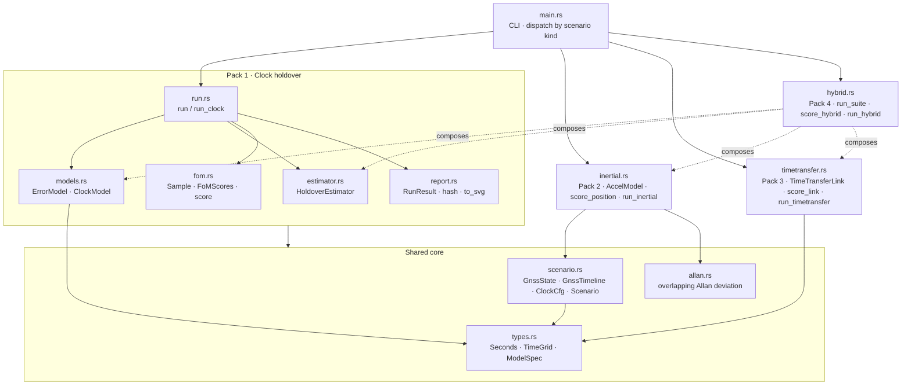
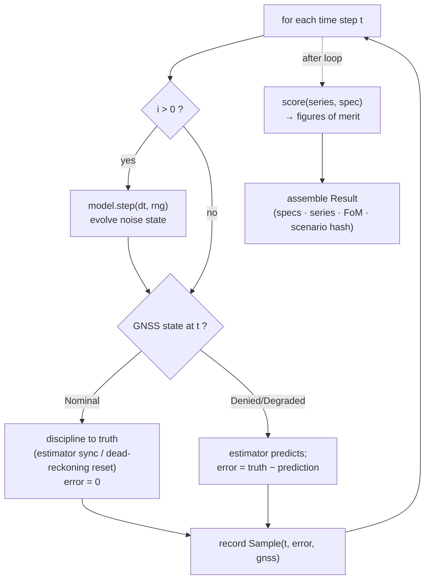
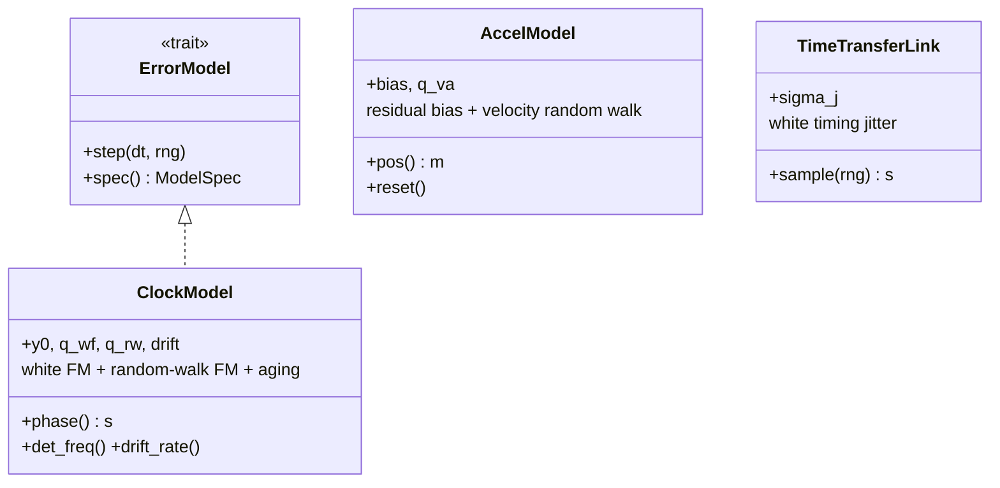
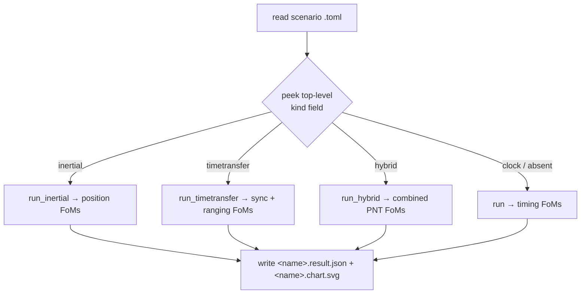
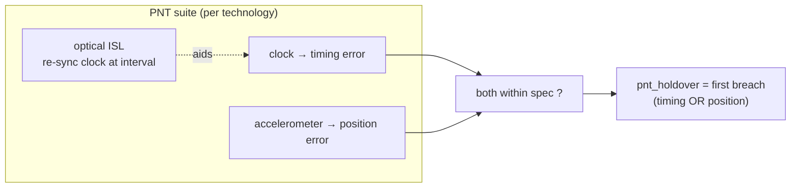

# Kshana — Architecture

Kshana is **one engine with four sensor packs**. The engine knows nothing about
"quantum" vs "classical": it drives sensor *error models* through a GNSS-outage
scenario, runs an estimator, and scores the outcome. A quantum and a classical
device are therefore compared on the same scenario, differing only in their
(published, cited) error parameters and their independent noise seeds.

This document collects the structural and behavioural diagrams. For usage see the
[README](../README.md); for what is and isn't validated see [VALIDATION](VALIDATION.md).

---

## 1. Module structure

The packs reuse the shared core (`types`, `scenario`, `allan`). Pack 4 (`hybrid`)
literally composes the models and estimators of Packs 1–3 rather than reimplementing
them.

## 2. Engine pipeline (per run)

Each run steps a single sensor model through the time grid, disciplining it whenever
GNSS is nominal and letting it free-run (holdover / dead-reckoning) during the outage.

A scenario runs this pipeline twice — once for the quantum sensor, once for the
classical sensor — with **independent seeds** (`classical_seed = seed +
0x9e3779b97f4a7c15`) so the two noise realizations are uncorrelated.

## 3. The error-model interface (the extension point)

Every sensor implements the same idea: a stateful object whose `step()` advances its
internal stochastic error and whose accumulated state is read out each tick. Clocks
expose accumulated phase; accelerometers expose doubly-integrated position; links
expose per-measurement jitter.

`ModelSpec { id, kind, provenance, params }` travels into the result so every figure
in the output is traceable to the published source named in `provenance`.

## 4. CLI dispatch

`serde` ignores the unknown `kind` field on each scenario struct, so existing
single-kind scenarios deserialize unchanged.

## 5. The hybrid capstone

The hybrid pack runs a *suite* (one clock + one accelerometer) and requires **both**
timing and position to stay in spec; `pnt_holdover` is the time until either breaches.
Optionally an optical inter-satellite link re-syncs the **clock** during the outage —
time aiding only; position is not re-synced, because time transfer gives time, not
position. This is what isolates the inertial sensor as the limiting factor.

## 6. Determinism & reproducibility

- All randomness flows through a single seeded `ChaCha8Rng` per run; the step order is
  fixed, so `(scenario, seed, engine version) → identical bits`.
- The result carries a SHA-256 `scenario_hash`; `scripts/check-reproducible.sh` runs a
  reference scenario twice and asserts byte-identical output.
- The same engine compiles to native (CLI today) and is intended to compile to
  WebAssembly for in-browser runs producing the same numbers.

## 7. Deferred / future structure

Tracked in [CHANGELOG](../CHANGELOG.md) `[Unreleased]`: flicker-FM floor, full
Kalman/factor-graph fusion (replacing the analytic holdover predictor), multi-window
holdover scoring, gyroscope/angular-random-walk, orbit-based scenarios (precise time
and propagation libraries), and Python + WebAssembly bindings. A private overlay repo
holds export-sensitive resilience depth; it plugs in via the same `ErrorModel`
interface without changing the public engine.
